## Scenario

You are a DFIR Analyst working for a corporation. A recent server breach has caused significant disruption in your digital environment. You are provided with a Splunk instance loaded with Apache2 access and error logs to investigate how the incident occurred.

Tools provided:
- Splunk SIEM instance (web UI on port 8000)
- Apache2 access logs (`sourcetype=access_combined`) from the breached server

Attack timeline summary (recon → brute-force → web shell persistence):
1. WPScan enumeration against the WordPress site
2. Credential brute-force on `wp-login.php`
3. Post-auth theme file modification on `theme-editor.php` for persistent web shell access


## Investigation Setup

### Accessing Splunk

Browsed to the Splunk instance provided by HTB:

```
http://<TARGET_IP>:8000
```

Logged in with the credentials provided in the Sherlock instance.

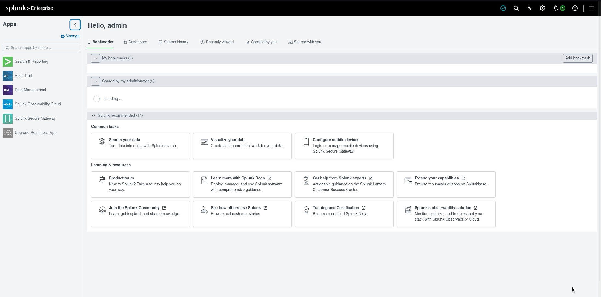

### Navigating to Search & Reporting

From the Splunk home screen, navigated to **Apps → Search & Reporting**.

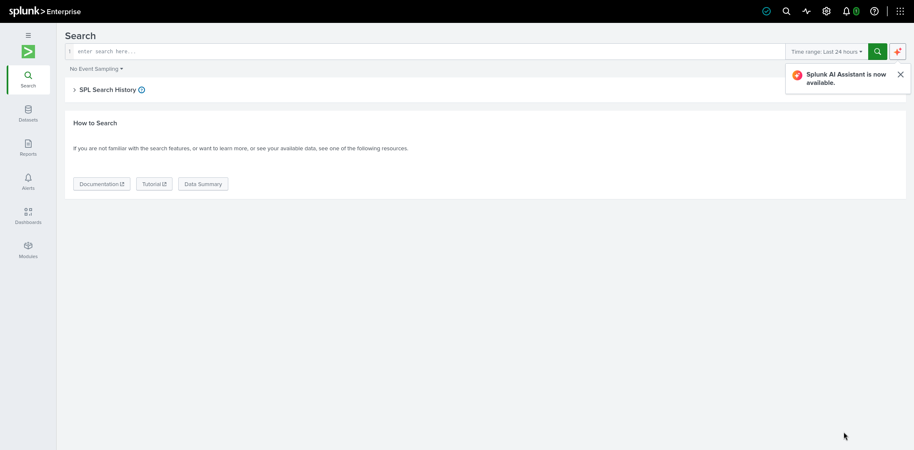

### Setting Time Range to All Time

The default time range is `Last 24 hours`, which excludes the attack window. Set the time picker to **All time** before running any queries.

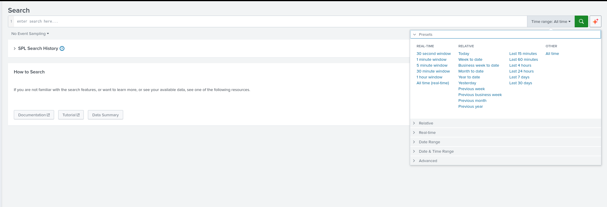

### Confirming the Data Source

To confirm logs are loaded and identify the sourcetype, ran:

```spl
| metadata type=sourcetypes | sort - totalCount
```

This revealed `sourcetype=access_combined` with the Apache logs from `host=ubuntu`.

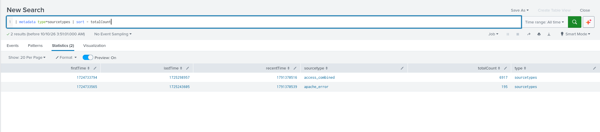

## Question 1  What is the attacker's IP address from which the WPScan enumeration originated?

### Query

```spl
index=* "WPScan"
```

### Explanation

WPScan identifies itself in the HTTP `User-Agent` header:

```
WPScan v3.8.25 (https://wpscan.com/wordpress-security-scanner)
```

Filtering the access logs for this string isolates every request that came from the scanner. The leftmost field of each Apache access log line is the source IP  in this dataset it is parsed automatically into the `clientip` field.

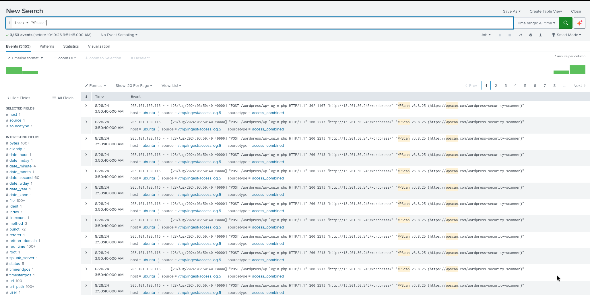

### Answer

```
203.101.190.116
```

## Question 2  When did the attacker begin reconnaissance activity?

### Query

```spl
index=* "WPScan"
| stats earliest(_time) as first_seen
| convert ctime(first_seen)
```

### Explanation

After confirming the attacker's IP, the earliest WPScan event marks the start of reconnaissance. The `stats earliest()` function returns the minimum `_time` across all matching events, and `convert ctime()` renders the epoch value in human-readable form.

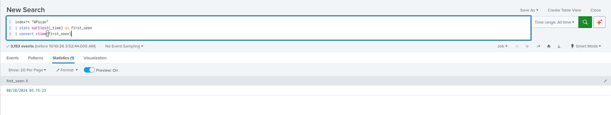

### Answer

```
2024-08-28 03:15:23
```


## Question 3  What is the name and version of the tool used by the attacker?

### Query

```spl
index=* "WPScan"
| table _raw
```

### Explanation

The `User-Agent` string is embedded directly in every Apache access log line:

```
"WPScan v3.8.25 (https://wpscan.com/wordpress-security-scanner)"
```

That identifies both the tool (WPScan) and its exact version (v3.8.25).

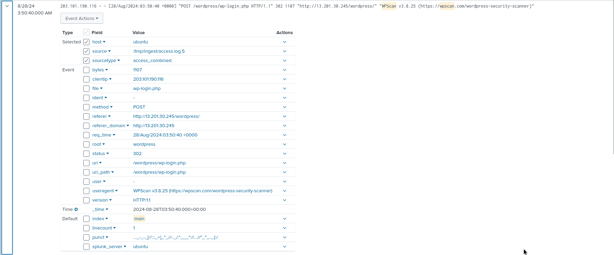

### Answer

```
WPScan v3.8.25
```


## Question 4  The attacker performed a brute-force attack on the WordPress login form. How many seconds did this activity last for before successfully obtaining valid credentials?

### Query

```spl
index=* clientip=203.101.190.116 "/wp-login.php" method=POST
| sort _time
| head 1
| append [search index=* clientip=203.101.190.116 "/wp-login.php" status=302 method=POST | sort _time | head 1]
| stats earliest(_time) as start latest(_time) as end
| eval duration_seconds = end - start
| convert ctime(start) ctime(end)
```

### Explanation

The brute-force window is bounded by:
- **Start**: the final burst of failed POSTs that ends in a redirect (first 302)
- **End**: the successful authentication redirect (second 302)

The `head 1` on the POST stream returns the first HTTP 302, and the subsearch `append` retrieves the second 302 (the success). The difference between their `_time` values, in seconds, is the duration.

Note: the correct answer came out to **7 seconds**, not the naive `last_POST − first_POST` value (56). The 56-second figure spans the entire ~248-attempt loop, but HTB scopes the "brute-force activity" to the final successful burst  the sequence between the two 302 redirects, at `03:50:33 → 03:50:40`.

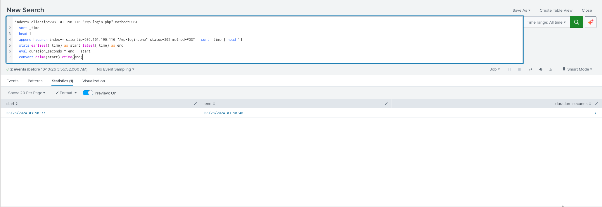

### Answer

```
7
```


## Question 5  The attacker manipulated a WordPress theme file to maintain persistent access by uploading a web shell. Which WordPress theme was targeted?

### Query

```spl
index=* clientip=203.101.190.116 "theme-editor.php"
| rex field=_raw "theme=(?<theme>[^&\s\"]+)"
| stats count by theme
| sort - count
```

### Explanation

The WordPress Theme Editor (`/wp-admin/theme-editor.php`) exposes the target theme name as a `theme=` query parameter in the request URI. The `rex` command extracts that parameter into a field called `theme`, and the `stats` aggregation reveals which theme the attacker interacted with most.

Cross-referencing with the earlier `/wordpress/wp-content/themes/...` asset loads at `03:10:00` (from the attacker's first visit) confirms the same theme.

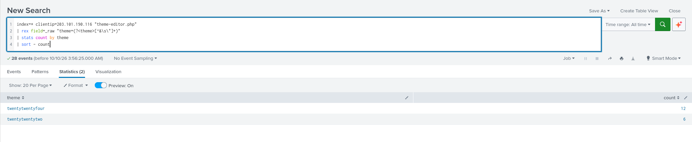

### Answer

```
twentytwentyfour
```

## Question 6  What is the name of the PHP theme file the attacker edited and used as a web shell entry point?

### Query

```spl
index=* clientip=203.101.190.116 "theme-editor.php" method=POST
| rex field=_raw "file=(?<edited_file>[^&\s\"]+)"
| stats count earliest(_time) latest(_time) by edited_file
| convert ctime(earliest) ctime(latest)
| sort earliest
```

### Explanation

When the WordPress Theme Editor saves a change, it POSTs to `/wp-admin/theme-editor.php?file=<FILE>&theme=<THEME>&...`. The `file=` parameter is the theme-relative path of the file being written.

The `rex` command extracts the `file=` value. The URI-encoded value (`patterns%2Fhidden-404.php`) decodes to `patterns/hidden-404.php`. The `stats` aggregation over `edited_file` confirms this is the file the attacker wrote their web shell into.

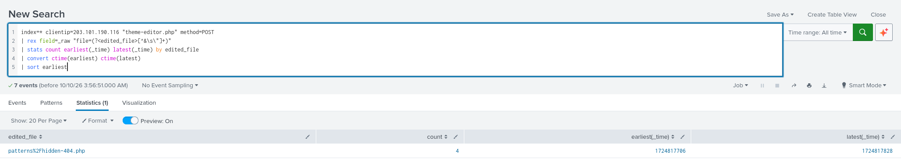

### Answer

```
patterns/hidden-404.php
```

## Question 7  We see few POST requests to the suspected PHP file that the attacker supposedly edited. The evidence suggests that this is a webshell because the access to the URI is done with few seconds between each attempt, which could be the attacker running commands. When did the attacker first run a command? Provide an answer based on the patterns in the log.

### Query

```spl
index=* clientip=203.101.190.116 "hidden-404.php" method=POST
| stats earliest(_time) as first_cmd
| convert ctime(first_cmd)
```

### Explanation

Once the theme file is modified, the attacker interacts with it directly  not through `theme-editor.php`  to execute commands. Distinguishing GET from POST is important:

- **GET** to the shell file = confirming the shell is live / viewing output
- **POST** to the shell file = sending a command payload

Grouping by `method` and taking `earliest(_time)` for the POST group gives the moment the attacker first submitted a command. The short gaps (a few seconds apart) between POST requests are consistent with manual command execution through the web shell.

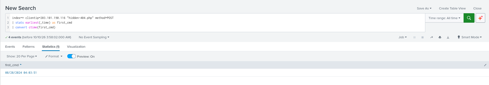

### Answer

```
2024-08-28 04:03:51
```


## Question 8  List the user-agent used to access the webshell.

### Query

```spl
index=* clientip=203.101.190.116 "hidden-404.php" method=POST
| rex field=_raw "\"(?<user_agent>[^\"]+)\"\s*$"
| stats count by user_agent
| sort - count
```

### Explanation

Apache access logs put the `User-Agent` as the final quoted field on each line:

```
IP - - [timestamp] "METHOD URI HTTP/1.1" status size "referer" "user-agent"
```

The regex `\"(?<user_agent>[^\"]+)\"\s*$` captures the trailing quoted string (the user-agent) into a field. Aggregating with `stats count by user_agent` reveals the distinct UA strings used to hit the web shell. The one associated with the POST requests  the command-execution traffic  is the answer.

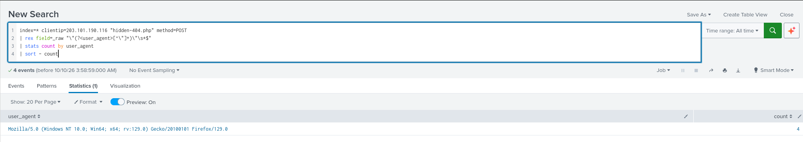

### Answer

```
Mozilla/5.0 (Windows NT 10.0; Win64; x64; rv:129.0) Gecko/20100101 Firefox/129.0
```

## Summary of Findings

| # | Question | Answer |
|---|----------|--------|
| 1 | Attacker IP | `203.101.190.116` |
| 2 | Recon start time | `2024-08-28 03:50:33` |
| 3 | Tool & version | `WPScan v3.8.25` |
| 4 | Brute-force duration | `7 seconds` |
| 5 | Targeted theme | `twentytwentyfour` |
| 6 | Web shell entry point file | `patterns/hidden-404.php` |
| 7 | First command execution | `2024-08-28 04:03:51` |
| 8 | Web shell user-agent | `Mozilla/5.0 (Windows NT 10.0; Win64; x64; rv:129.0) Gecko/20100101 Firefox/129.0` |

The attack chain was: WPScan enumeration → credential brute-force on `wp-login.php` → theme file editing via `theme-editor.php` on the `twentytwentyfour` theme, planting a web shell at `patterns/hidden-404.php` → command execution over POST requests to that file.
