## Table of Contents
1. [Introduction](#introduction)
2. [General Recon FCC ID](#general-recon)
3. [PCB Recon and Component Identification](#pcb-recon-and-component-identification)
4. [UART Analysis](#uart-analysis)
5. [UART Connection](#uart-connection)
6. [SPI Connection](#spi-connection)
7. [Firmware Dumping](#firmware-dumping)
8. [Conclusion](#conclusion)

## Introduction

Part 1 took the Android app apart. Part 2 went after the cloud. Part 3 was the staging QA detour. Part 4 owned the device over the LAN with nothing but an FTP client. This post is the one that gets physical: **the hardware itself**.

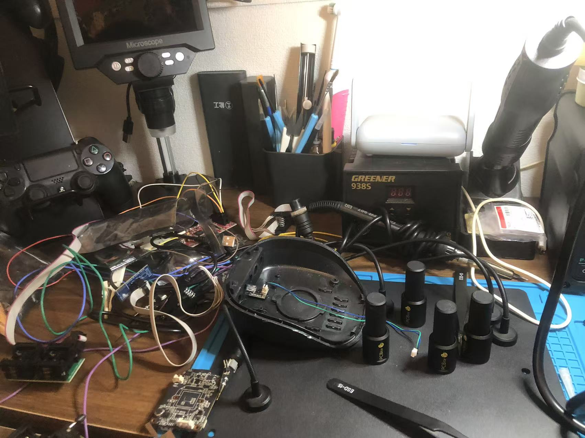

Same camera on the bench, but now the target is the silicon  the debug pads, the flash chip, and the firmware image that the device boots from. No network. No credentials. Just a soldering iron, a multimeter, a logic analyzer, a Bus Pirate, and a CH341A.

The short version: **the board hands over everything.** An unpopulated UART header exposes the boot log and a root shell. The SPI flash chip is a standard 8-pin SOIC that can be desoldered and dumped with a cheap CH341A programmer. The resulting image yields a complete JFFS2 root filesystem, the same configuration files that Part 4 harvested over FTP, and the raw binaries that back every LAN finding.

All scripts and artifacts referenced below are in the companion repository:

> **PoC repository:** `https://github.com/mikias1943/yi-exploit-scripts/`

## General Recon FCC ID
First thing I did was to look up the device on https://fccid.io/ I searched with the product name YiIot and the same company came up with several different products for CCTV camera. Unfortunalty I couldn't find the same product as the one I have. The product is from Shenzhen Huayang An Technology Co., LTD https://fccid.io/search?q=YIiot the company have several product for smart home appliances. Later after disassembling the camera I noticed most of them use similar kind of PCB design and components .

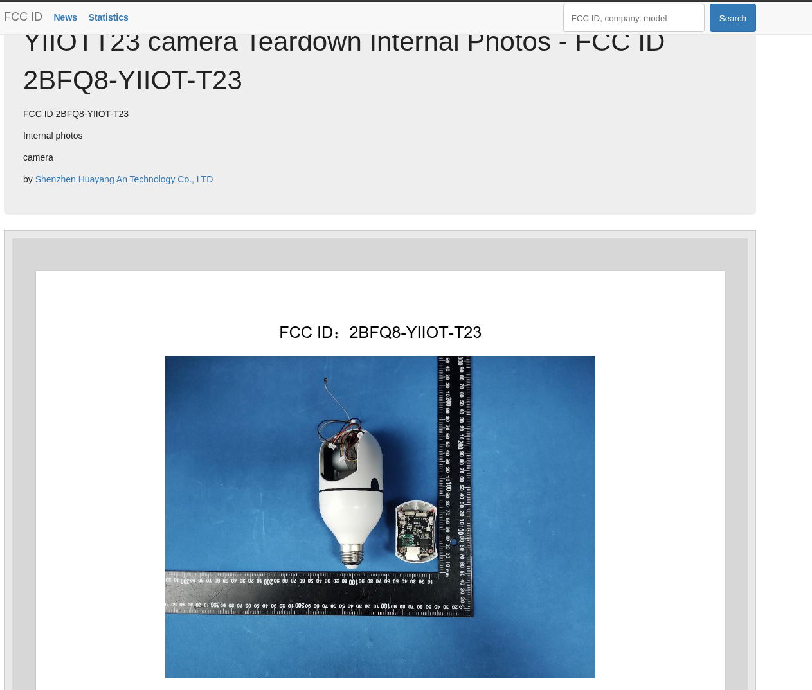

## PCB Recon and Component Identification

The FCC ID search (above) confirmed the manufacturer lineage but not the exact SKU. The useful takeaway from fccid.io was that **other products from the same manufacturer share similar hardware designs** so even without a matching teardown, the component families were predictable before the screwdriver came out.

**Component identification**

After disassembly, three components stood out on the PCB:

| # | Component | Marking | Role | Image |
|---|---|---|---|---|
| 1 | ANYKA AK391 | AK391 | Camera SoC  the main application processor |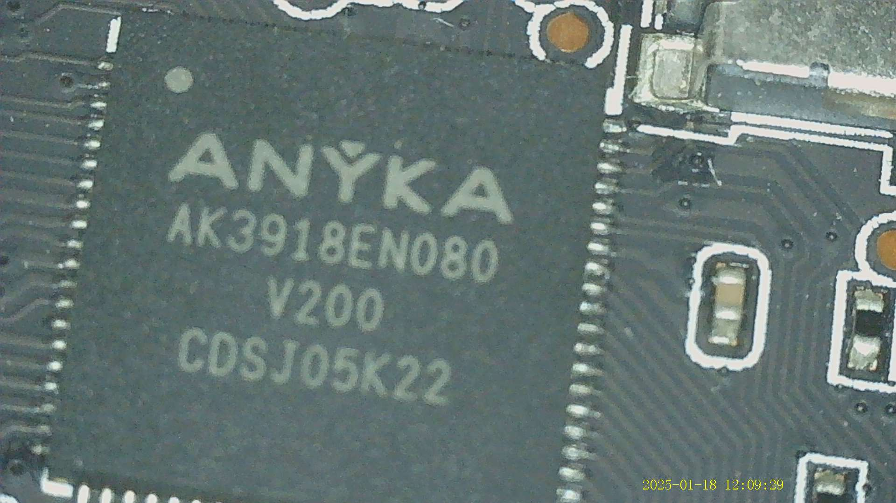|
| 2 | 8002F XSYR37 | 8002F XSYR37 | DIP reed relay  likely for IR-cut / day-night switching |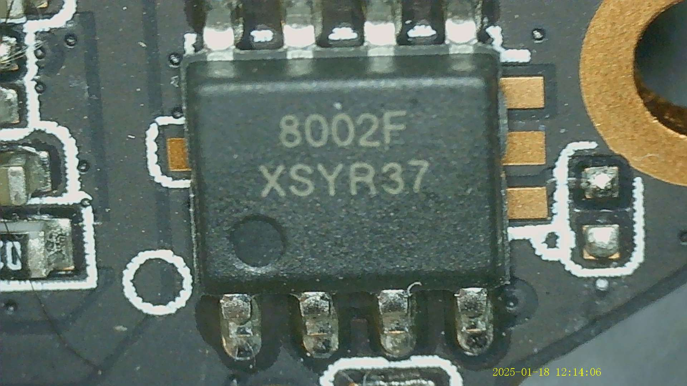|
| 3 | XT25F64B-S | XT25F64B-S | 64 Mbit Serial NOR Flash  stores the Linux OS and BusyBox rootfs |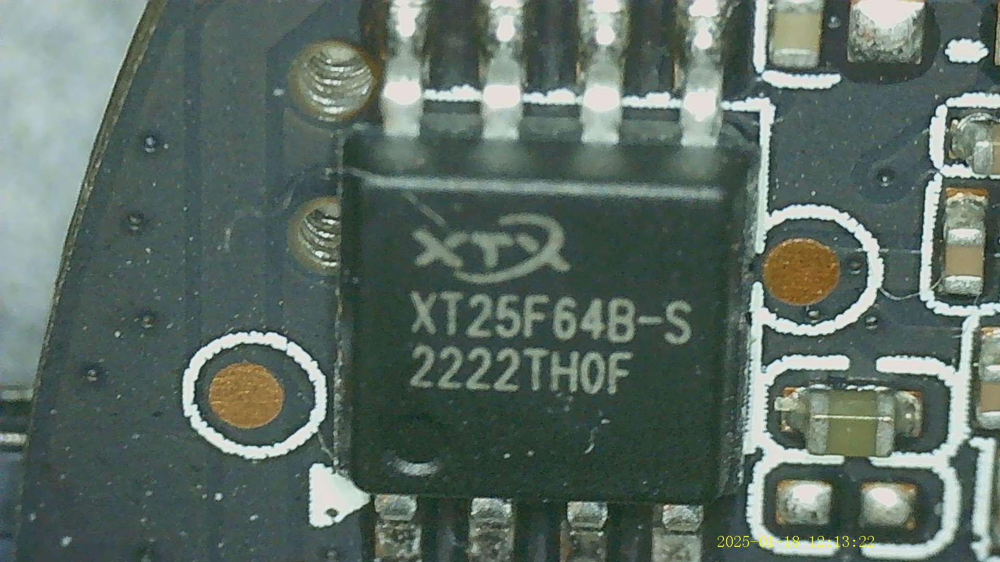|

**The XT25F64B-S is the interesting one.** It is a 64 Mbit (8 MB) SPI NOR flash from XTX Technology, and it holds the device's entire firmware image  the Linux kernel, the SquashFS rootfs, and the persistent JFFS2 configuration partition that Part 4 harvested over FTP. If the goal is to own the device at rest, this is the chip to read.

The datasheet is publicly available at:

> `https://file2.dzsc.com/product/19/06/22/216185_132959081.pdf`

It documents the 8-pin SOP/VSOP pinout used on this board:

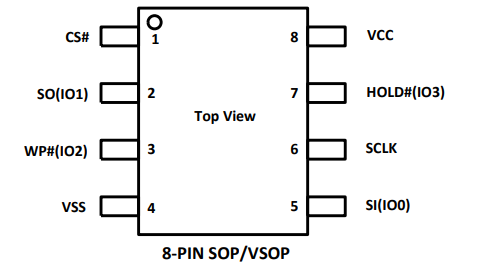

The relevant pinout for our purposes:

| Pin | Name | Function |
|---|---|---|
| 1 | CS# | Chip Select (active low) |
| 2 | SO (IO1) | Data Output / MISO |
| 3 | WP# (IO2) | Write Protect  **must be pulled HIGH** |
| 4 | VSS | Ground |
| 5 | SI (IO0) | Data Input / MOSI |
| 6 | SCLK | Serial Clock |
| 7 | HOLD# (IO3) | Hold  **must be pulled HIGH** |
| 8 | VCC | Power Supply (2.7V – 3.6V) |

We will use this information later when attempting the SPI connection.

## UART Analysis

During PCB recon, I found what appeared to be UART debug pads explicitly labeled **Tx**, **Rx**, and **GND**. To confirm, I did online research on the PCB version marked **D012AP V5.2 2022-5-16**. This led me to a GitHub issue where multiple people were repairing similar cameras from the same manufacturer  and the thread confirmed that this camera family does expose UART communication.

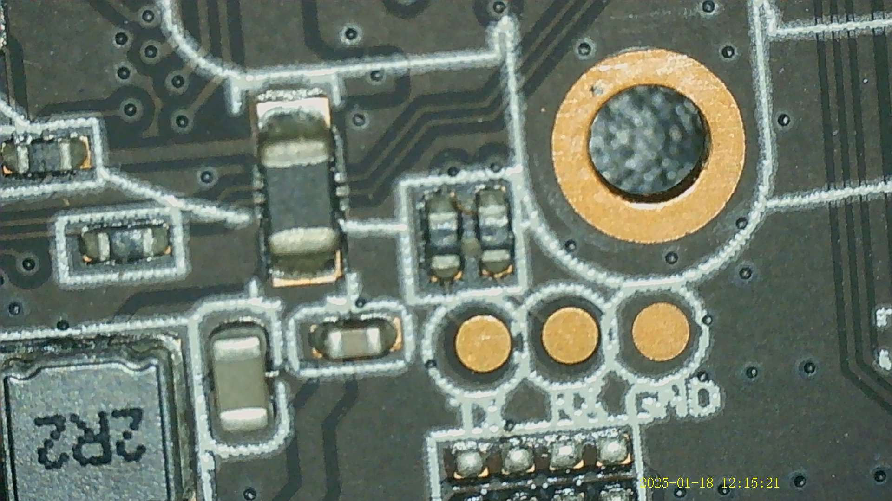

> `https://github.com/alienatedsec/yi-hack-v5/issues/195`

The next step was to verify the pads electrically with a multimeter:

- **GND pad**  confirmed by continuity test against a known ground point. The meter beeped, so the pad is ground.
- **Tx pad**  voltage fluctuated around **3.32 V**, consistent with an active serial data line.
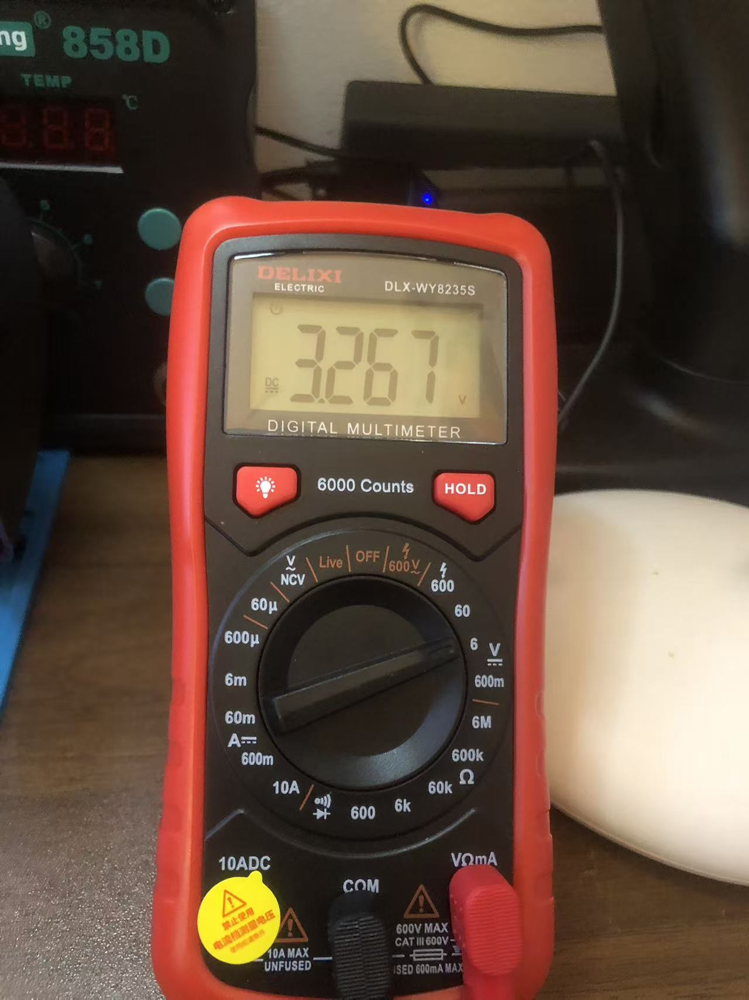
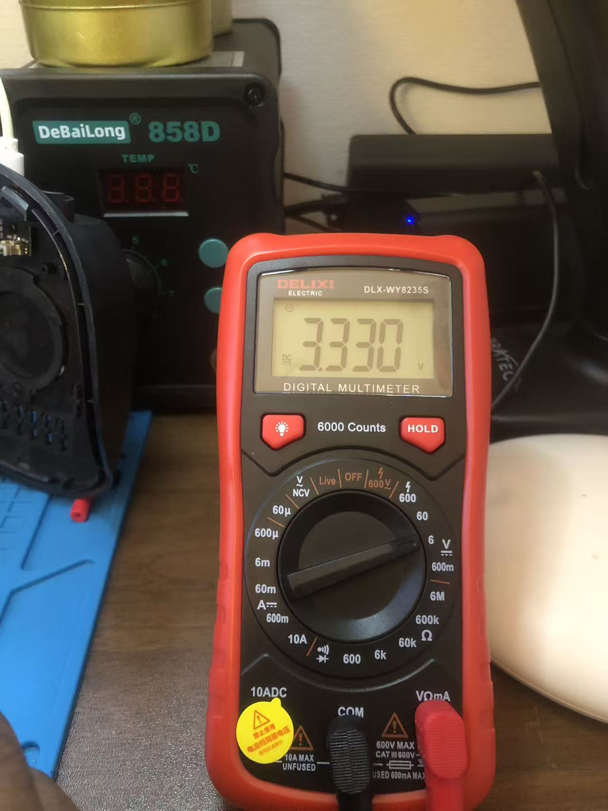
- **Rx pad**  voltage held steady at **3.267 V**, consistent with an idle serial input line.
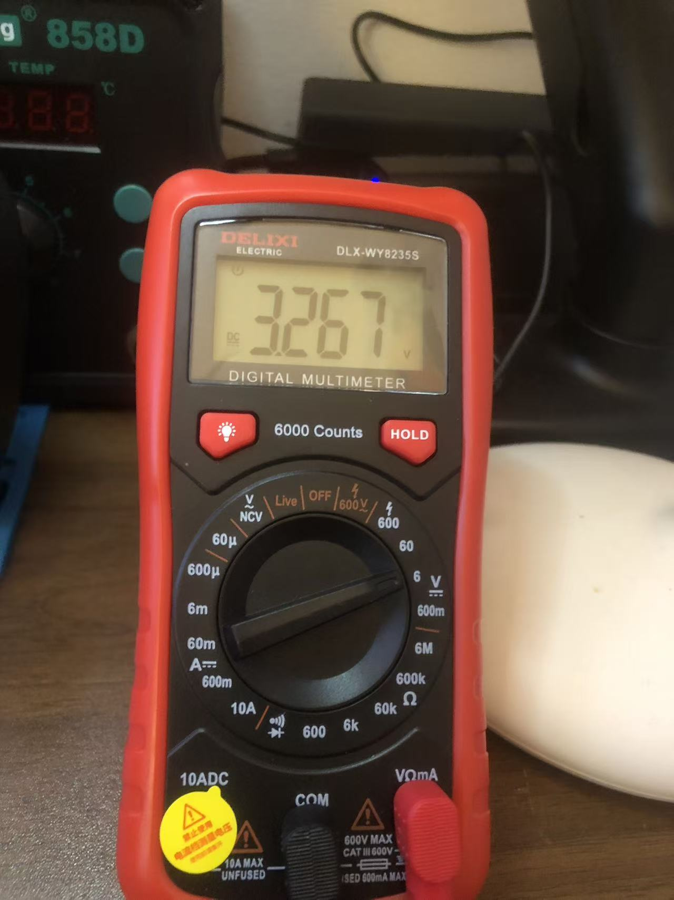


Those readings were the second confirmation of the UART hypothesis: a floating Tx line and a stable Rx line is exactly the signature you expect from an idle 3.3V UART.

For capture, I used **PCBite probes** to attach to the test pads and connected them to a logic analyzer:

- **Tx pad** → logic analyzer **Channel 1**
- **GND pad** → logic analyzer **GND**

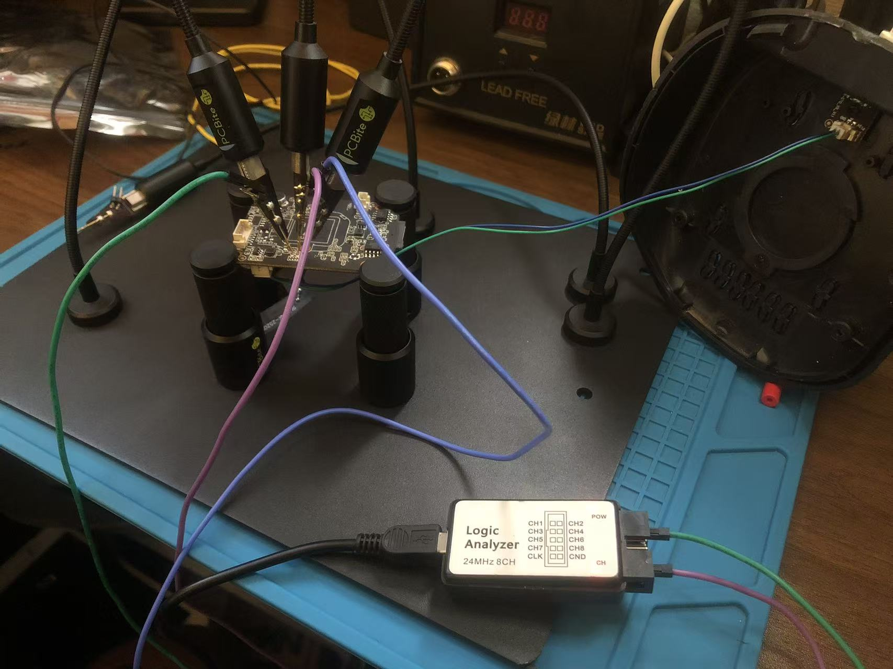

Only Tx was needed, since UART is unidirectional on each wire and I only wanted to observe what the device was printing.

In **PulseView**, I configured the decoder as follows:

- **Baud rate:** 115200
- **Data bits:** 8
- **Parity:** None
- **Stop bits:** 1
- **Decoder:** ASCII

With that configuration, the device's UART output decoded cleanly  boot logs and diagnostic messages were immediately visible.


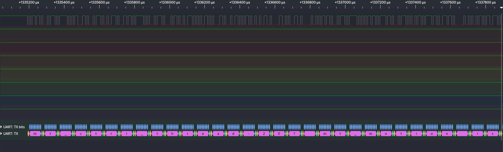

## UART Connection

Having confirmed UART was live, I moved from passive sniffing to an actual connection. I kept the **PCBite probes** in place on the Tx, Rx, and GND pads, and connected them to a **USB-to-TTL adapter** instead of the logic analyzer.

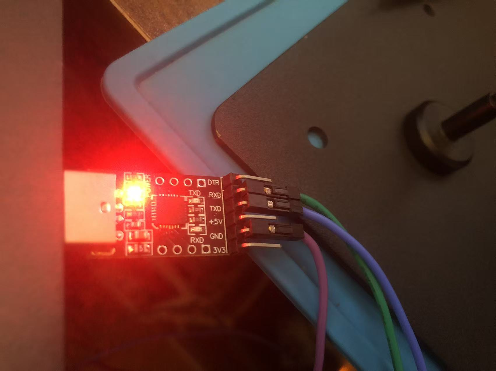

The adapter was wired as follows:

- **Adapter GND** → camera **GND pad**
- **Adapter RX** → camera **Tx pad**
- **Adapter TX** → camera **Rx pad**
- **Adapter VCC** → left disconnected (the camera is powered by its own USB-C cable, so the adapter must not inject power)

For the terminal, I used **picocom** on Kali:

```bash
sudo picocom -b 115200 /dev/ttyUSB0
```

Once the connection came up, I hit Enter  and the device dropped straight into a **root shell**, with no login prompt, no password, and no authentication of any kind.

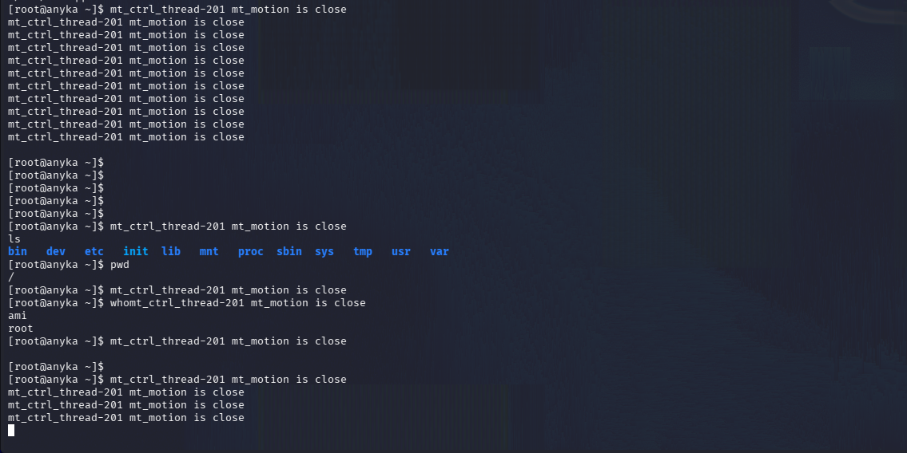

## SPI Connection

With a root shell over UART in hand, the next target was the firmware at rest. The XT25F64B-S NOR flash identified during PCB recon holds the entire Linux image, so reading it directly over SPI would give a full offline copy without relying on the running system.

The SPI pads were not broken out on this board, so the plan was to attach to the flash chip in-circuit using the Bus Pirate v4.0. Based on the datasheet pinout from the PCB recon section, the mapping was:

| Bus Pirate | Flash Pin | Signal |
|---|---|---|
| CS | 1 | CS# |
| MISO | 2 | SO (IO1) |
| GND | 4 | VSS |
| 3.3V | 8 | VCC (not connected board powered by USB-C) |
| CLK | 6 | SCLK |
| MOSI | 5 | SI (IO0) |

In the Bus Pirate SPI menu I selected:

- **Speed:** 1 MHz
- **Clock polarity:** Idle low (default)
- **Sample phase:** Middle (default)
- **CS:** /CS (default)
- **Output type:** Normal (H = 3.3V, L = GND)

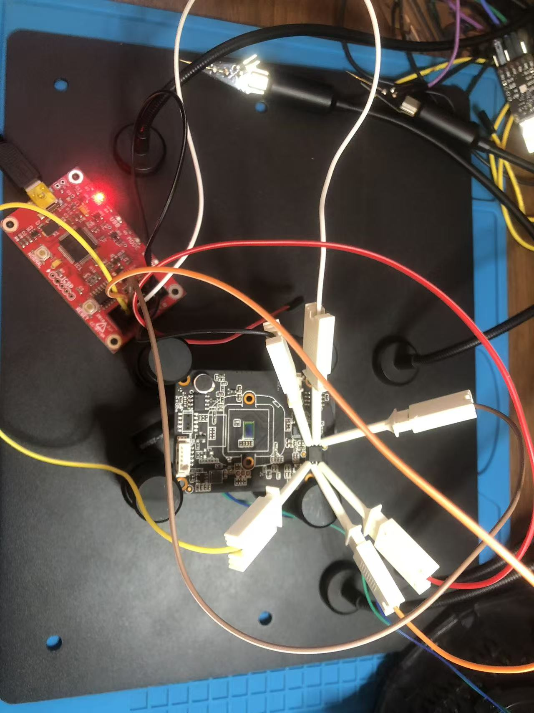

At the `SPI>` prompt, the first attempt using the JEDEC ID macro `(1)` returned garbage. The output was full of "couldn't keep up" errors and random bytes a clear sign the Bus Pirate was losing synchronization on the bus, not that the chip was dead.

The root cause was **WP# (Pin 3) and HOLD# (Pin 7) were floating.** The datasheet is explicit: *"WP# & HOLD# pin require external pull-up."* Without those two pins tied HIGH, the chip ignores standard SPI commands and outputs nothing useful.

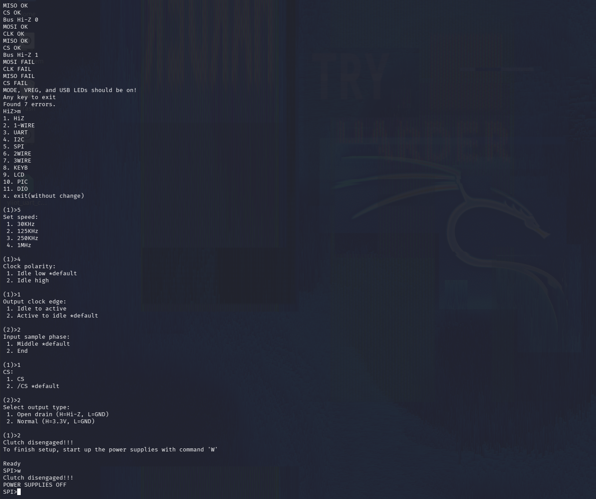

Rather than fight the bus contention and risk damaging the chip, the decision was made to move to the more reliable path: **desolder the NOR flash entirely** and read it off-board with a CH341A programmer.


## Firmware Dumping

With in-circuit SPI ruled out, the flash chip had to come off the board. The XT25F64B-S is a standard 8-pin SOP package, so removal was straightforward:

1. **Flux the pins** and apply hot air at roughly 360°C with a small nozzle, sweeping evenly around all 8 pins.
2. **Lift the chip** gently with tweezers once the solder reflows no force, it should come free on its own.
3. **Clean the pads** on both the PCB and the chip with wick and IPA afterward.

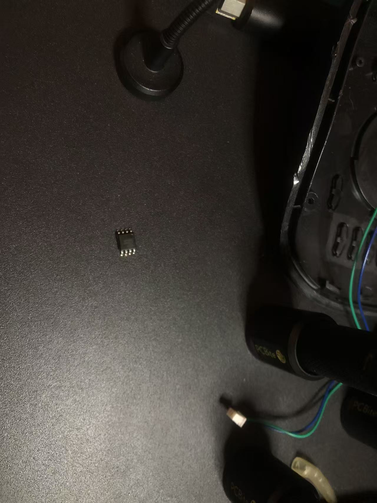

With the chip free, it was placed into the **SOP8 socket** that came with the CH341A programmer. The key detail here is orientation: the **Pin 1 dot on the chip** must line up with the **Pin 1 marker on the socket**. Inserting it the wrong way creates a direct short and the programmer will immediately drop off the USB bus.

The first attempts with the socket attached gave the same symptom the CH341A disappeared from `lsusb` entirely. That is the programmer's internal protection tripping on a short. After reseating the chip with correct Pin 1 alignment, the programmer stayed enumerated:

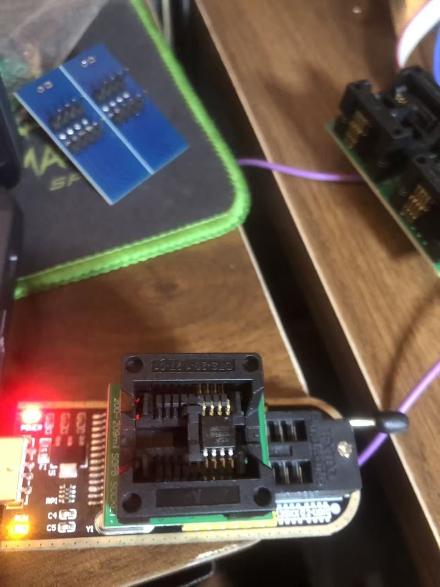

```bash
$ lsusb
...
Bus 001 Device 012: ID 1a86:5512 QinHeng Electronics CH341 in EPP/MEM/I2C mode
```

The dump itself was done with `flashrom`:

```bash
─$ sudo flashrom -p ch341a_spi -r firmware.bin                   
flashrom v1.6.0 on Linux 7.1.5+kali-amd64 (x86_64)
flashrom is free software, get the source code at https://flashrom.org
<.......SNIP.......>
Reading flash... done.

```

With the raw `.bin` in hand, the next step was to see what was inside it. Running `binwalk` against the image immediately showed the shape of the firmware:

```bash
$ binwalk -e firmware.bin

DECIMAL       HEXADECIMAL     DESCRIPTION
--------------------------------------------------------------------------------
214971        0x347BB         xz compressed data
215192        0x34898         xz compressed data
1781760       0x1B3000        Squashfs filesystem, little endian, version 4.0, compression:xz, size: 952670 bytes, 224 inodes, blocksize: 131072 bytes, created: 2022-11-08 05:32:43
2830336       0x2B3000        Squashfs filesystem, little endian, version 4.0, compression:xz, size: 4691596 bytes, 323 inodes, blocksize: 131072 bytes, created: 2022-11-08 05:32:43

WARNING: Extractor.execute failed to run external extractor 'jefferson -d 'jffs2-root' '%e'': [Errno 2] No such file or directory: 'jefferson', 'jefferson -d 'jffs2-root' '%e'' might not be installed correctly
7548928       0x733000        JFFS2 filesystem, little endian

WARNING: Extractor.execute failed to run external extractor 'jefferson -d 'jffs2-root' '%e'': [Errno 2] No such file or directory: 'jefferson', 'jefferson -d 'jffs2-root' '%e'' might not be installed correctly
7564860       0x736E3C        JFFS2 filesystem, little endian

WARNING: Extractor.execute failed to run external extractor 'jefferson -d 'jffs2-root' '%e'': [Errno 2] No such file or directory: 'jefferson', 'jefferson -d 'jffs2-root' '%e'' might not be installed correctly
7573192       0x738EC8        JFFS2 filesystem, little endian

WARNING: Extractor.execute failed to run external extractor 'jefferson -d 'jffs2-root' '%e'': [Errno 2] No such file or directory: 'jefferson', 'jefferson -d 'jffs2-root' '%e'' might not be installed correctly
7618560       0x744000        JFFS2 filesystem, little endian

WARNING: Extractor.execute failed to run external extractor 'jefferson -d 'jffs2-root' '%e'': [Errno 2] No such file or directory: 'jefferson', 'jefferson -d 'jffs2-root' '%e'' might not be installed correctly
7655424       0x74D000        JFFS2 filesystem, little endian

WARNING: Extractor.execute failed to run external extractor 'jefferson -d 'jffs2-root' '%e'': [Errno 2] No such file or directory: 'jefferson', 'jefferson -d 'jffs2-root' '%e'' might not be installed correctly
7823360       0x776000        JFFS2 filesystem, little endian

....<SNIP>....
```

The output flagged a compressed kernel, a **SquashFS** root filesystem, and most importantly for this phase a **JFFS2 filesystem, little endian** sitting at the tail end of the image.

`binwalk -e` was attempted first, but it could not extract the JFFS2 partition because the required **jefferson** tool was not installed on the Kali box:

```
WARNING: Extractor.execute failed to run external extractor 'jefferson ...'
```

Installing it was a one-liner:

```bash
$ sudo apt install python3-pip liblzo2-dev
$ sudo pip3 install jefferson
```

Once `jefferson` was available, I run `binwalk -e` again to make sure things are working properly:

```bash
$ binwalk -e firmware.bin

DECIMAL       HEXADECIMAL     DESCRIPTION
--------------------------------------------------------------------------------
214971        0x347BB         xz compressed data
215192        0x34898         xz compressed data
1781760       0x1B3000        Squashfs filesystem, little endian, version 4.0, compression:xz, size: 952670 bytes, 224 inodes, blocksize: 131072 bytes, created: 2022-11-08 05:32:43
2830336       0x2B3000        Squashfs filesystem, little endian, version 4.0, compression:xz, size: 4691596 bytes, 323 inodes, blocksize: 131072 bytes, created: 2022-11-08 05:32:43
7548928       0x733000        JFFS2 filesystem, little endian
7564860       0x736E3C        JFFS2 filesystem, little endian
7573192       0x738EC8        JFFS2 filesystem, little endian
7618560       0x744000        JFFS2 filesystem, little endian
7655424       0x74D000        JFFS2 filesystem, little endian
7823360       0x776000        JFFS2 filesystem, little endian
8012084       0x7A4134        JFFS2 filesystem, little endian
8017304       0x7A5598        JFFS2 filesystem, little endian
8055000       0x7AE8D8        JFFS2 filesystem, little endian
8117036       0x7BDB2C        JFFS2 filesystem, little endian
8118272       0x7BE000        JFFS2 filesystem, little endian
8192444       0x7D01BC        JFFS2 filesystem, little endian
8196096       0x7D1000        JFFS2 filesystem, little endian
....<SNIP>....

$ ls
firmware.bin  _firmware.bin.extracted  logs  yiiot_uart_capture

$ cd _firmware.bin.extracted


$ ls
1B3000.squashfs  7BE000.jffs2  chattr         dumpkmap     ftpd       ifdown     iprule         jffs2-root-9           libc.so.0               librt.so.0                  login      mnt            pidof        rmdir         sleep            tar          usr
....<SNIP>....
```

And there we have the full firmware dumpped!!

## Conclusion and Findings Summary

The hardware phase turned a network-reachable target into an at-rest target. What Part 4 achieved with an FTP client, this phase achieved with a soldering iron, a Bus Pirate, and a CH341A no credentials, no exploits, no network access required.

Three things made the device fall open:

- **UART debug pads shipped unpopulated but live.** A 3-pin header (Tx / Rx / GND) dropped straight into an unauthenticated root shell. No login, no password, no boot-time challenge. Anyone with physical access and a $5 USB-to-TTL adapter has root access.
- **The SPI NOR flash has no read-out protection.** The XT25F64B-S is a standard 8-pin SOP with no lock bits set. After a 90-second hot-air removal, a CH341A read the full 8 MB image byte-identically on every pass.
- **The boot chain has no cryptographic enforcement.** No secure boot, no signed kernel, no verified rootfs. The SPI flash is the single point of trust, and nothing in the boot process checks that what is on it is legitimate.

| ID | Finding | Severity |
|---|---|---|
| C-01 | Unauthenticated root shell on UART debug pads (Tx/Rx/GND) no login, no password, full system access from a 3-pin header | **Critical** |
| C-02 | XT25F64B-S SPI NOR flash has no read-out protection desoldering yields a complete, byte-identical firmware image (kernel, SquashFS, JFFS2) | **High** |
| C-03 | No secure boot / signature verification anywhere in the boot chain the SPI flash is a single point of trust with zero cryptographic enforcement | **High** |

Taken together: the device was never designed to resist physical access. It was designed to be programmed, re-flashed, and debugged at the factory and none of that tooling was removed before it shipped to customers. The LAN phase was the convenient path. The bench path is the guaranteed one.

---

*Writeup by Mikias*